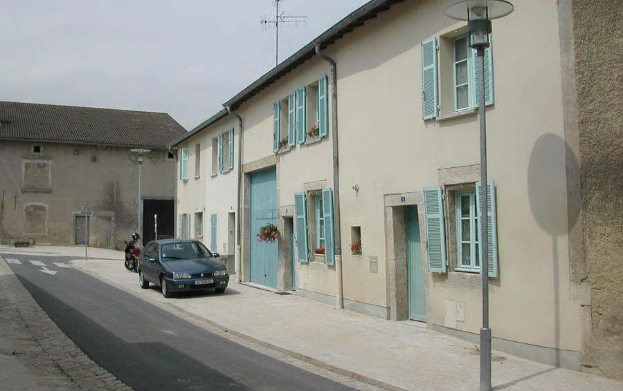
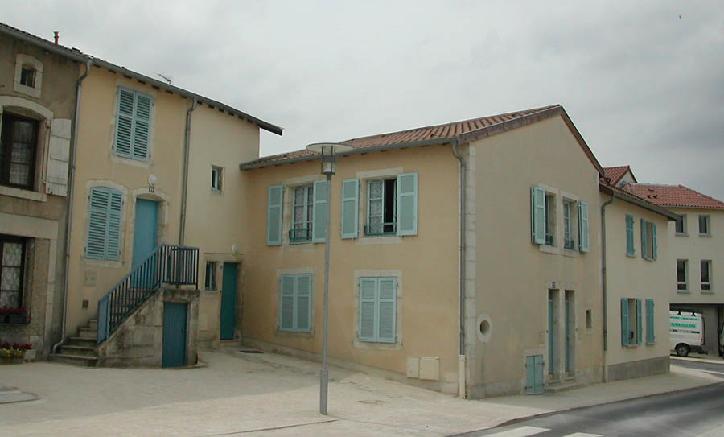
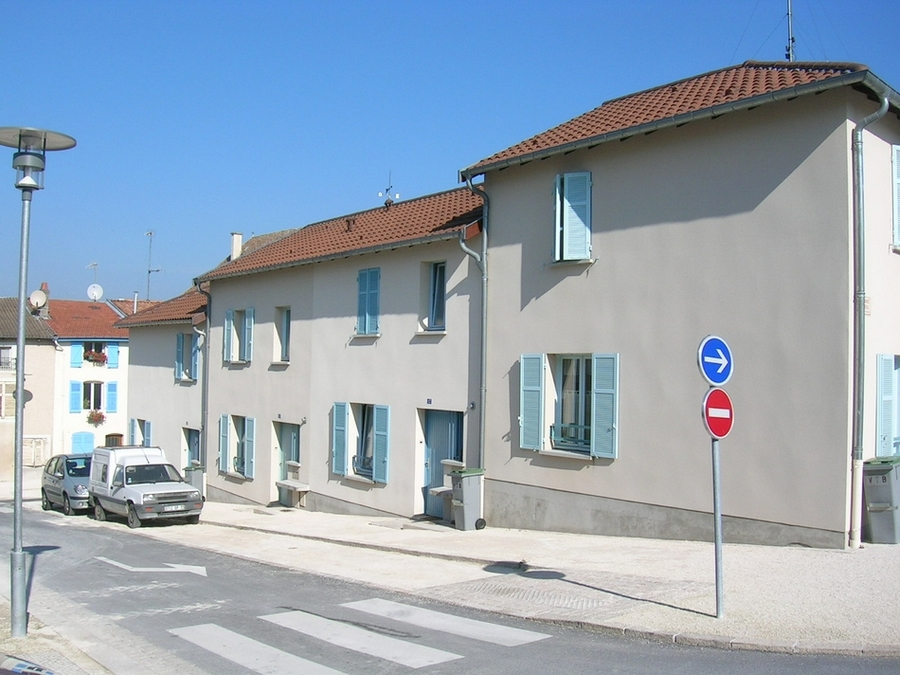
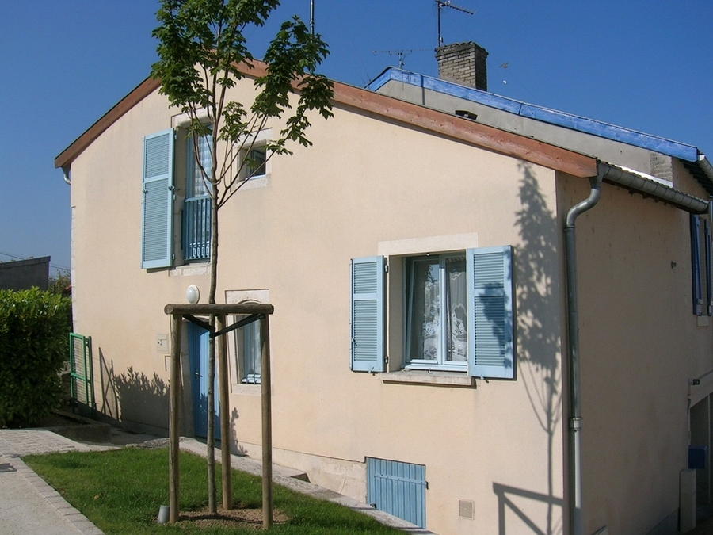
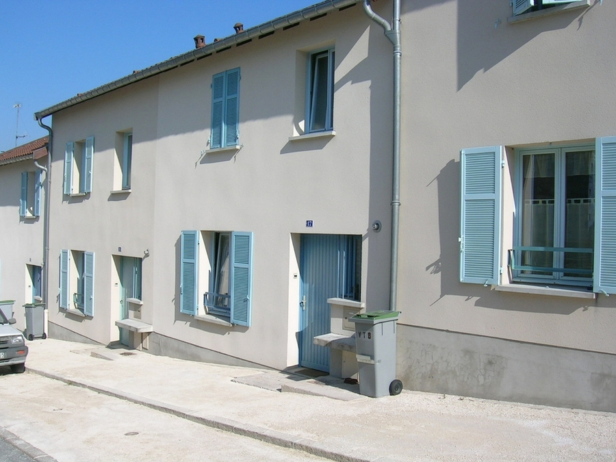

Réhabilitation de 3 maisons de faubourg et d'une grange afin de constituer 7
            logements et construction de 5 maisons de ville neuves.
            Maitrise d'ouvrage : S.A. H.L.M. V.T.B.
            Collaboration : J. PITOIS (Economiste)
            Montant des travaux : 603 000 € | Surfaces : 639 m² (S.U.
            réhabilitation), 352 m² (S.U. 5 maisons de ville).
            1999-2000

 

 

