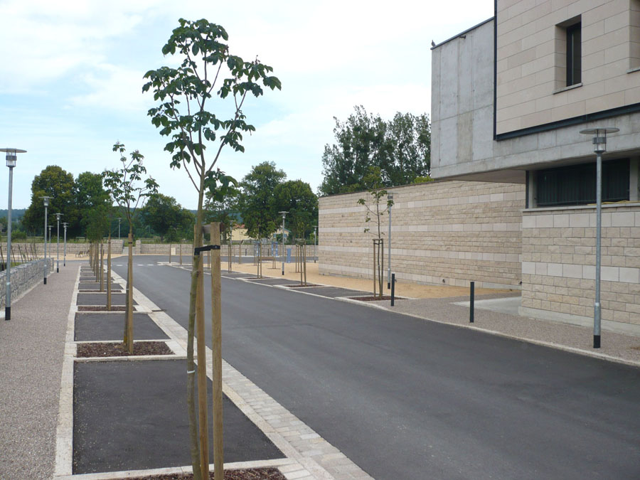
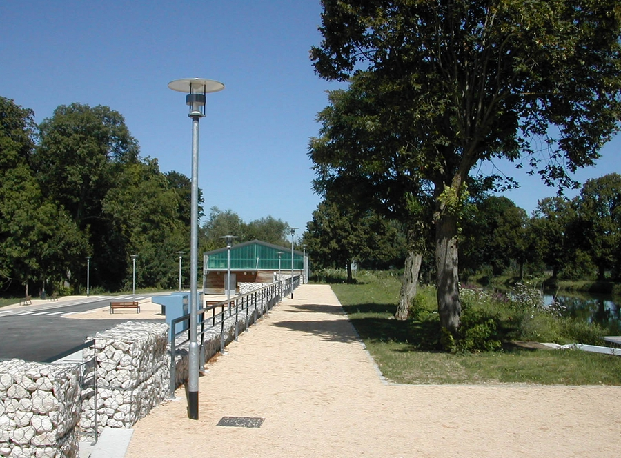
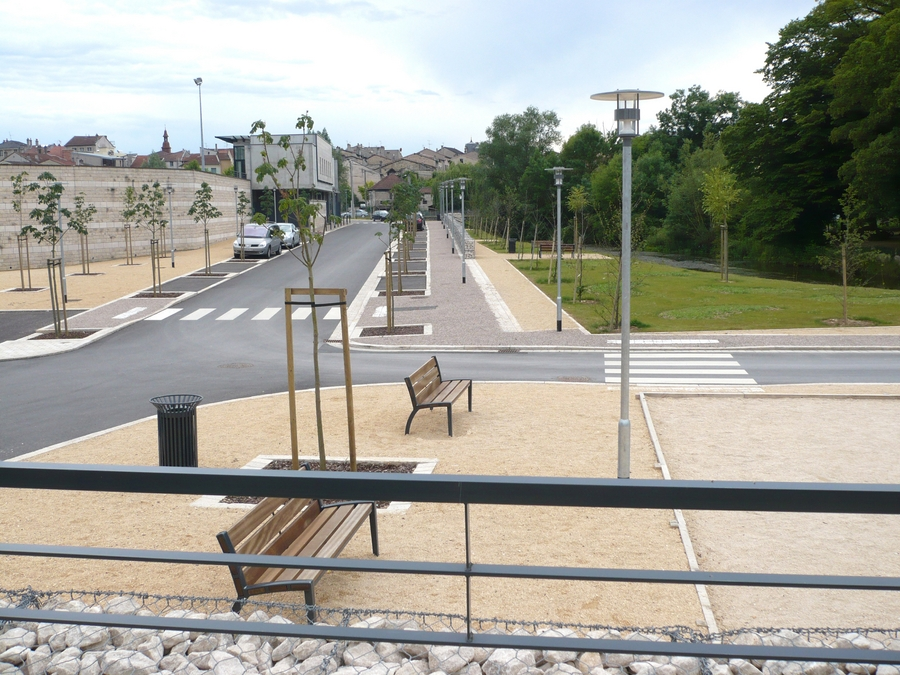
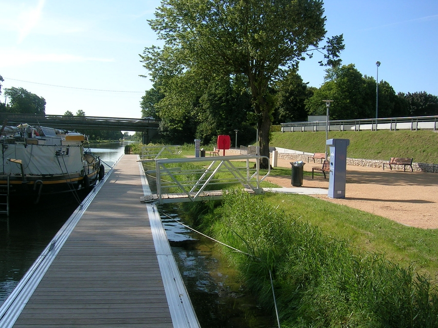
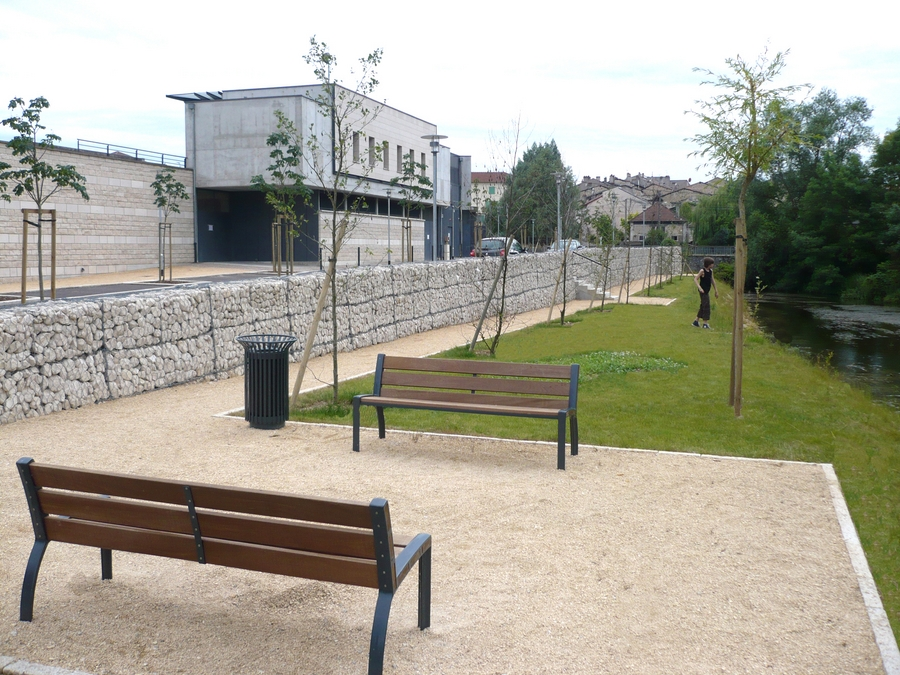
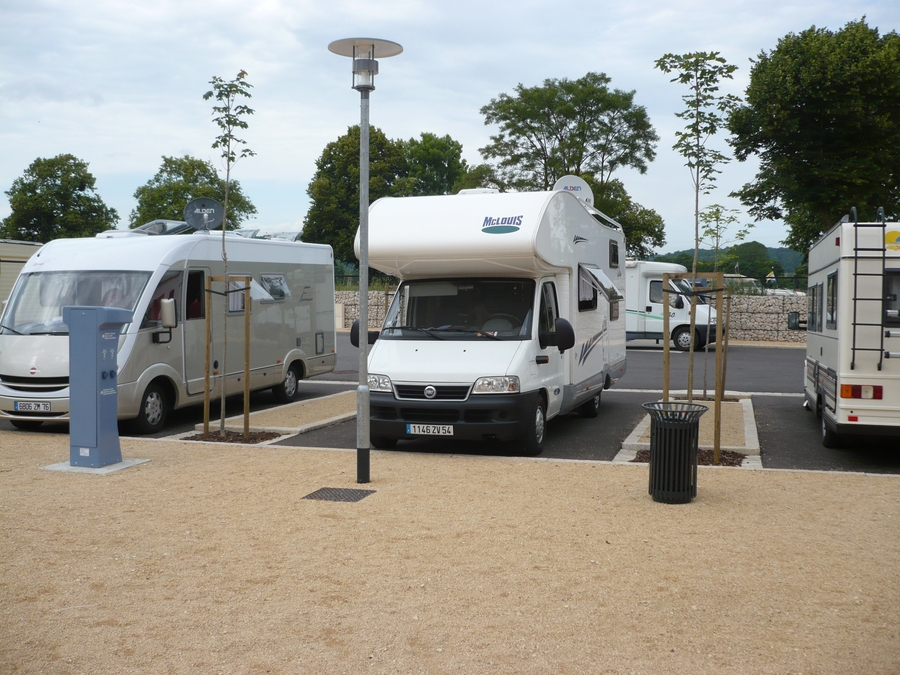
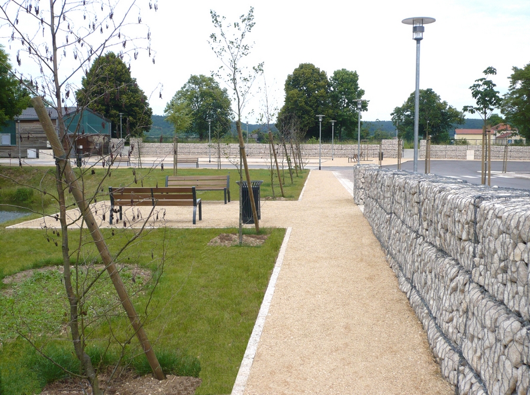
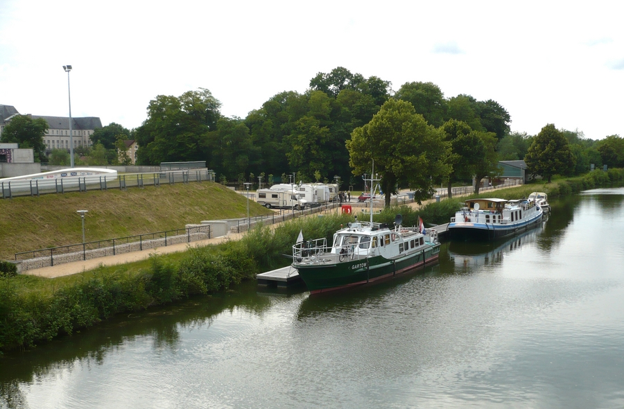

Aménagements paysagers des abords du vélodrome, halte fluviale sur le
            canal de la Meuse, aire d'accueil pour camping car et terrains de boules.
            Maitrise d'ouvrage : Ville de Commercy.
            Collaboration : S.L.I. (B.E.T.)
            Montant des travaux : 655 000 € (HT) | Surface : 4 100 m².
            2007 - 2008.

 

 

 

 

