Réalisation de décors pour l’Opéra « Ariane et barbe
            bleue ».
            Metteur en scène : Danielle ORY.
            Costumes : Arthur ABALLAIN.
            Lumières : Robert VENTURI.
            Année de production : 2007

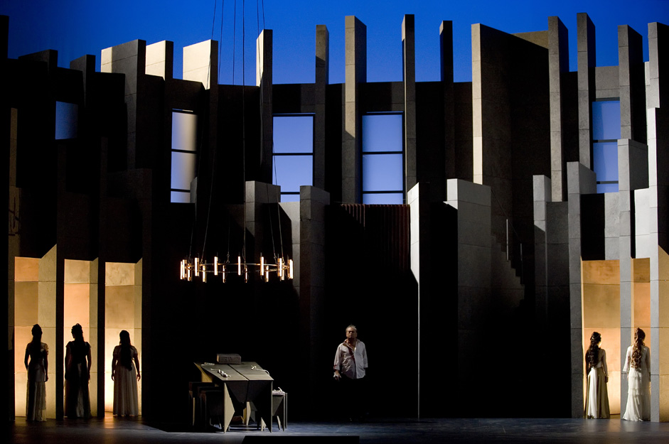 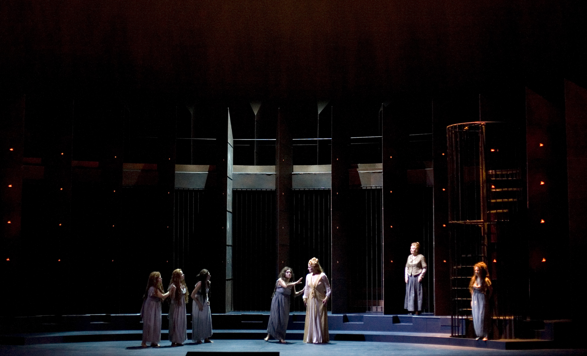

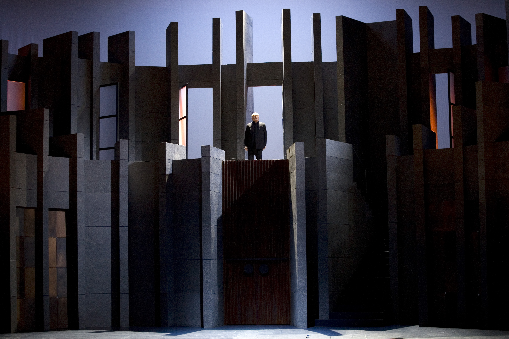 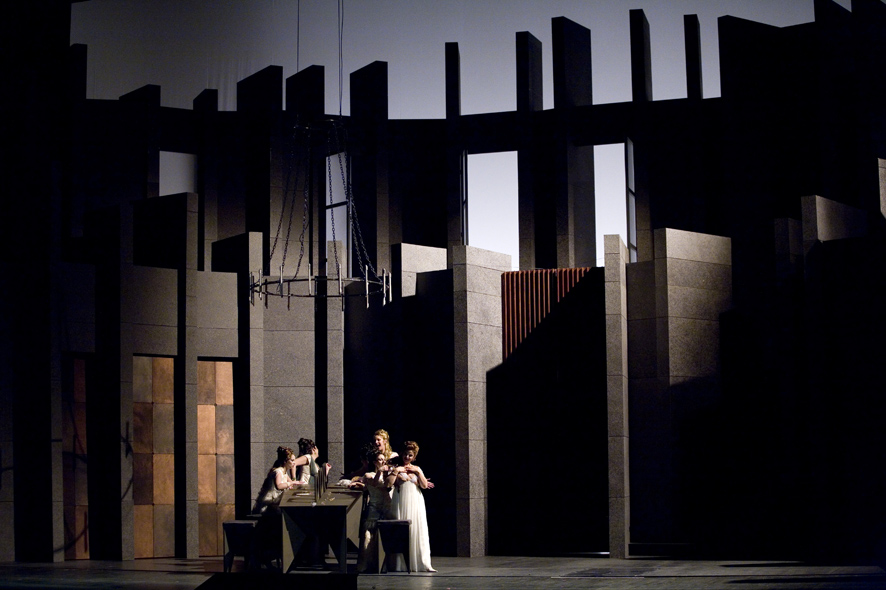

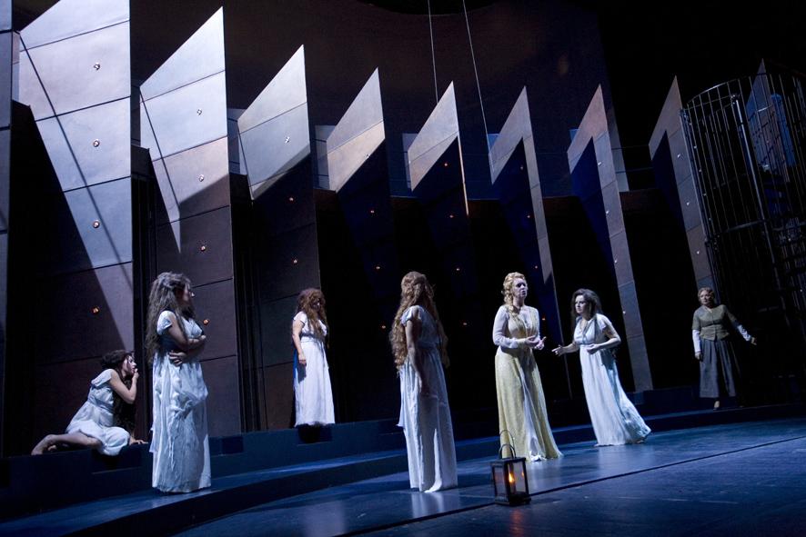 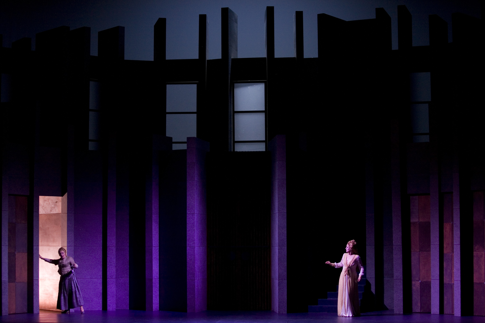

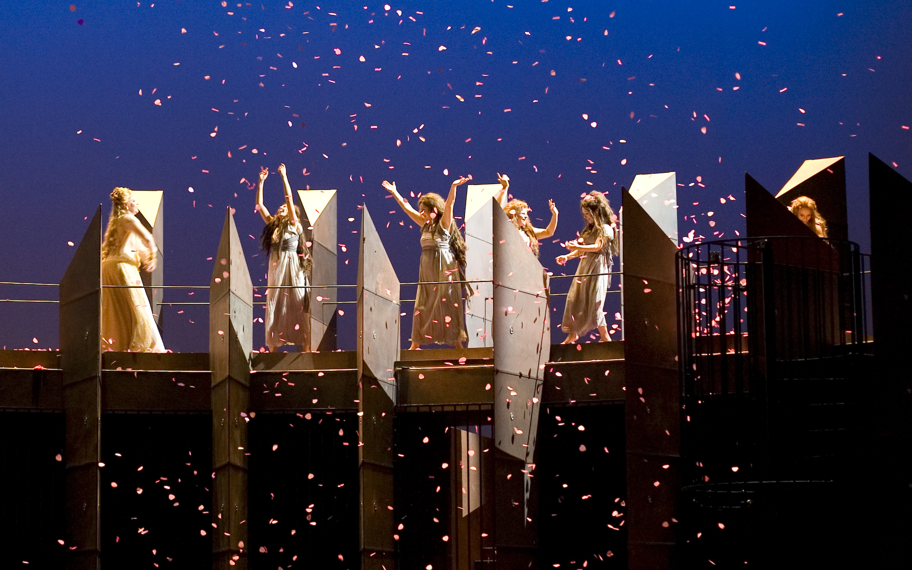 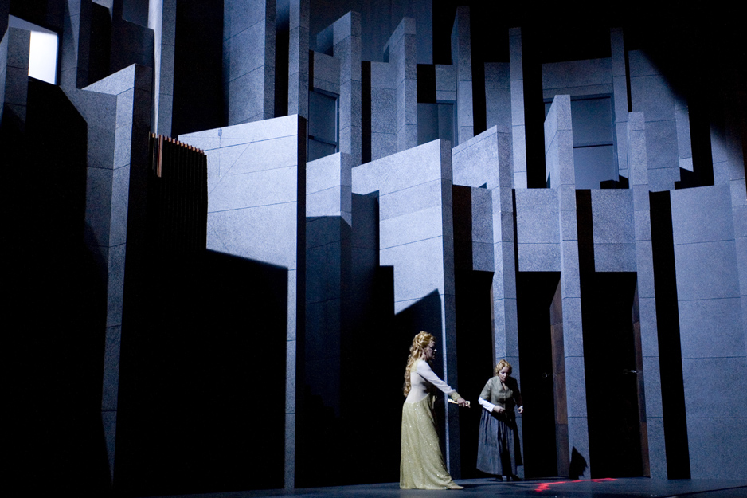

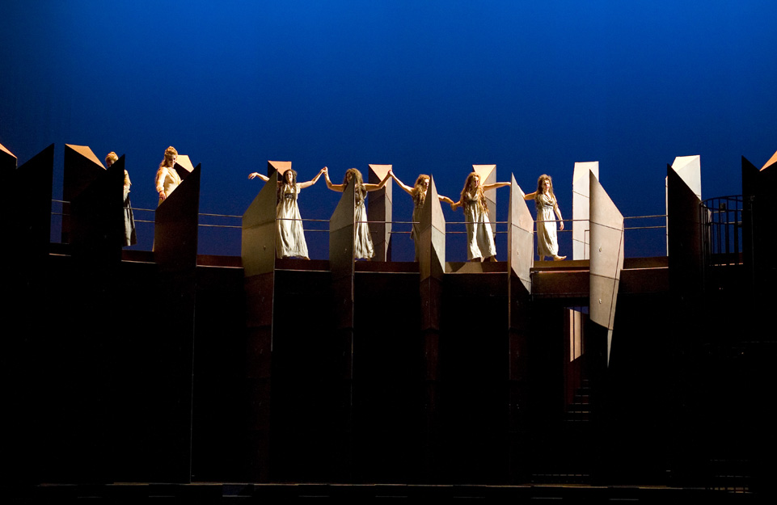 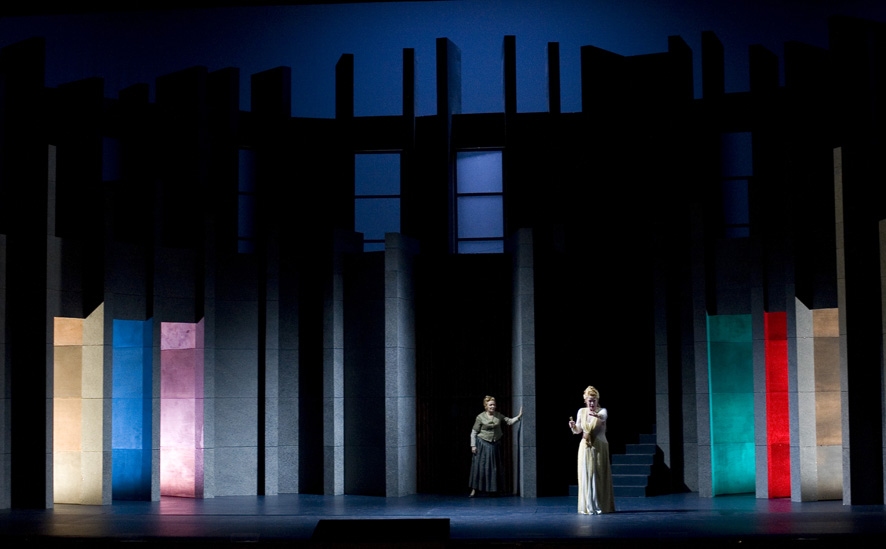

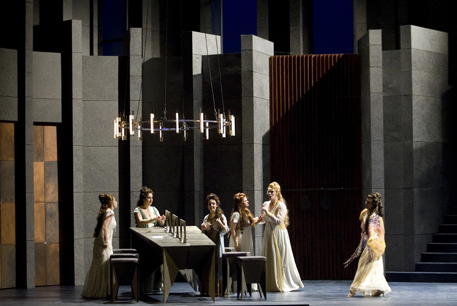

