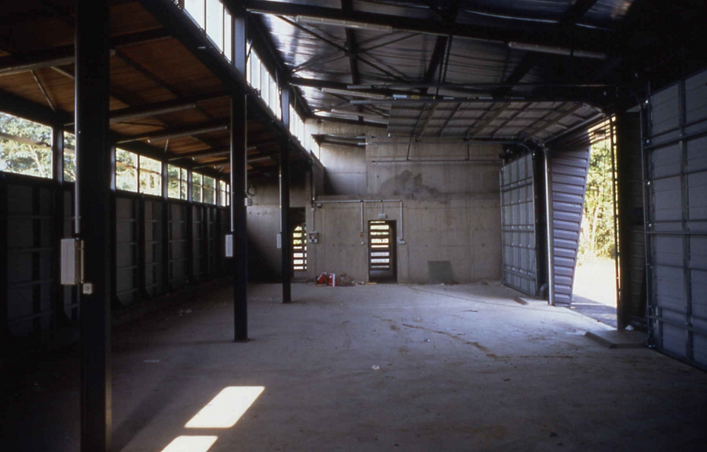
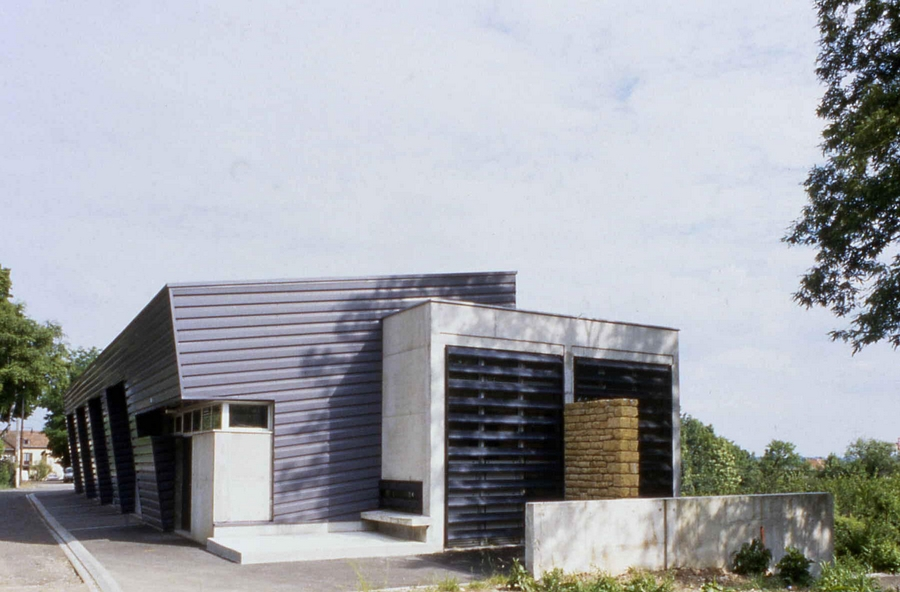
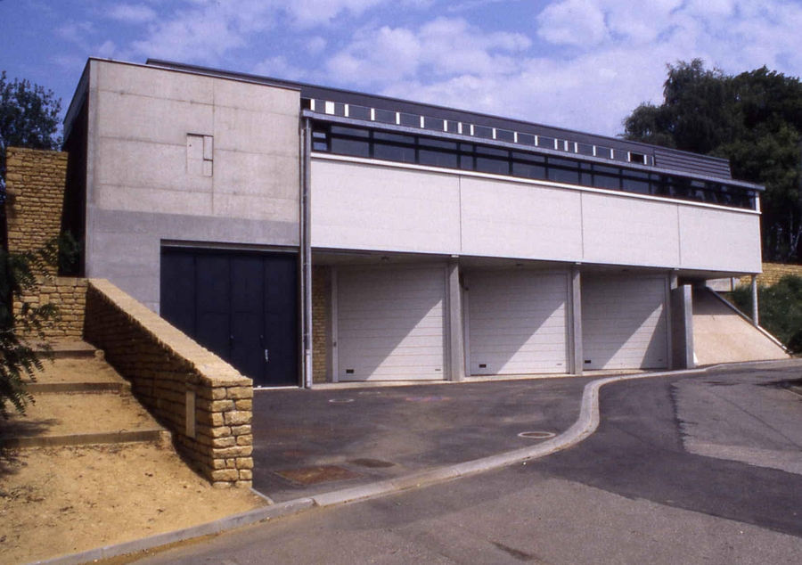
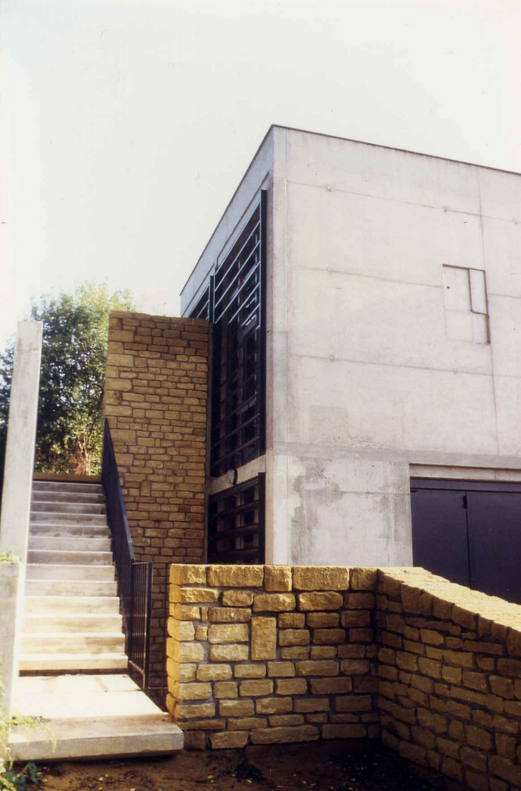

Construction d'atelier, garages et vestiaires adossée au talus de l'ancienne
            gare.
            Maitrise d’ouvrage : Commune de Moulins-les-Metz.
            Maitrise d’oeuvre : SECOMET Ingénierie S.A. (B.E.T. et Economiste).
            Architecte associé : Philippe TONDON.
            Montant des travaux : 350 630 € (HT) | Surface 460 m².
            1993 - 1994.

 

 

