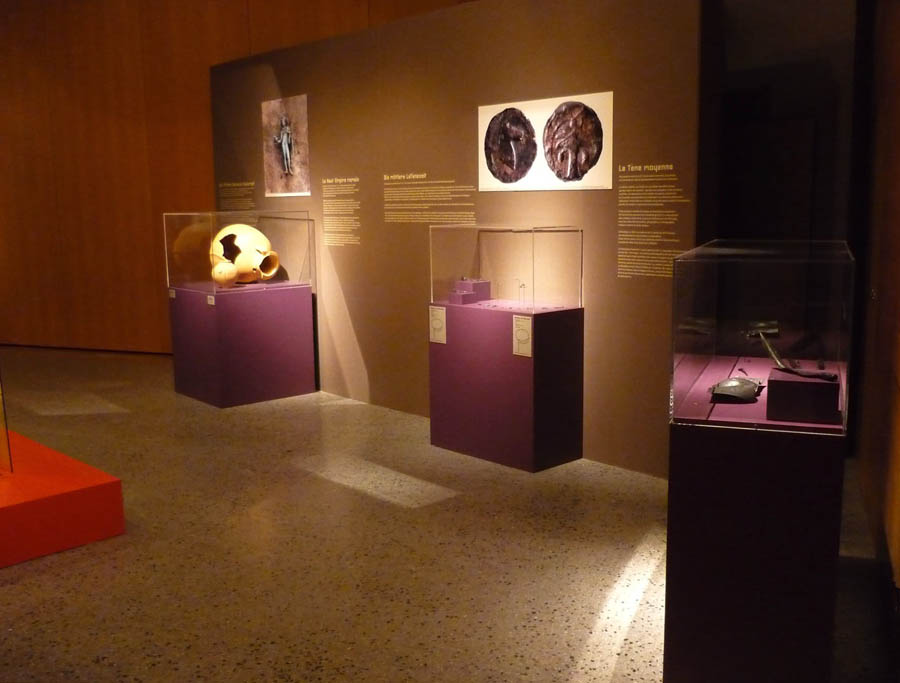
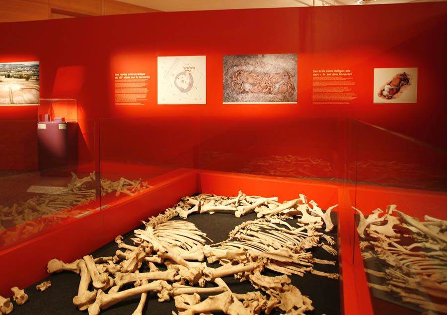
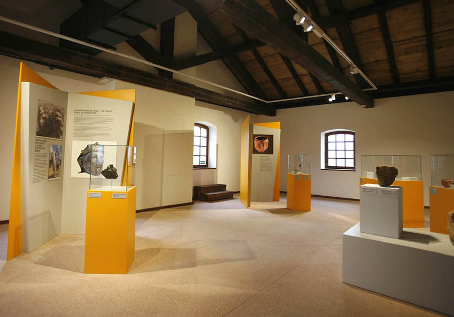
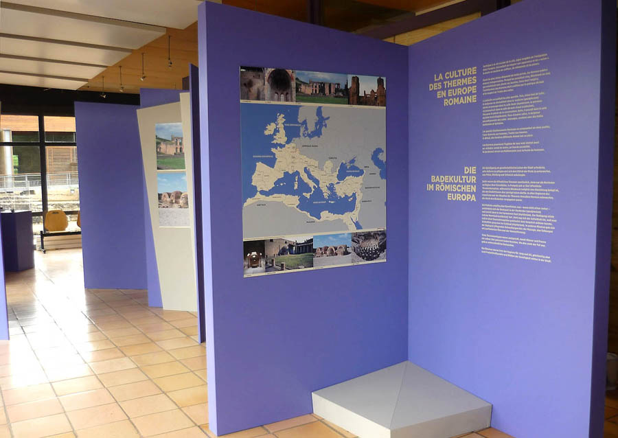
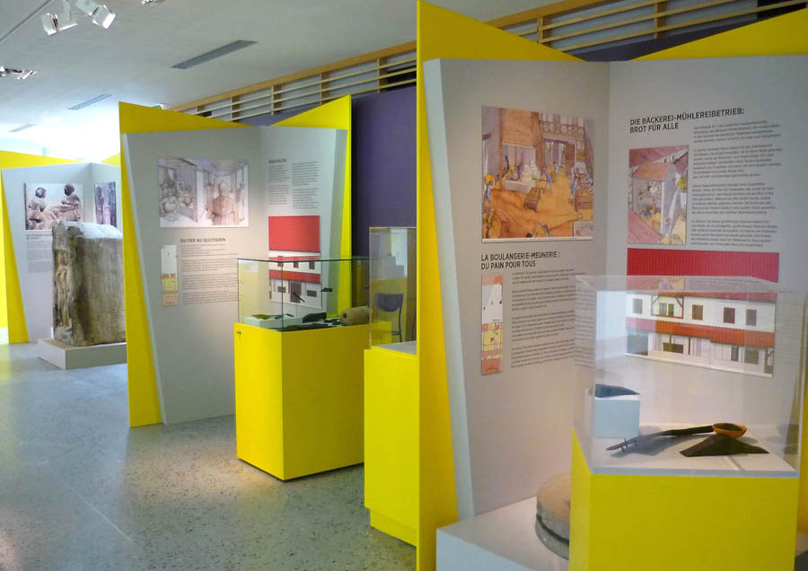
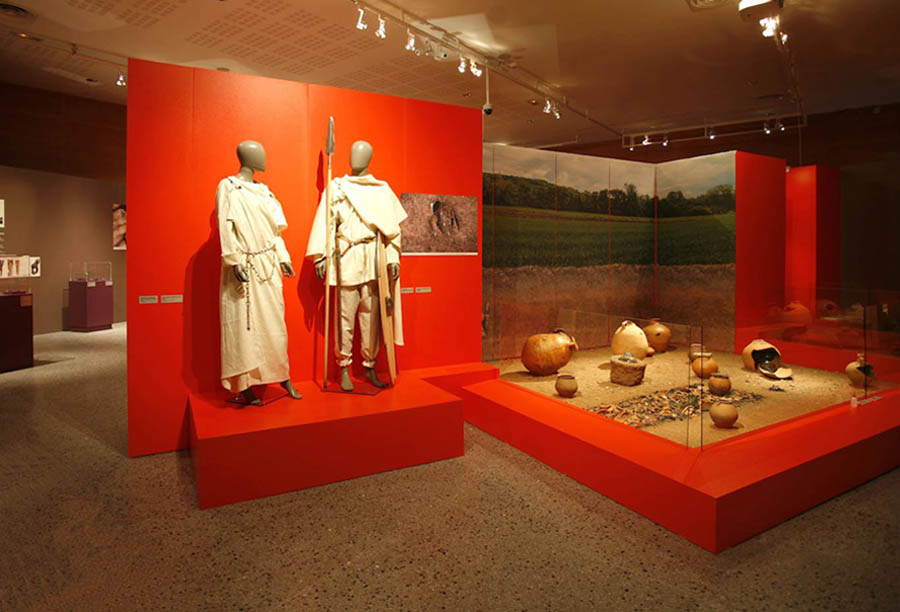
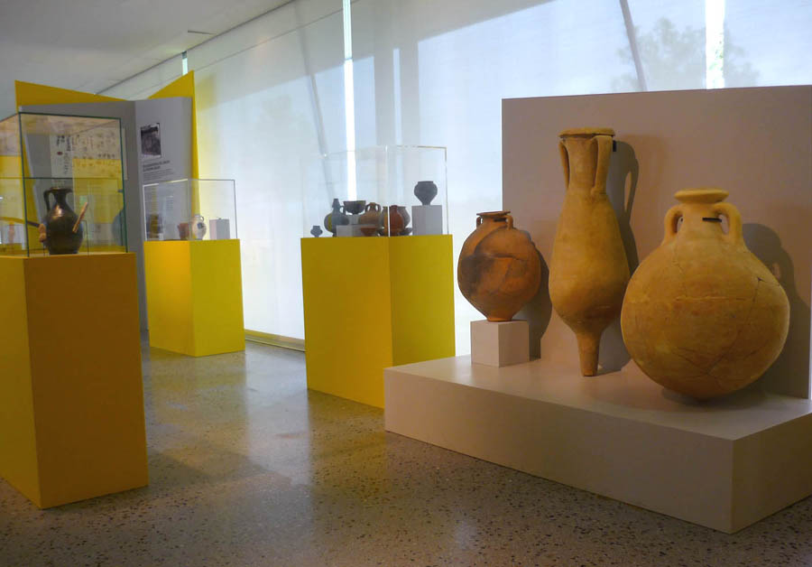
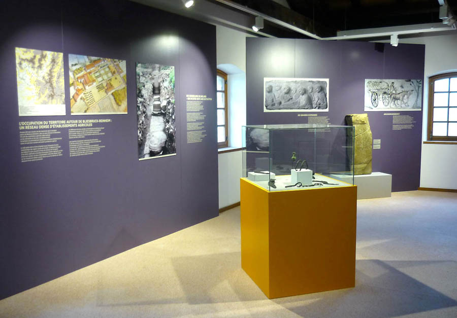

Scénographique de l'exposition temporaire et présentation permanente dans
            4 bâtiments du site "Exposition parcours 2013, 2500 ans d’histoire commune en
            Moselle et en Sarre" au Parc archéologique Européen de Bliesbruck-Reinheim.
            Maitrise d'ouvrage : Conseil Général de Moselle et Saarpfalz-Kreis.
            Graphiste associé : Atelier Martial DAMBLANT.
            Éclairagiste associé : Roberto VENTURI.
            Coût : 170 000 € (H.T.) | Surface : 897 m².
            2013
            Entreprises : Les Menuiseries de l’Est, Atelier DuO, Eiffage Energie et Expocom.

 

 

 

 

