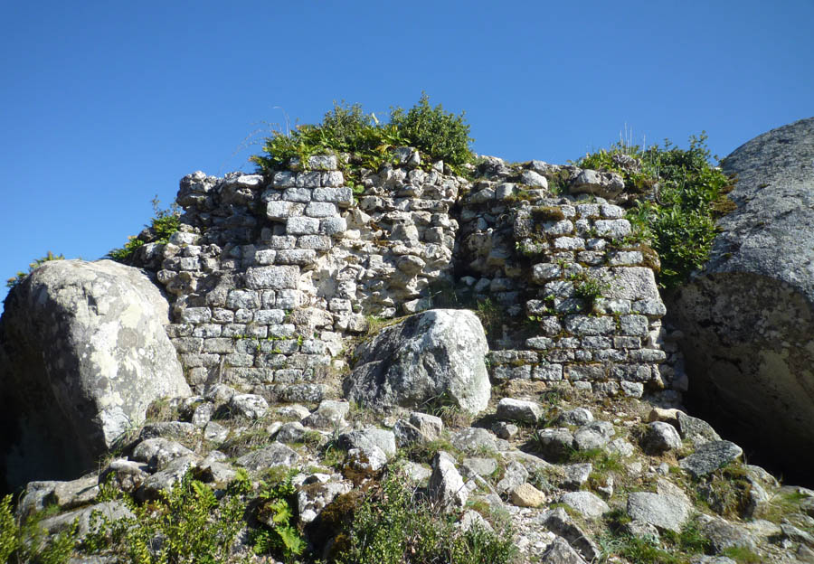
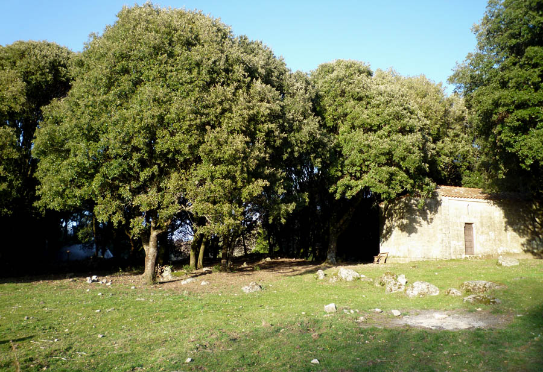
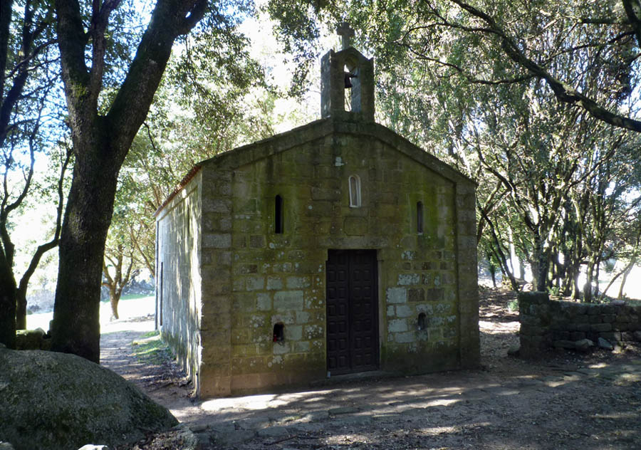
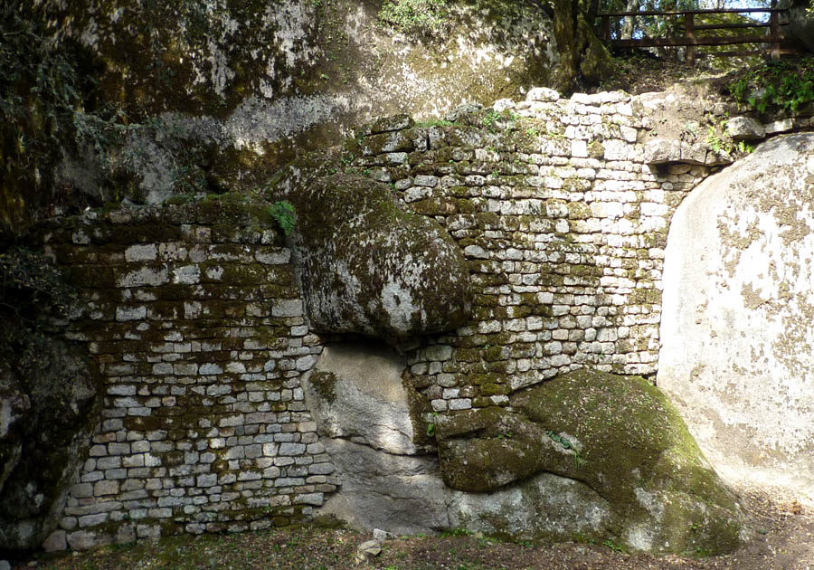
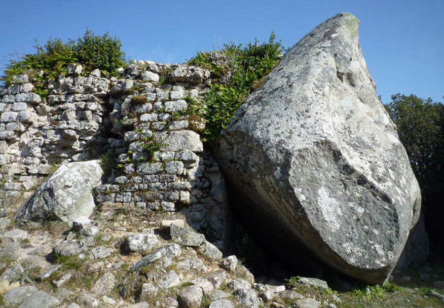
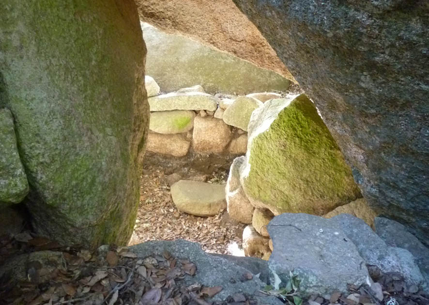

Etude en vue de l'aménagement du site archéologique de Capula - ALTA
            ROCCA (Corse du Sud).
            Diagnostic et prospective.
            Maîtrise d'ouvrage : Communauté de communes de l'Alta Rocca (Levie)
            Architectes associés : F. Muller et A. Oziol.
            2012

 

 

 

