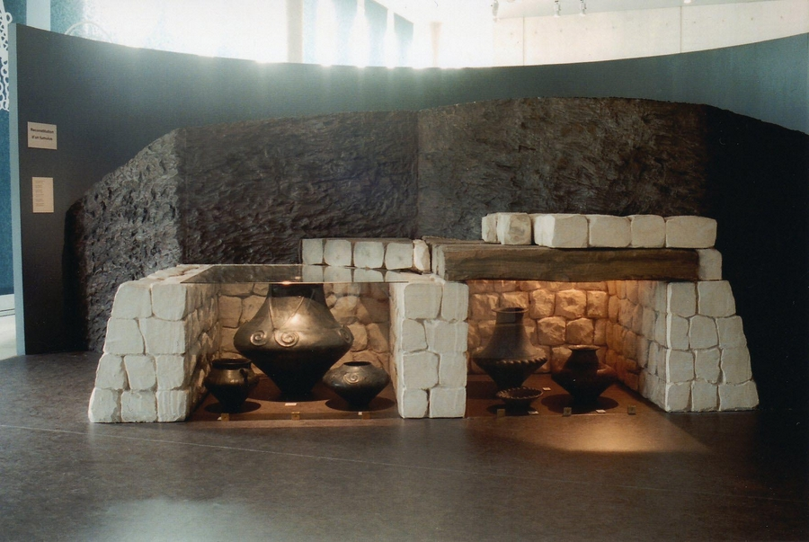
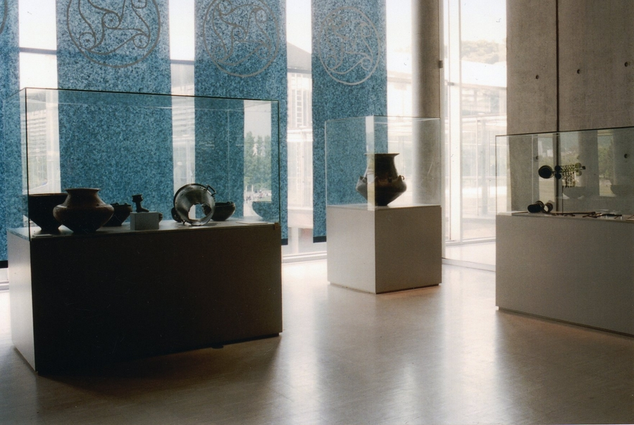
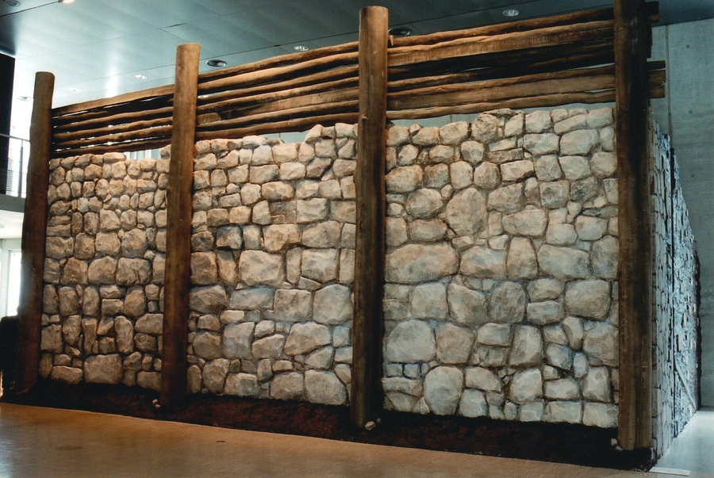
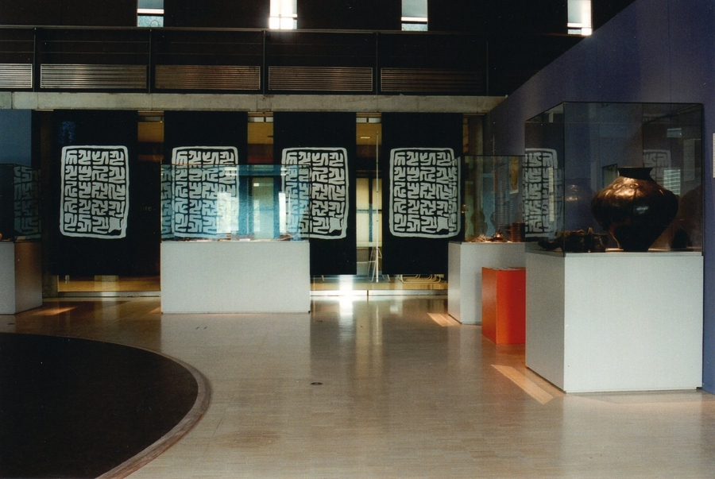
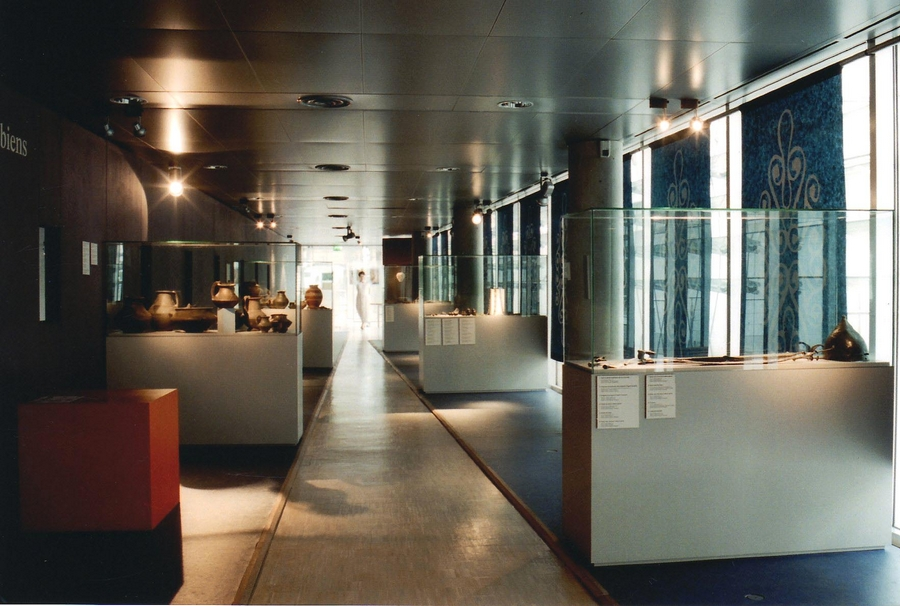

Réalisation scénographique pour une exposition temporaire intitulée
            Celte de Hongrie au musée archéologique de Saint-Romain-En-Gal.
            Maitrise d'ouvrage : Conseil Général du Rhône.
            Coût : 125 000 € (HT) | Surface : 650 m².
            2001-2002.

 

 

