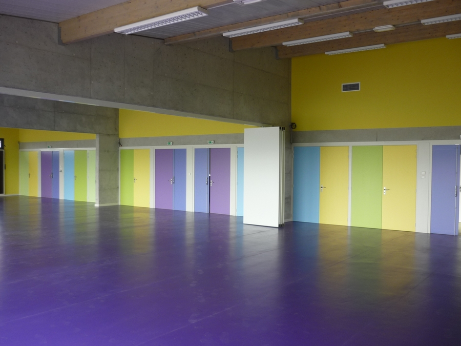
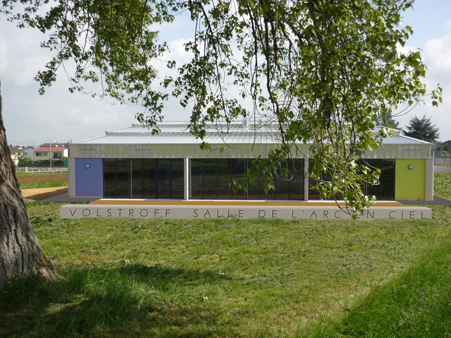
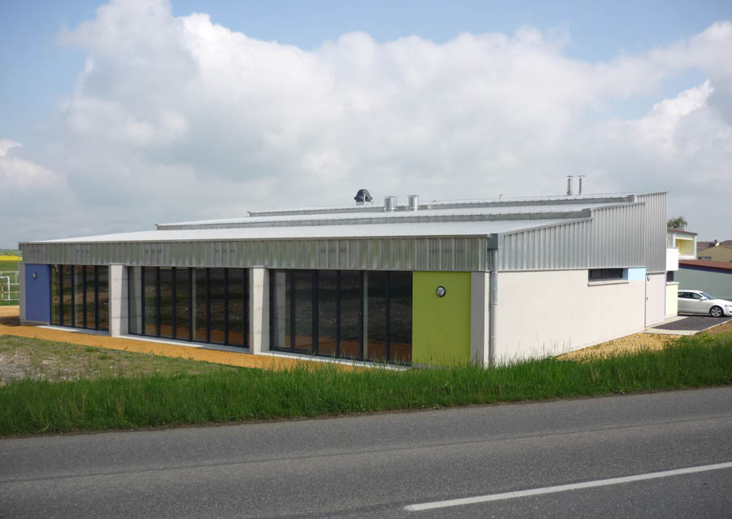
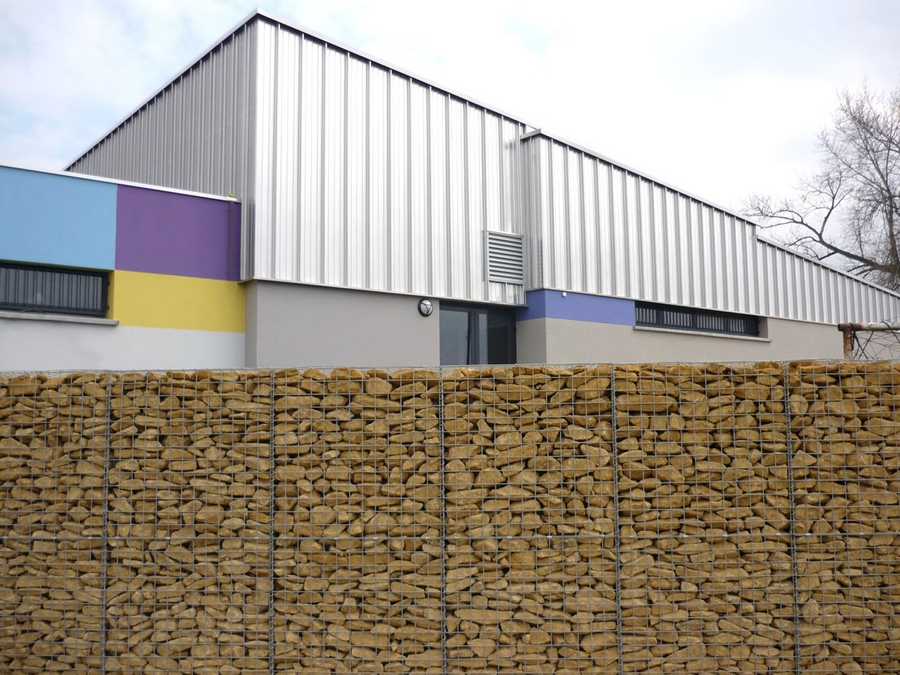
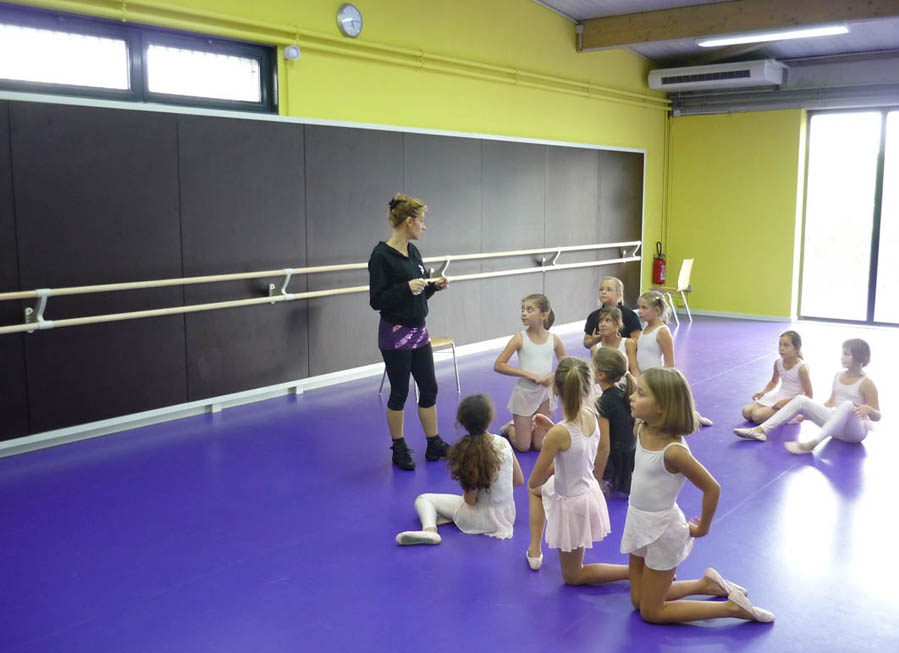
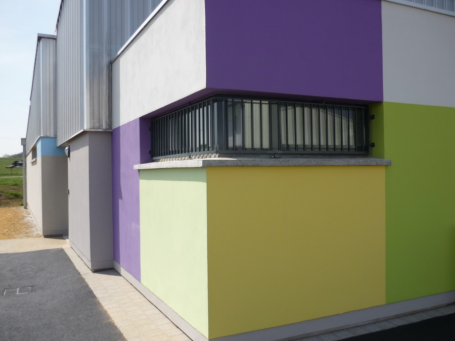
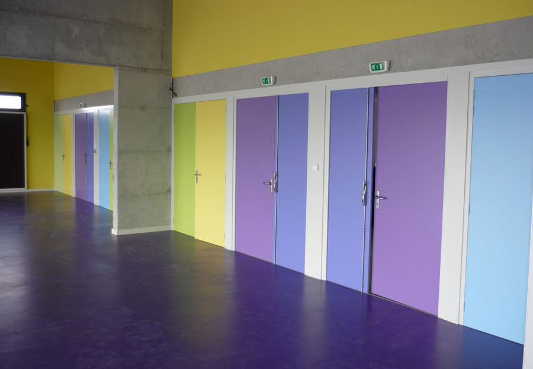
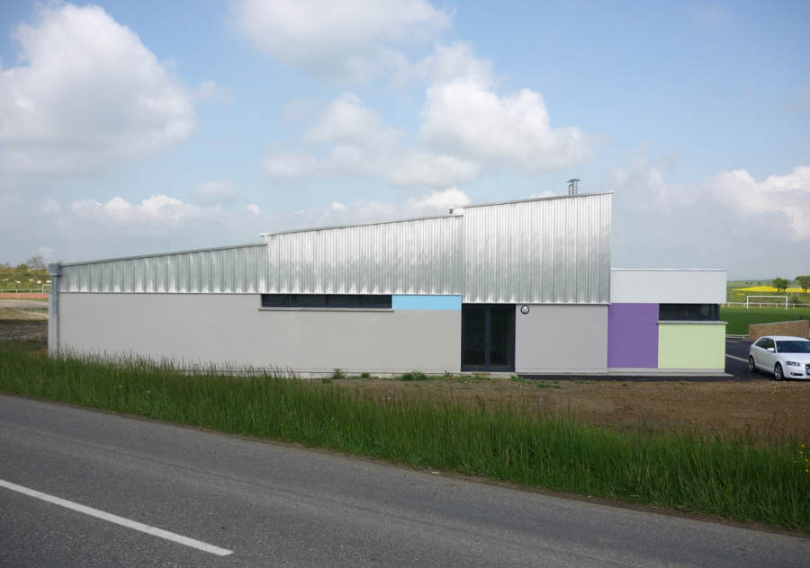
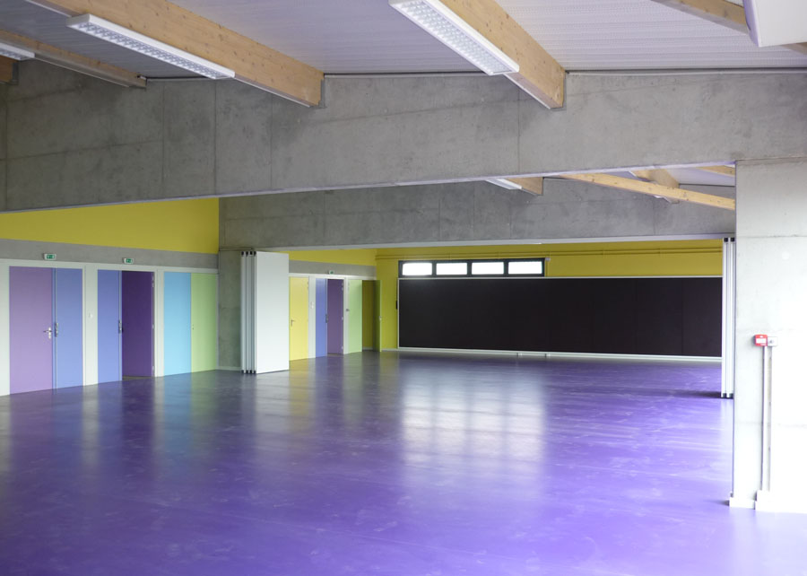

Construction d'un centre communal composé de deux salles (200+100 m2, pouvant
            se regrouper) et ses annexes.
            Maitrise d'ouvrage : Commune de Volstroff.
            Collaborations : N.E. Ingénierie. (B.E.T.), SOGECLI ( B.E.F.), J. PITOIS
            (Economiste).
            Montant des travaux : 750 000 € (H.T.) | Surface : 670 m² (S.H.O.N.) 613
            m² (S.H.).
            2009-2010

 

 

 

 

