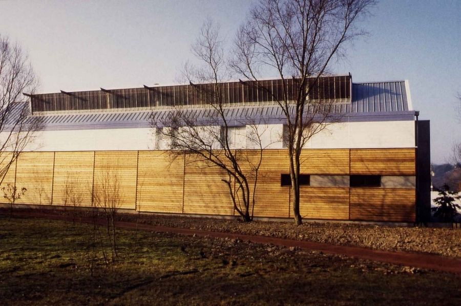
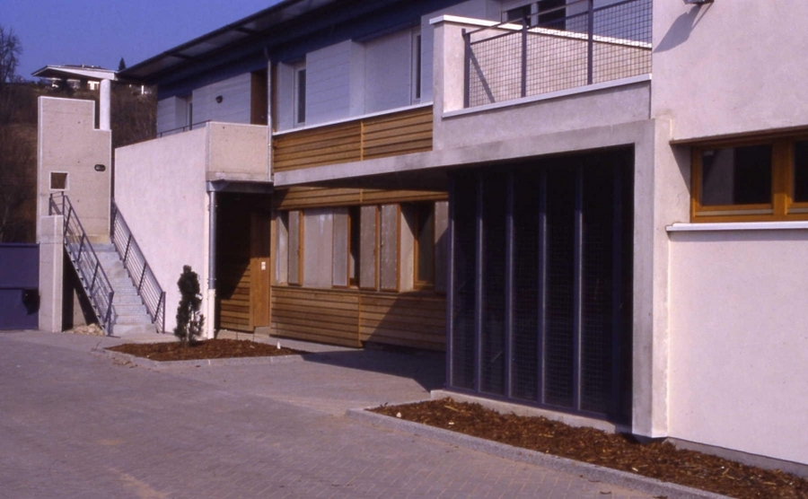
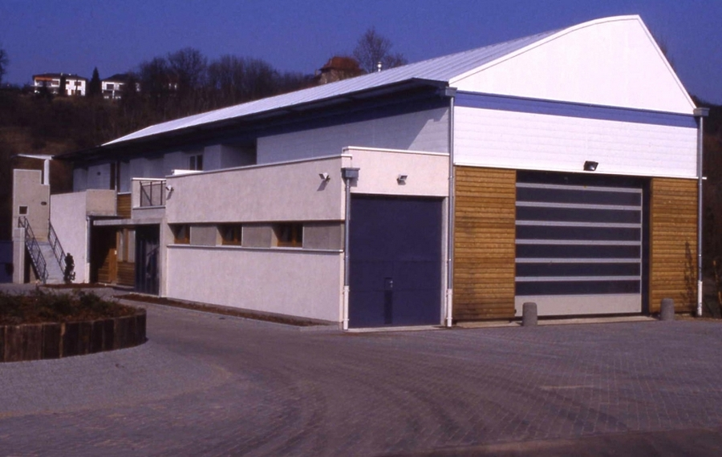
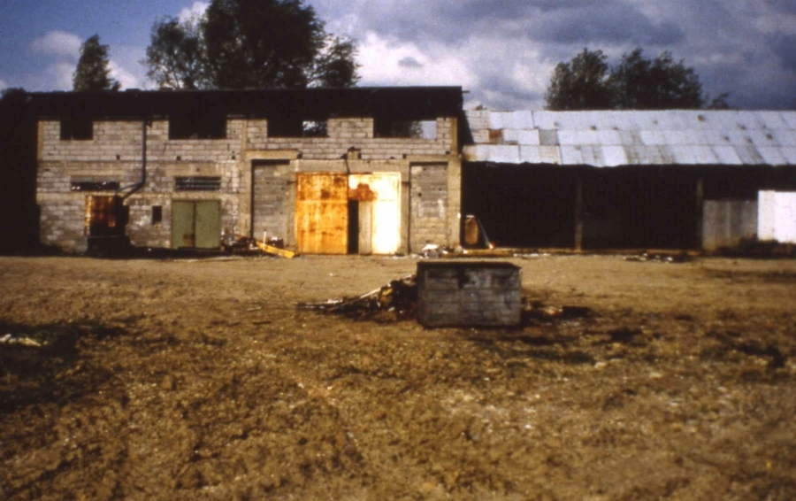
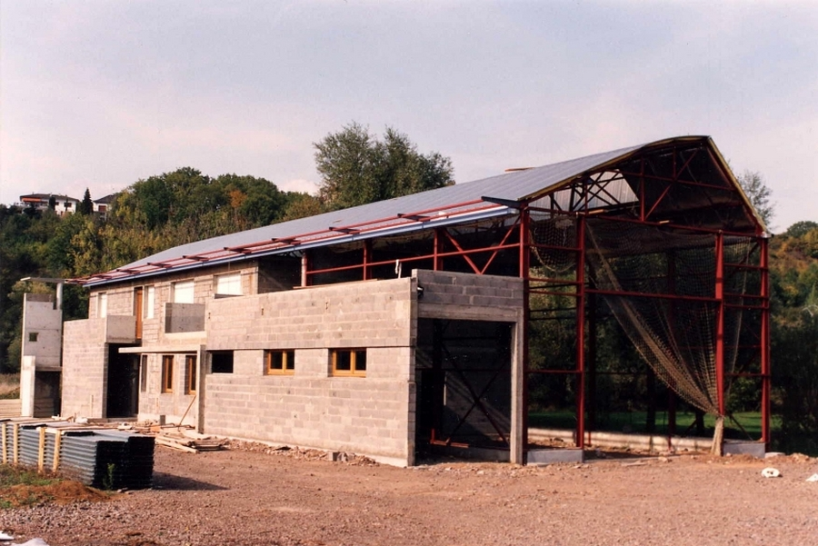

Reconversion d'un bâtiment existant inachevé en bureaux et garages.
            Maitrise d'ouvrage : Société D.H.R.
            Architecte associé : Philippe TONDON.
            Montant des travaux : 340 000 € (HT)
            1992-1993

 

 

