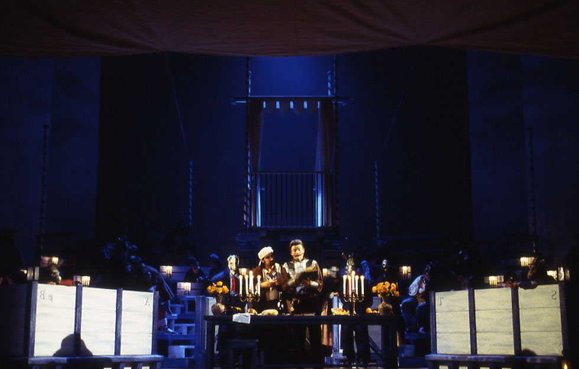
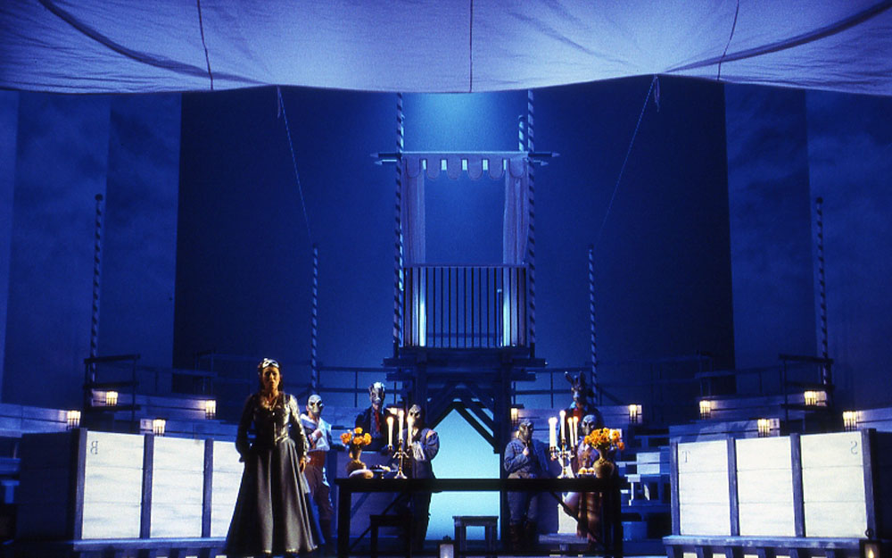
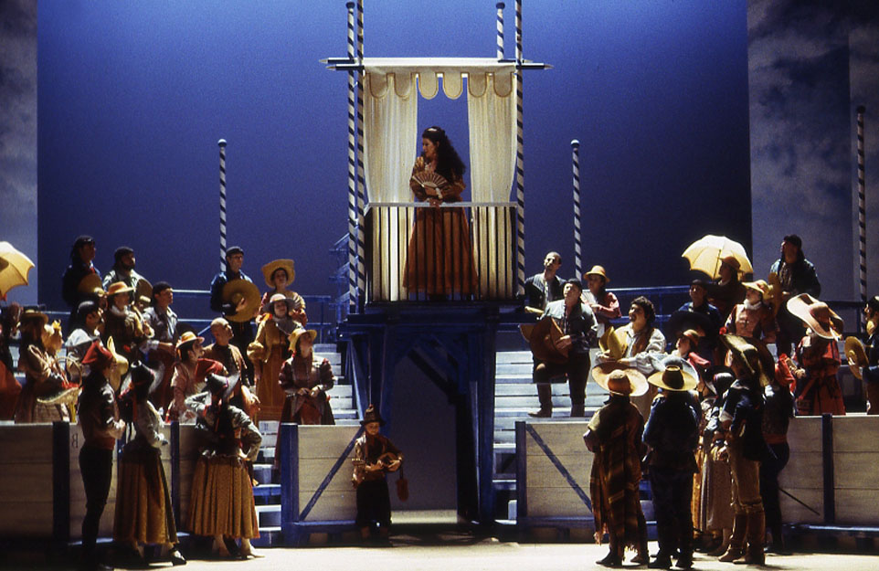
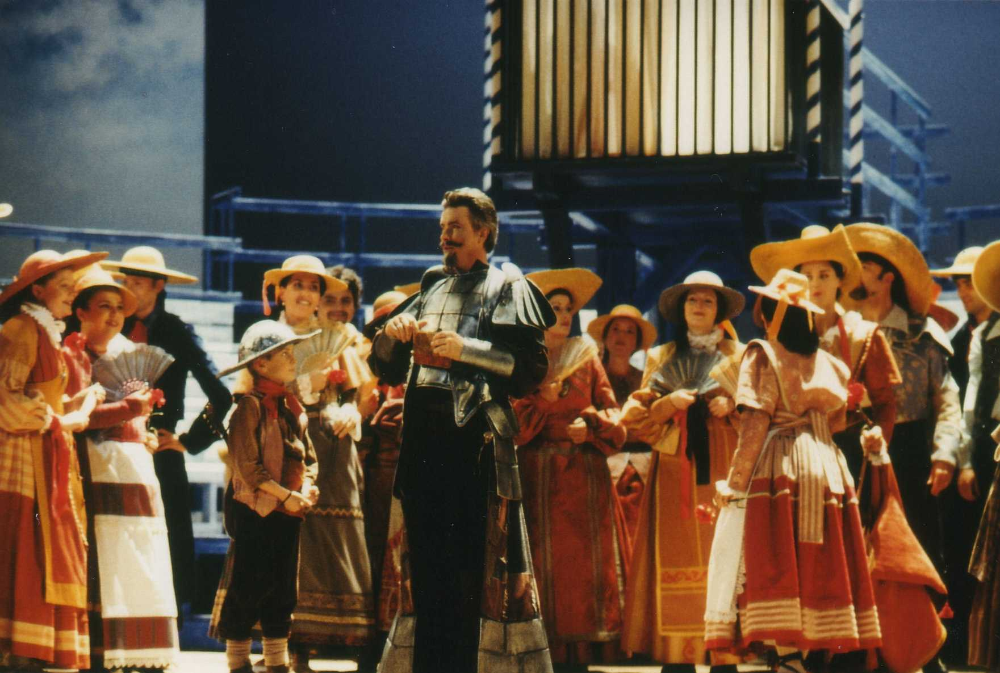
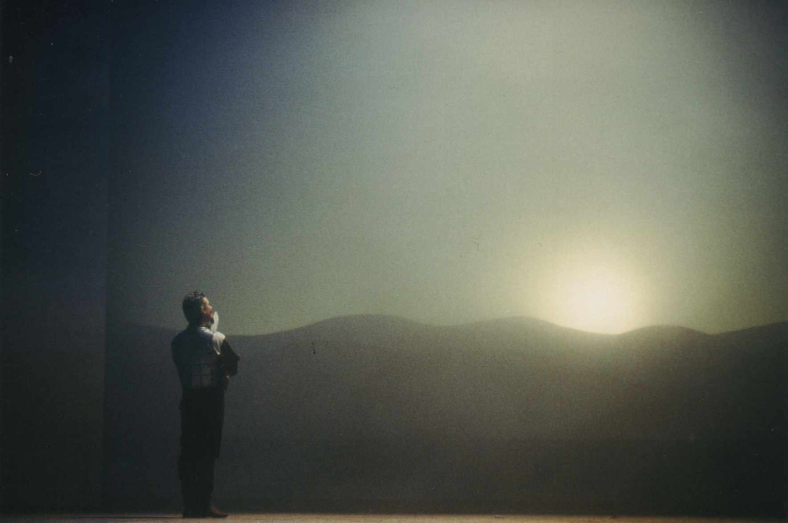
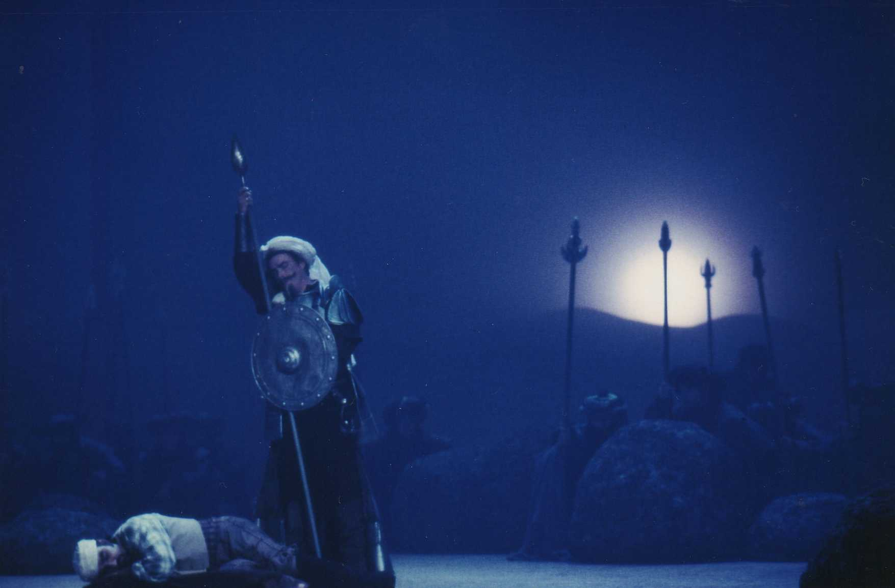
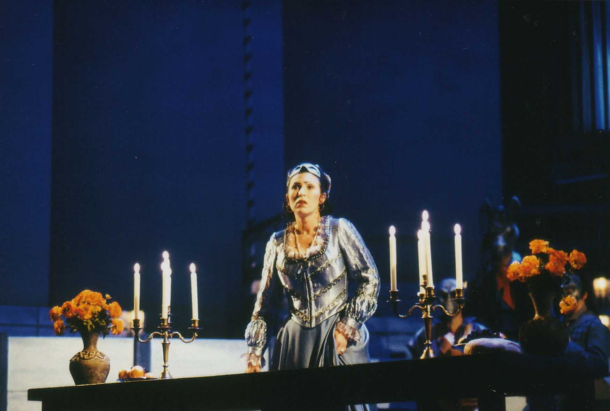

Réalisation de décors pour l'Opéra "Don Quichotte.
            Metteur en scène : Danielle ORY.
            Costumes : Arthur ABALLAIN.
            Lumières : Roberto VENTURI.
            Année de production : 2001

 

 

 

