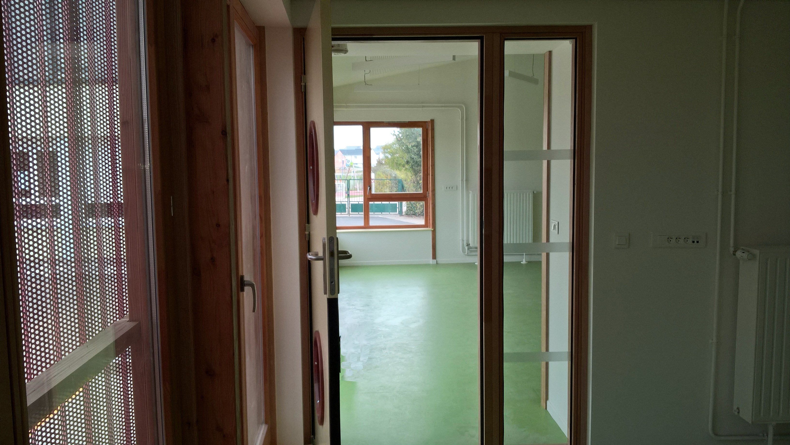
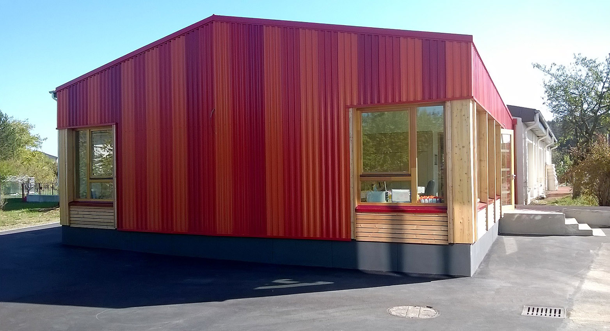
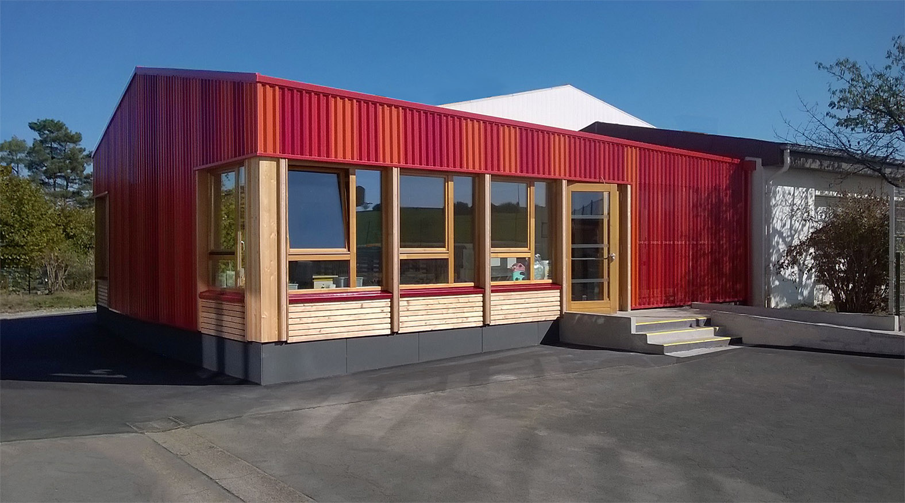
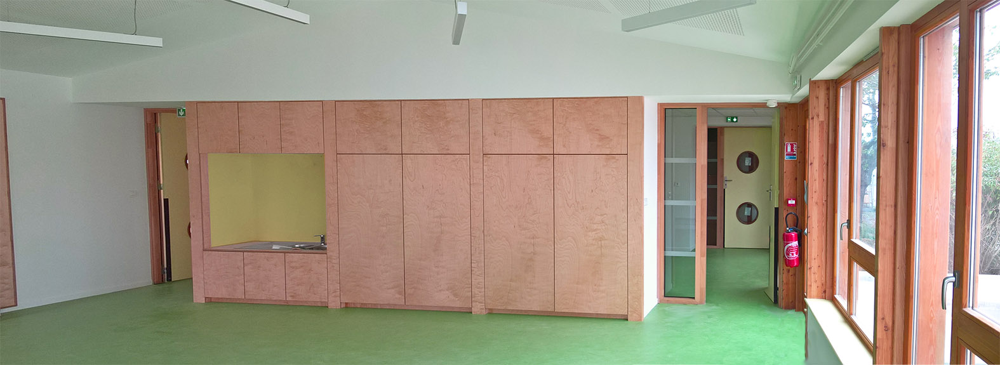
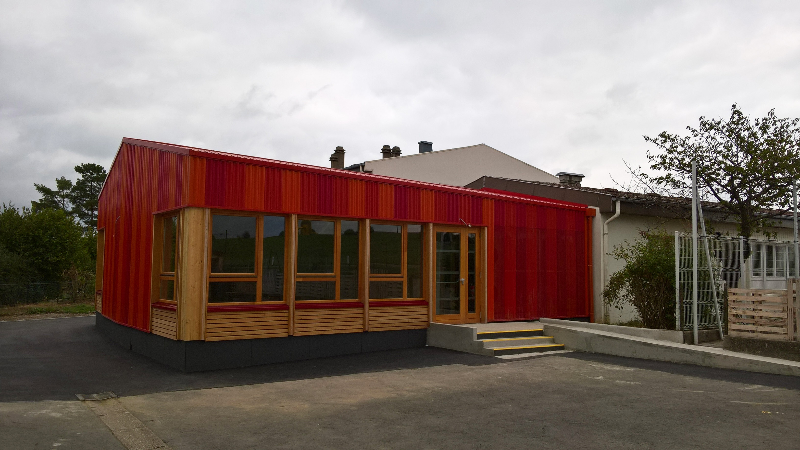

Création d’une salle de classe en extension de l’école
            maternelle.
            Maître d’ouvrage : Commune de Volstroff.
            Collaborations : OMNITECH (B.E.T. Structures), BICOME (B.E.T. Fluides), J. PITOIS
            (Économiste)
            Montant des travaux : 335 600 € (H.T.) Surface : 120 m2
            2017 – 2018

 

 

