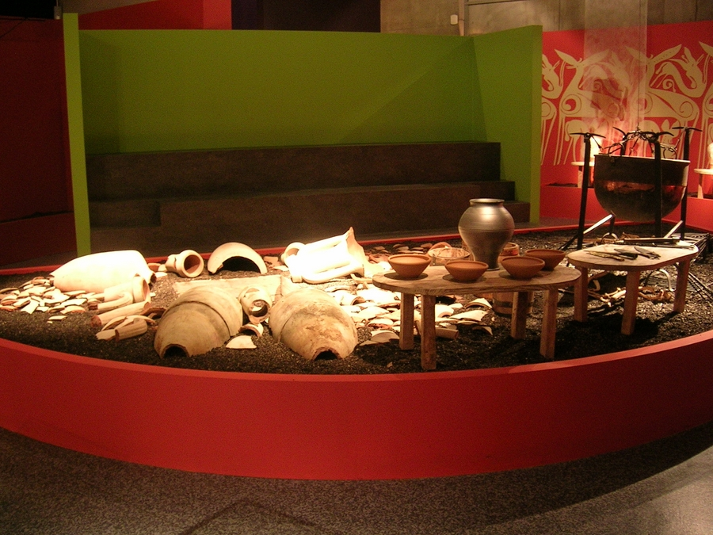
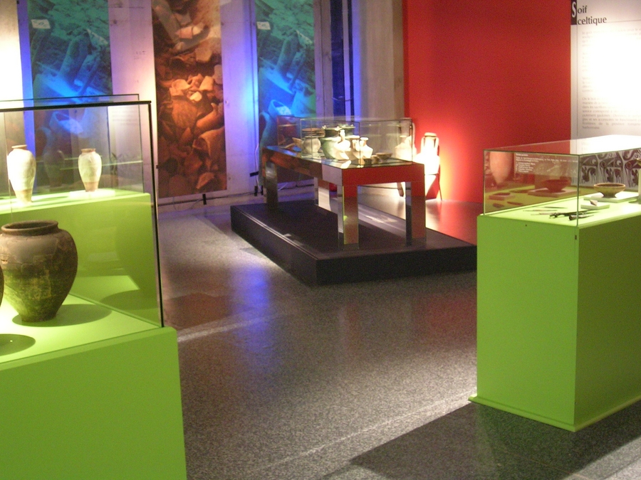
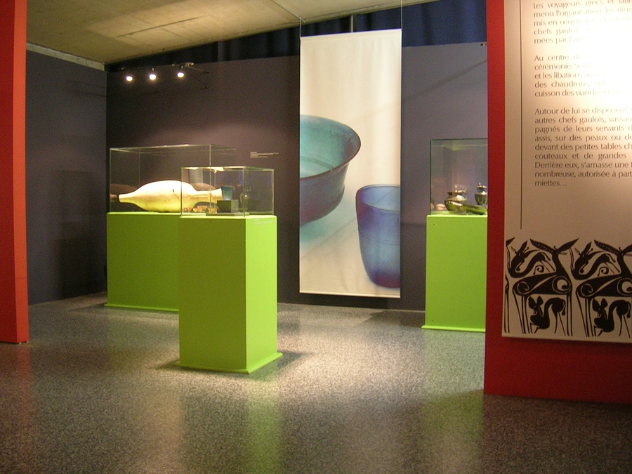
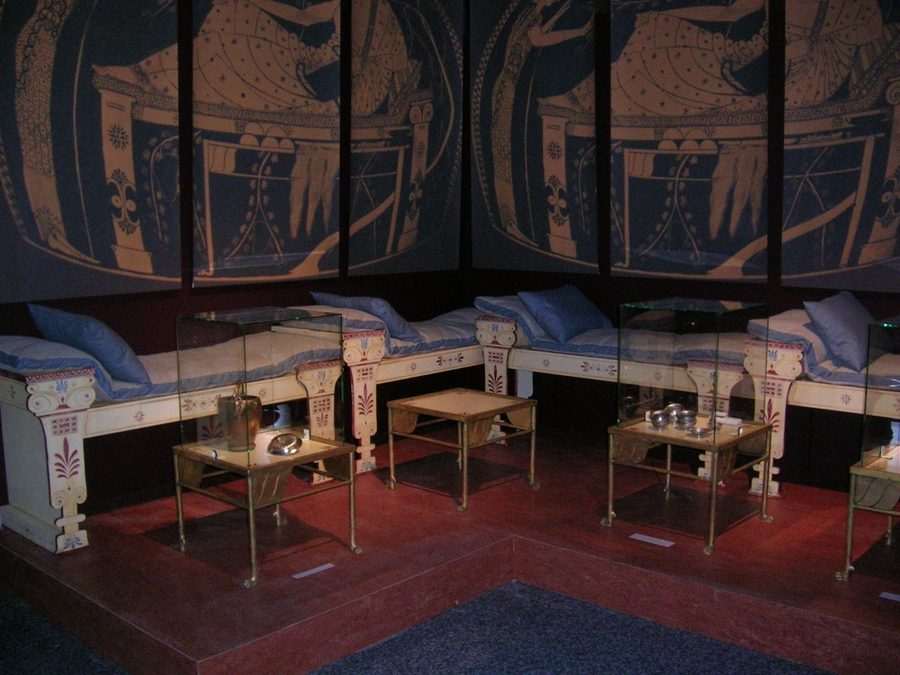
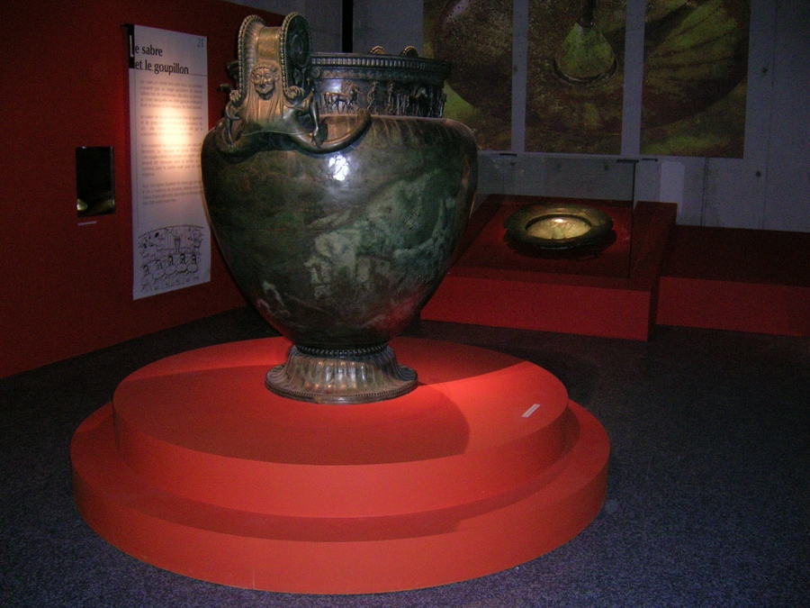
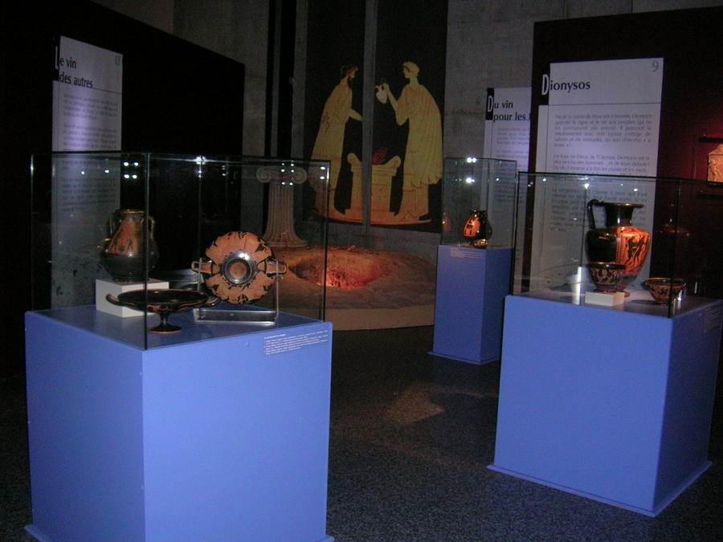

Réalisation scénographique pour une exposition temporaire intitulée
            le vin, plaisir des dieux au Musée de la civilisation Gallo-Romaine à Lyon.
            Maitrise d'ouvrage : Conseil Général du Rhône.
            Coût : 550 000 € (HT) | Surface : 800 m².
            2004 - 2005

 

 

 

