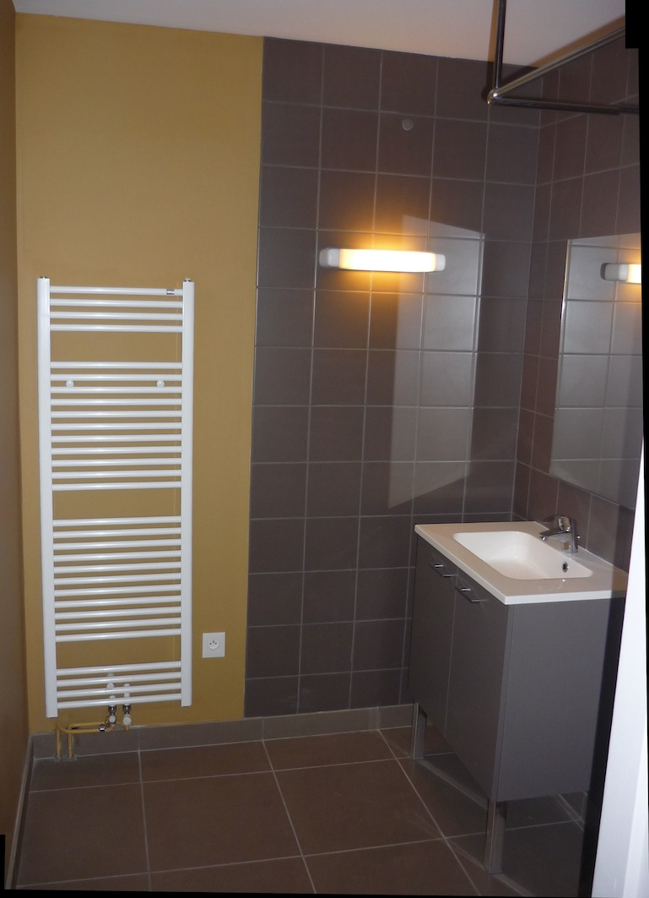
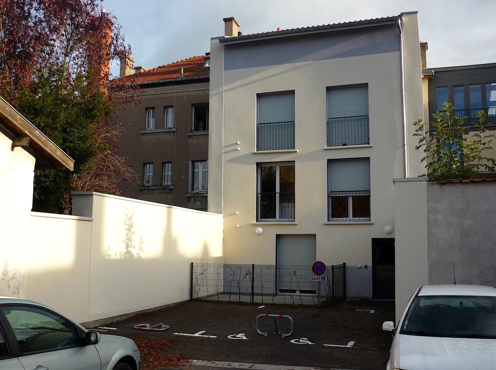
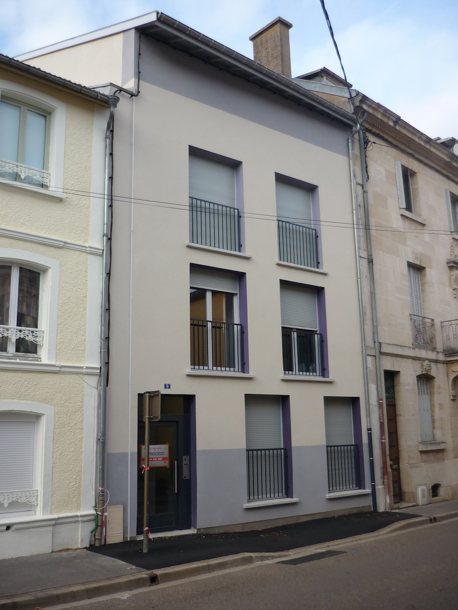
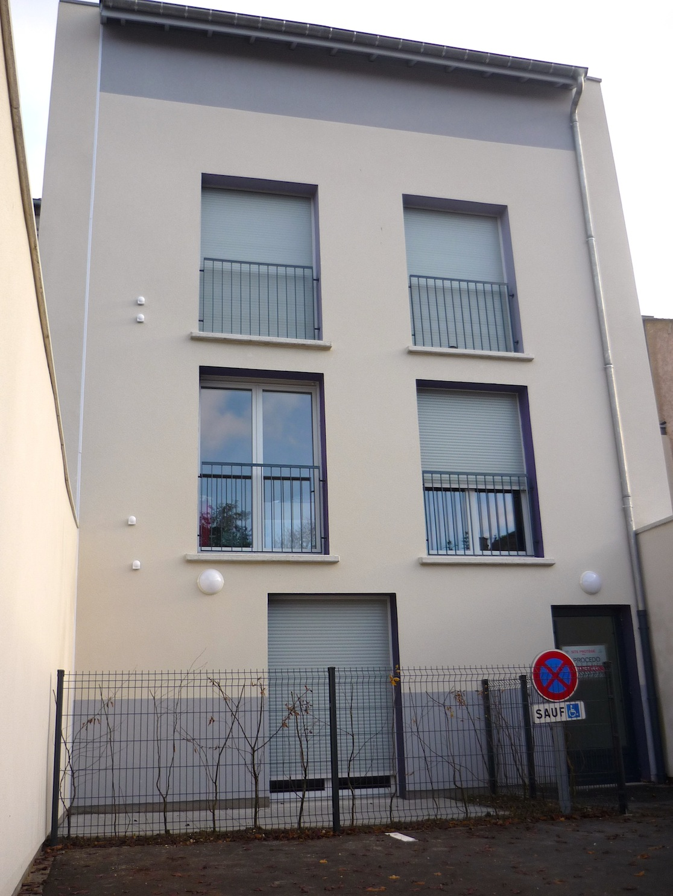
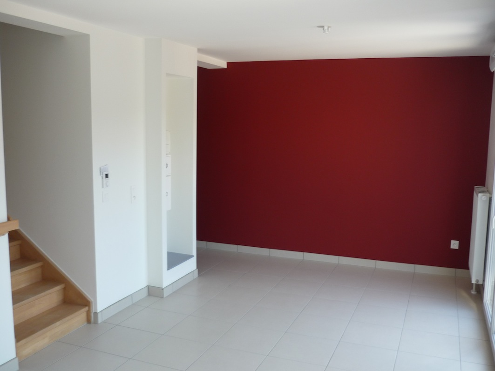

Construction d’un immeuble d’habitation collectif de 4 appartements en
            centre ville (2T2, 1T4 et 1T5).
            Maître d’ouvrage : OPHLM de la Meuse, Bar le Duc.
            Collaborations : SECALOR (B.E.T.), ETF INGENIERIE S.A.S. (B.E.T.)
            Montant des travaux : 496 700 € (H.T.) Surface : 380 m2
            2014 – 2015

 

 

