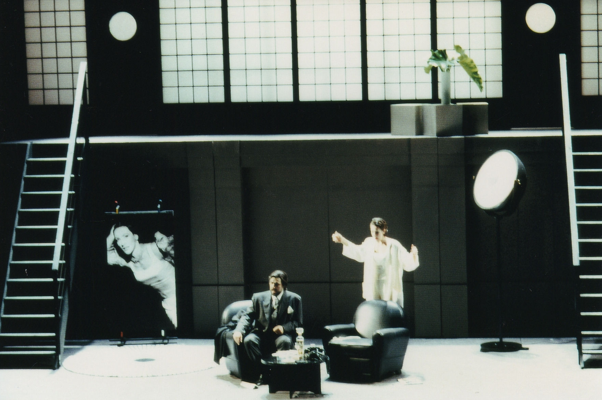
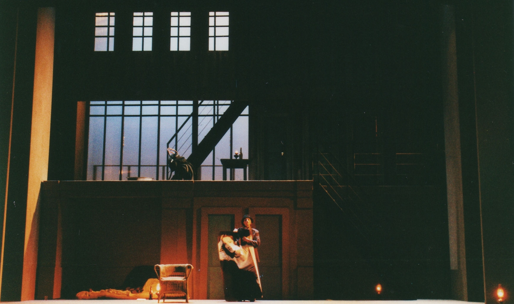
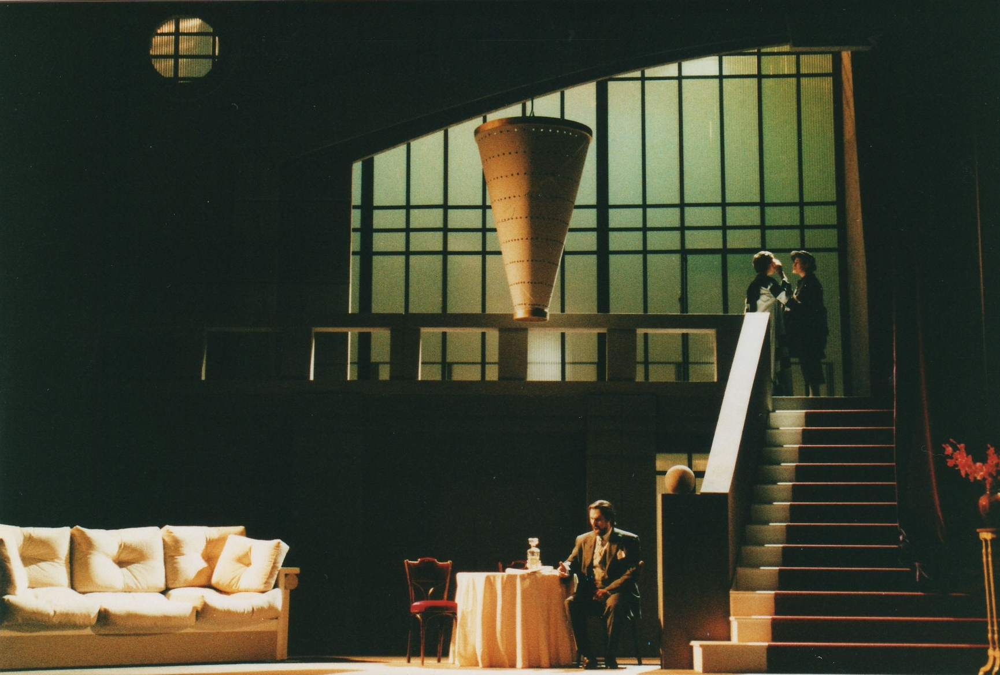
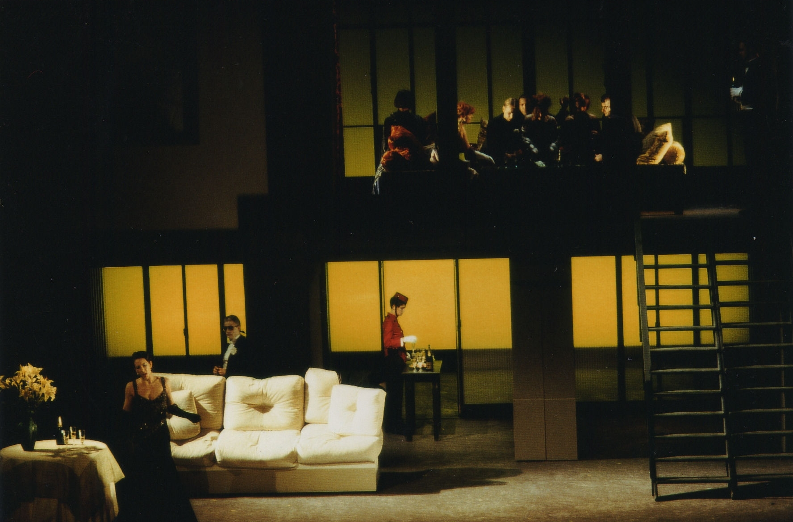
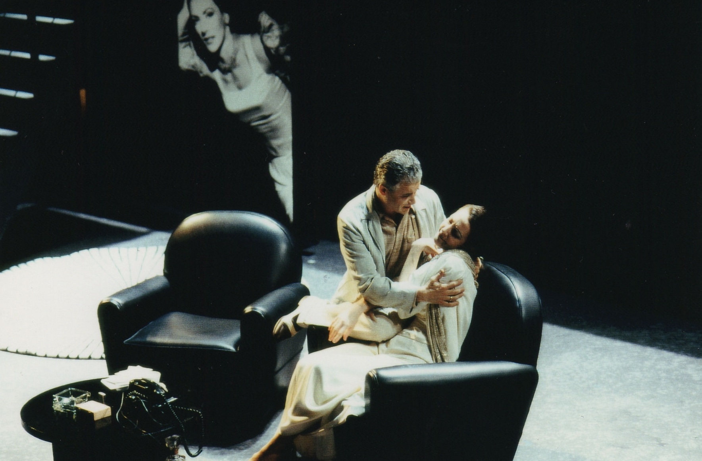

Réalisation de décors pour l'Opéra "Lulu".
            Metteur en scène : Danielle ORY.
            Costumes : Arthur ABALLAIN.
            Lumières : Robert VENTURI.
            Année de production : 2000

 

 

