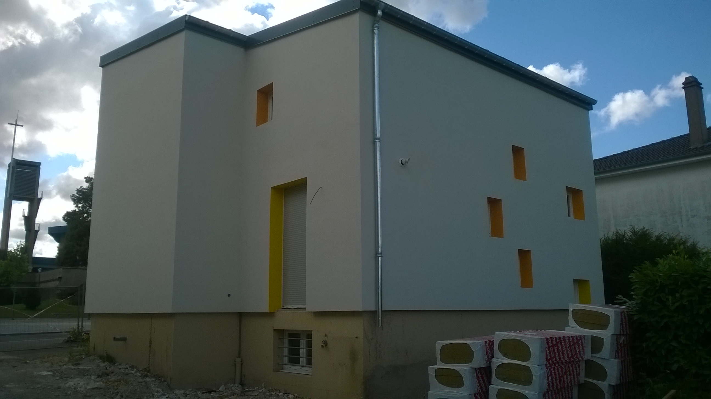
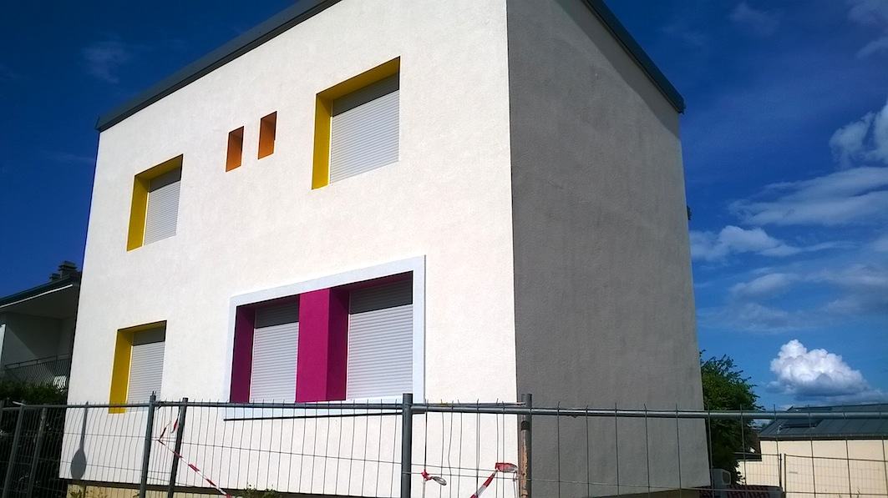
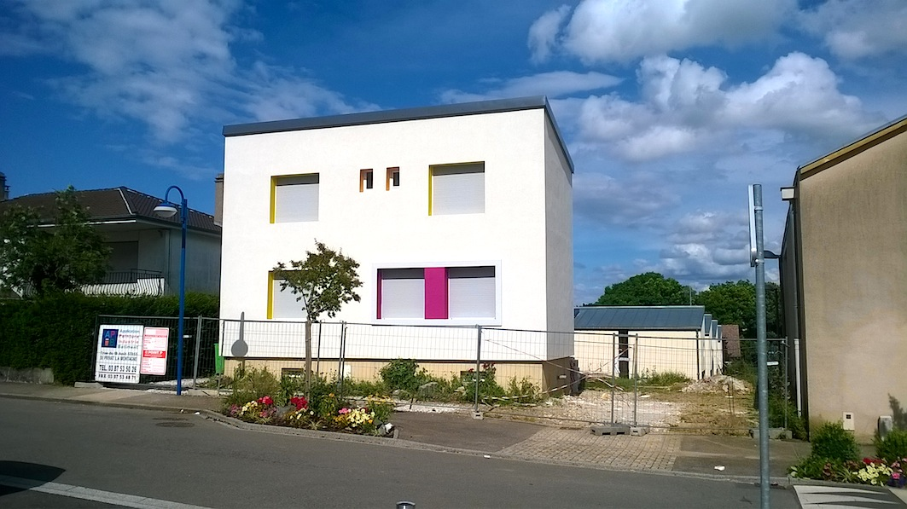

Rénovation d’une ancienne maison unifamiliale, en centre ville.
            Maître d’ouvrage : Commune de Semécourt.
            Montant des travaux : 128 500 € (H.T.) Surface : 150 m2
            2016
        

 

d