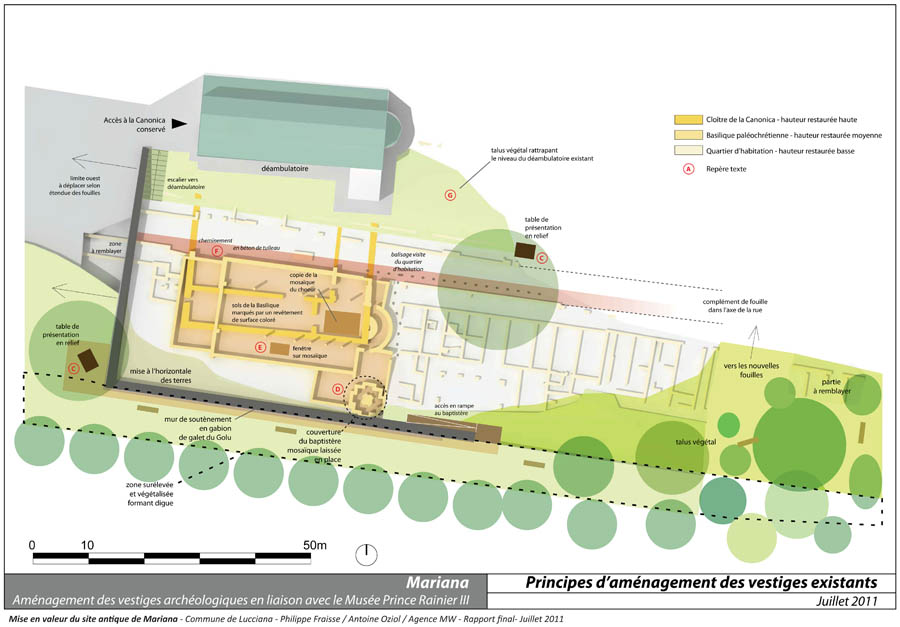
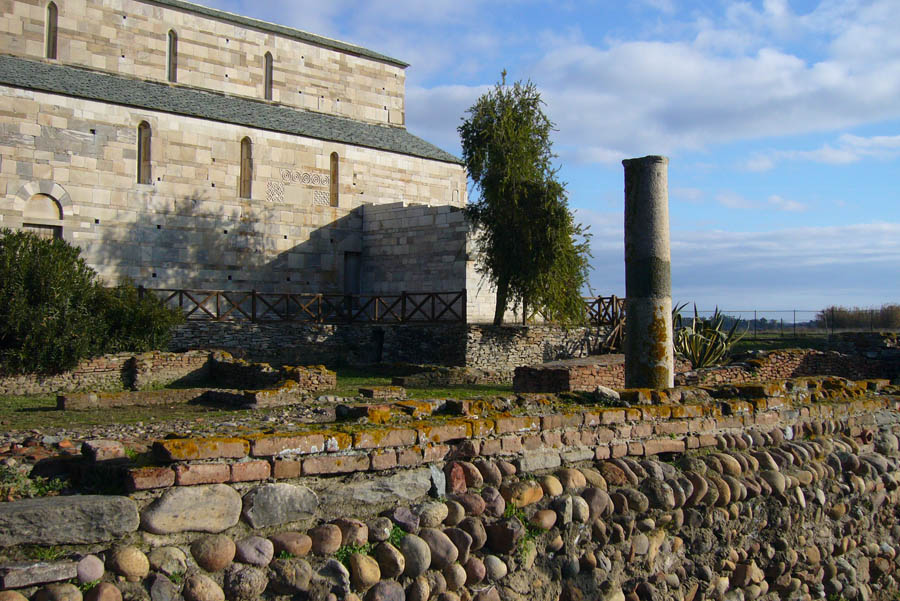
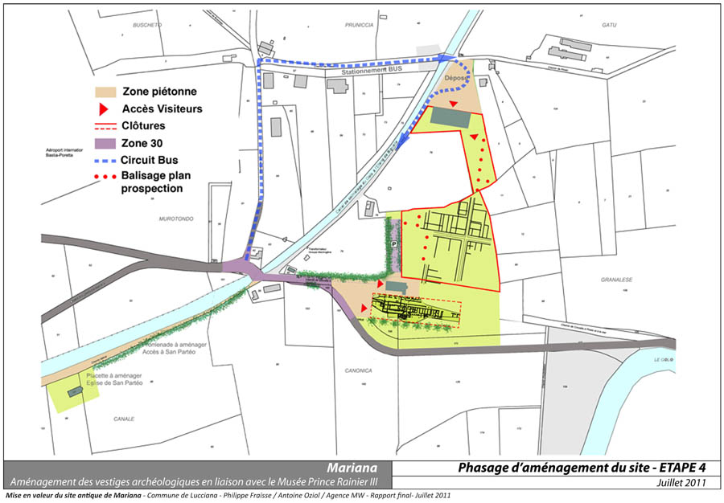
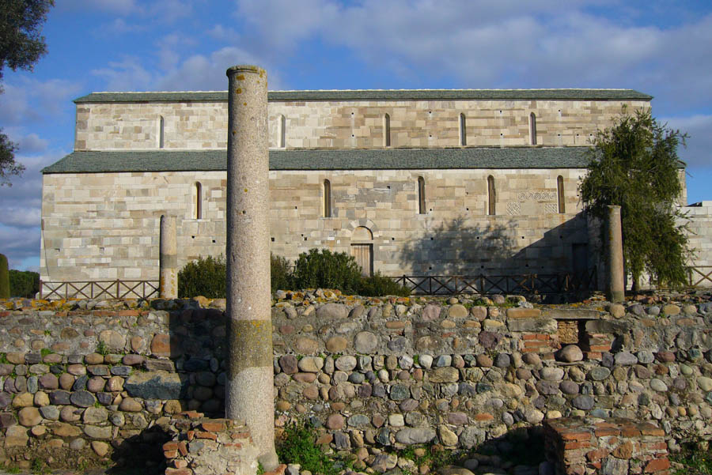
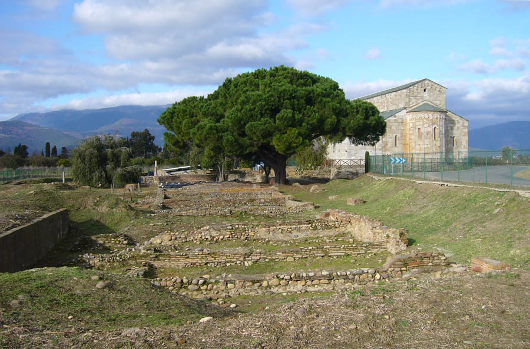
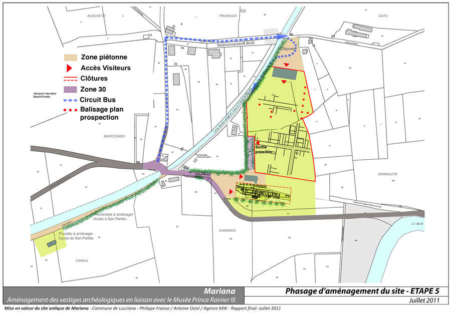
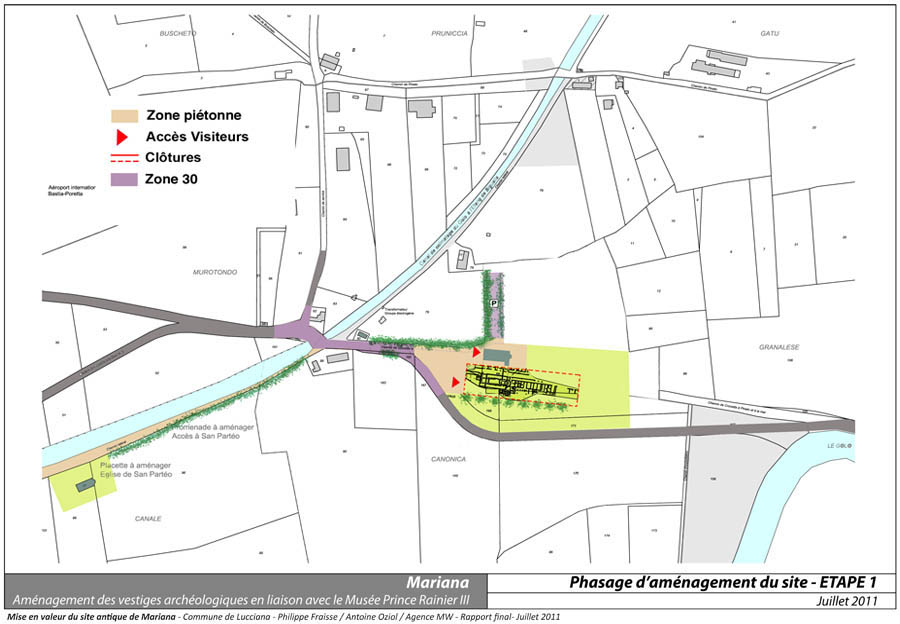
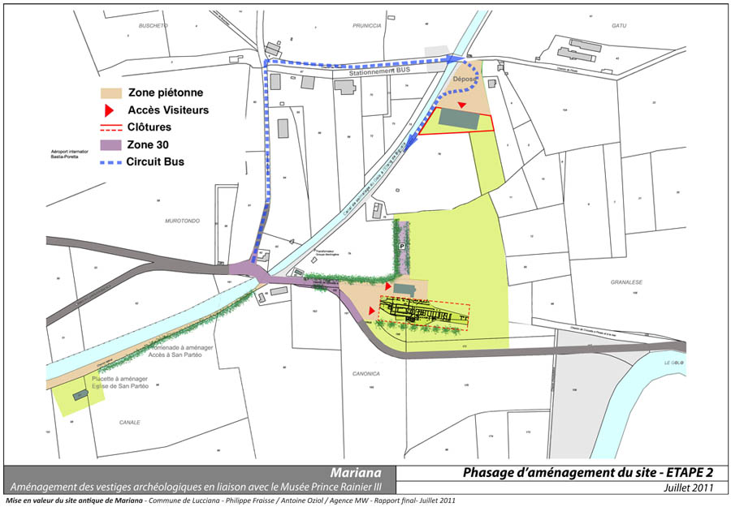
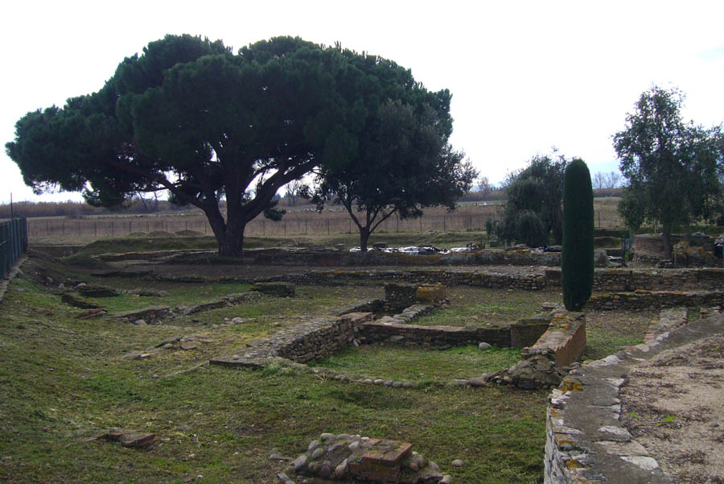
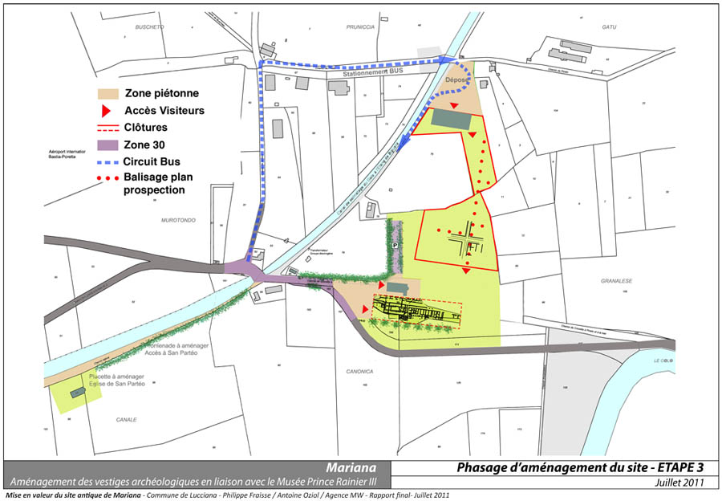

Etude en vue de l'aménagement du site archéologique de Mariana à
            LUCCIANA (Haute Corse).
            Diagnostic et prospective.
            Maîtrise d'ouvrage : Commune de Lucciana.
            Architectes associés : F. Muller et A. Oziol.
            2011

 

 

 

 

 

