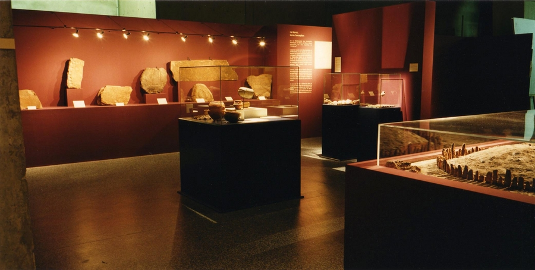
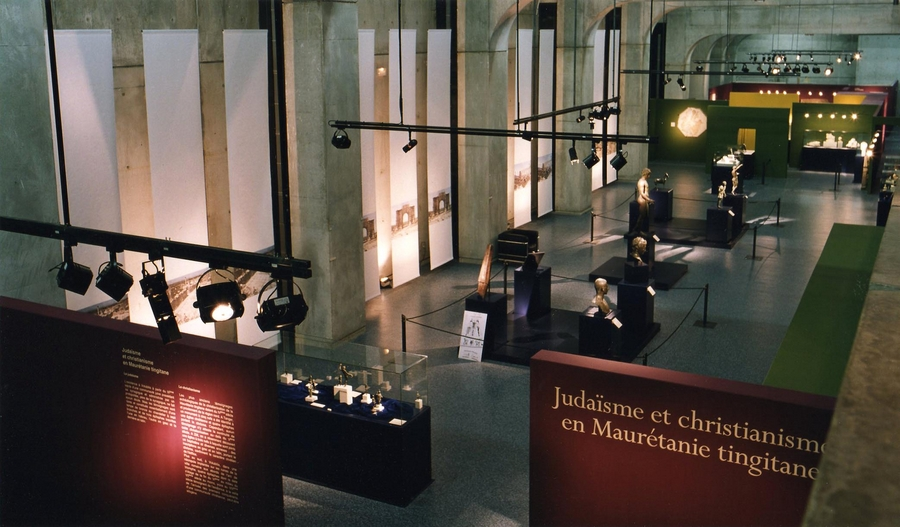
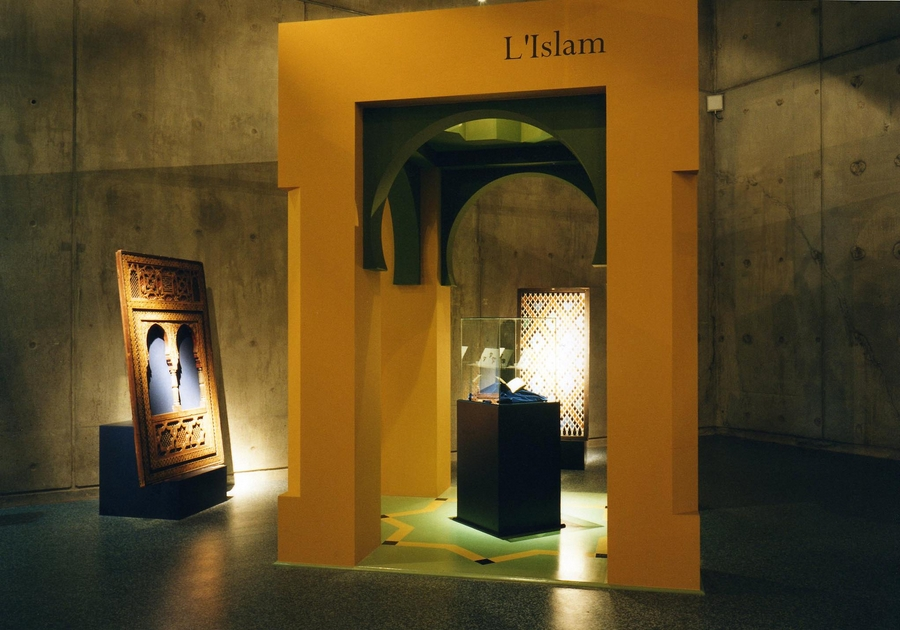
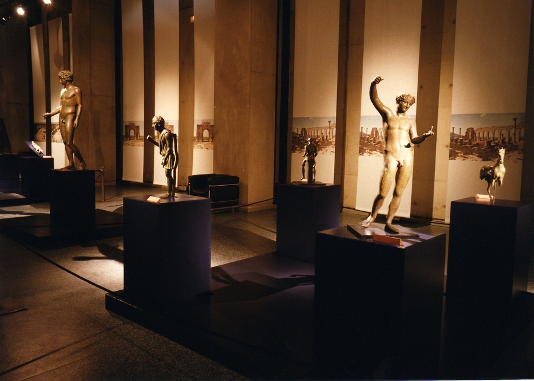

Réalisation scénographique pour une exposition temporaire intitulée
            "Le Maroc des origines" au Musée de la civilisation Gallo-Romaine à Lyon.
            Maitrise d'ouvrage : Conseil Général du Rhône.
            Coût : 350 000 € (HT) | Surface : 750 m².
            1999 - 2000.

 

 

