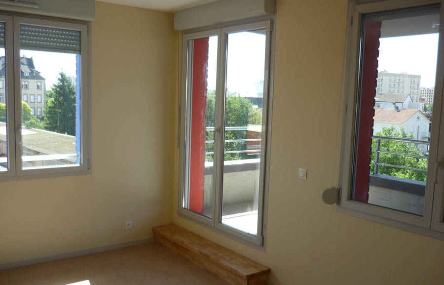
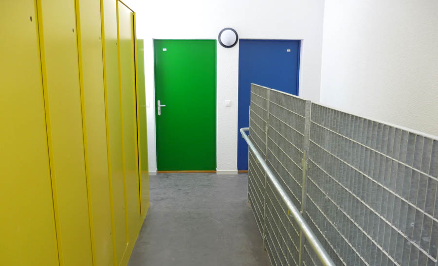
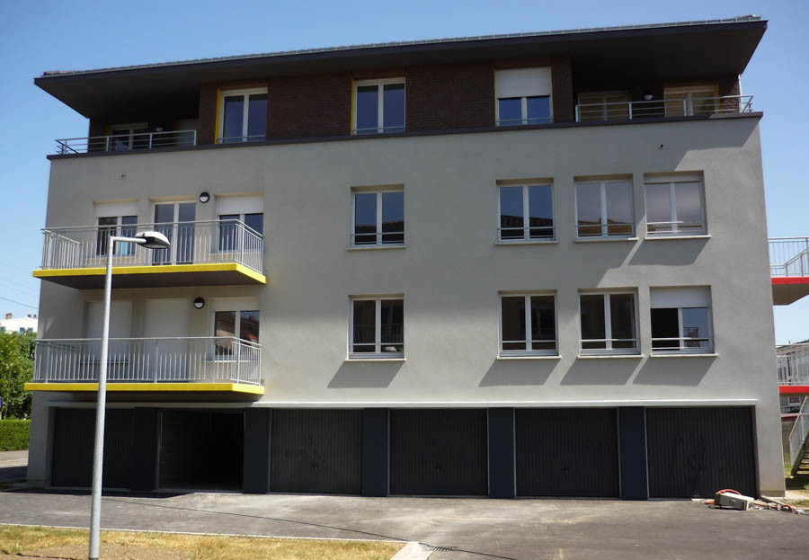
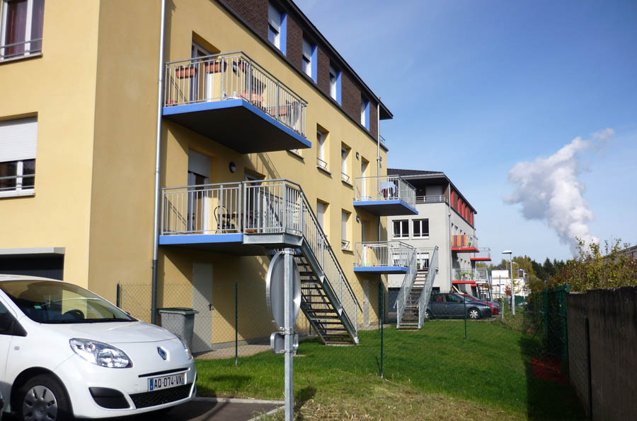
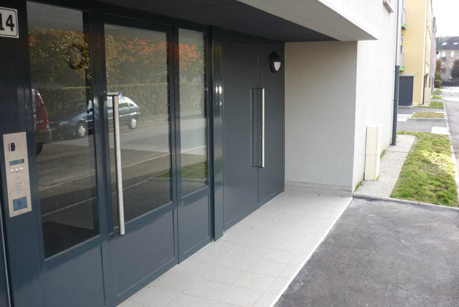
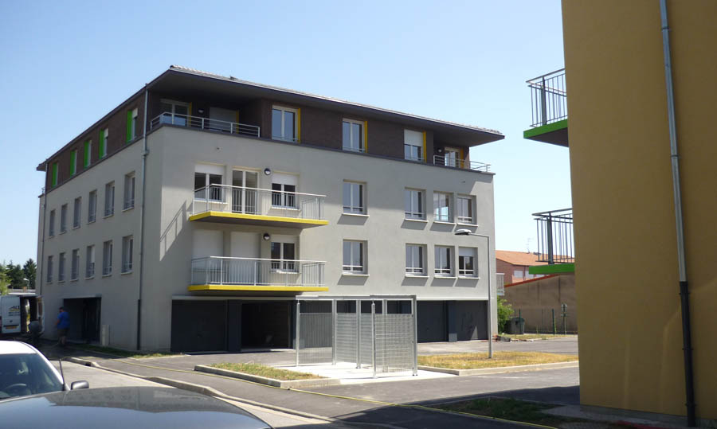
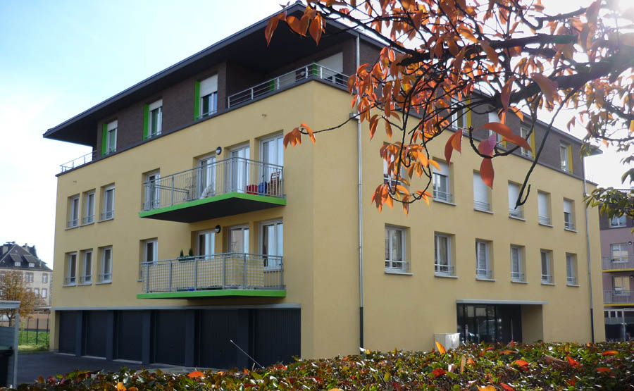
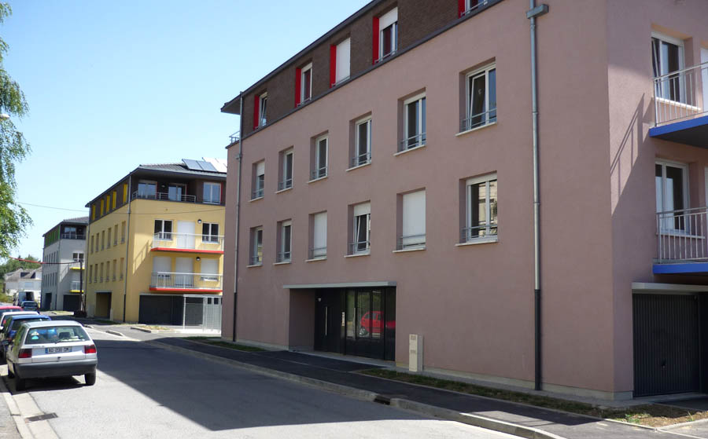
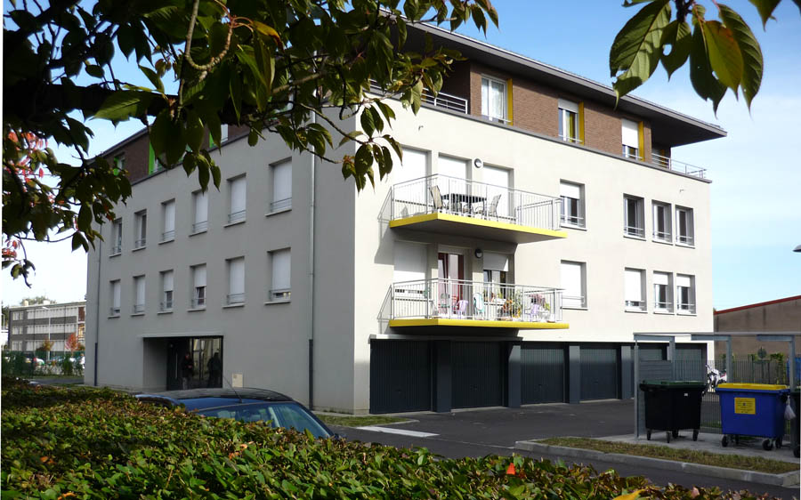
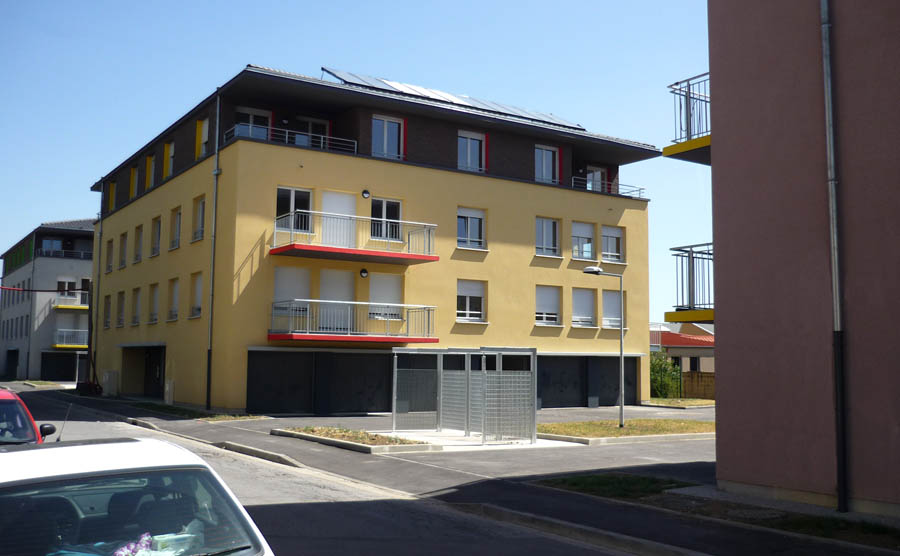

Construction de 36 logements, répartis sur trois immeubles-villas de 12
            logements (3 F2, 4 F3, 3 F4 et 2 F5).
            Maitrise d'ouvrage : MOSELIS, Metz.
            Architecte associé : Cabinet O. SEYLER et J. LUCAN
            Collaboration : E.S.F.F.O. (B.E.T.), SOGECLI (B.E.F.), C.E.T. P. HUMBERT (Economiste).
            Montant des travaux : 3 346 823 € (HT) | Surface : 3 046 m² (S.U)
            2008 - 2010

 

 

 

 

 

