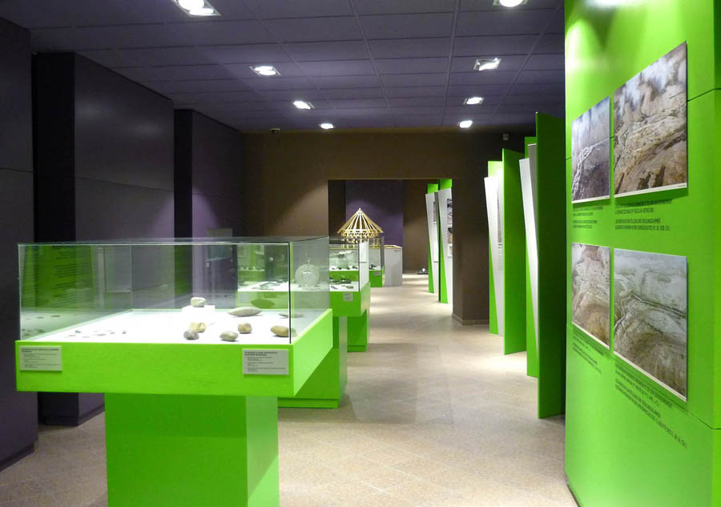
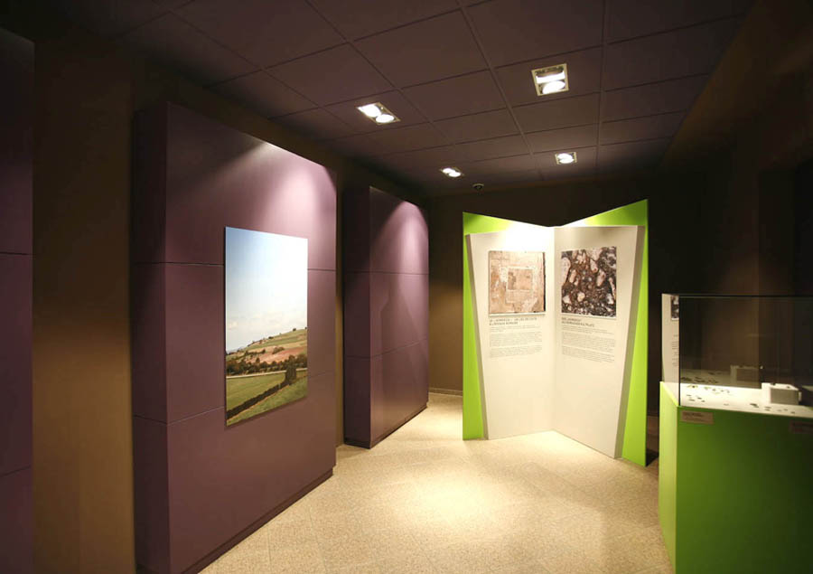
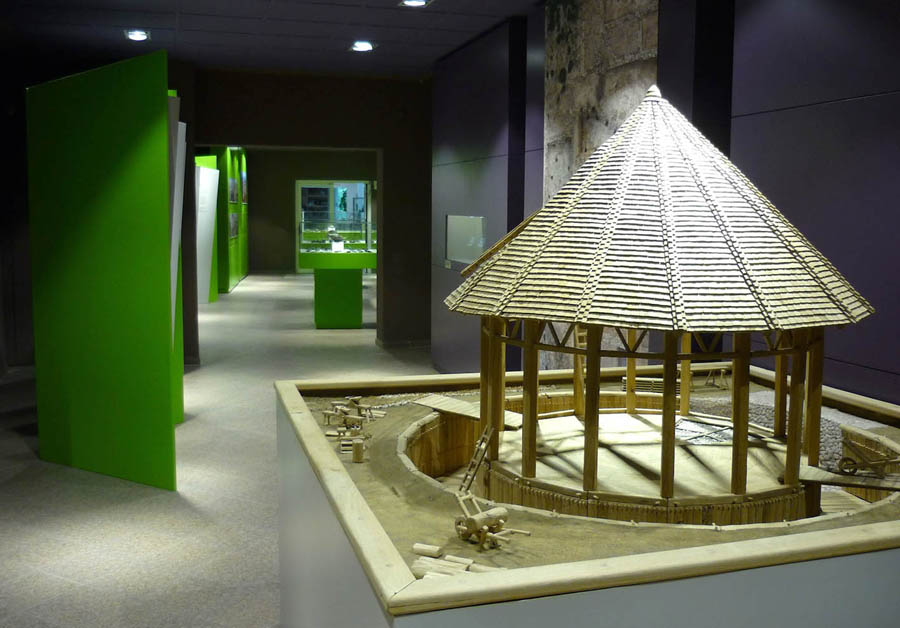
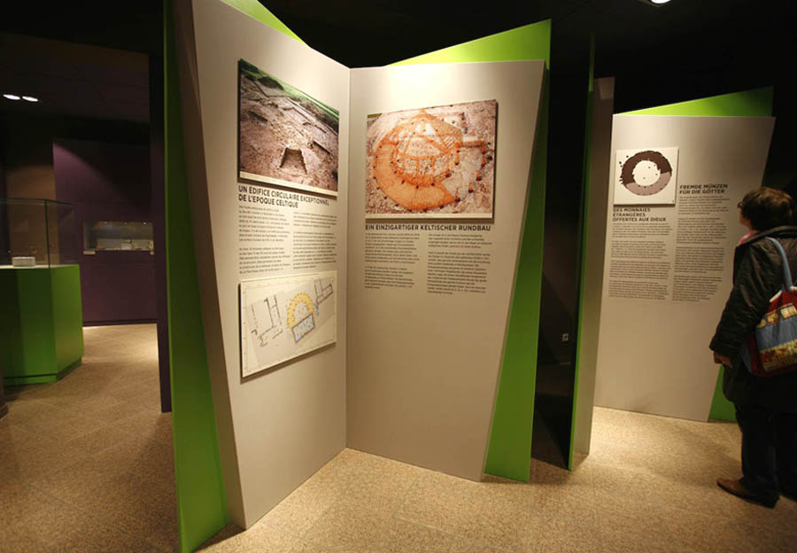
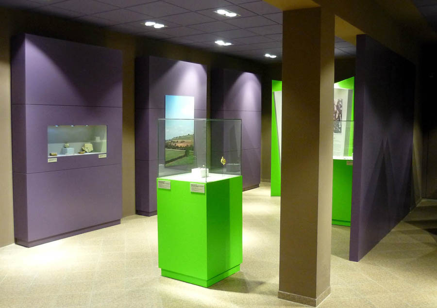

Rénovation du musée et scénographie dans le cadre de la
            présentation permanente "Exposition parcours 2013, 2500 ans d’histoire
            commune en Moselle et en Sarre" au Parc archéologique Européen de
            Bliesbruck-Reinheim.
            Maitrise d'ouvrage : Saarpfalz-Kreis.
            Graphiste associé : Atelier Martial DAMBLANT.
            Éclairagiste associé : Roberto VENTURI.
            Coût : 42 000 € (H.T.) | Surface : 150 m².
            2013

 

 

