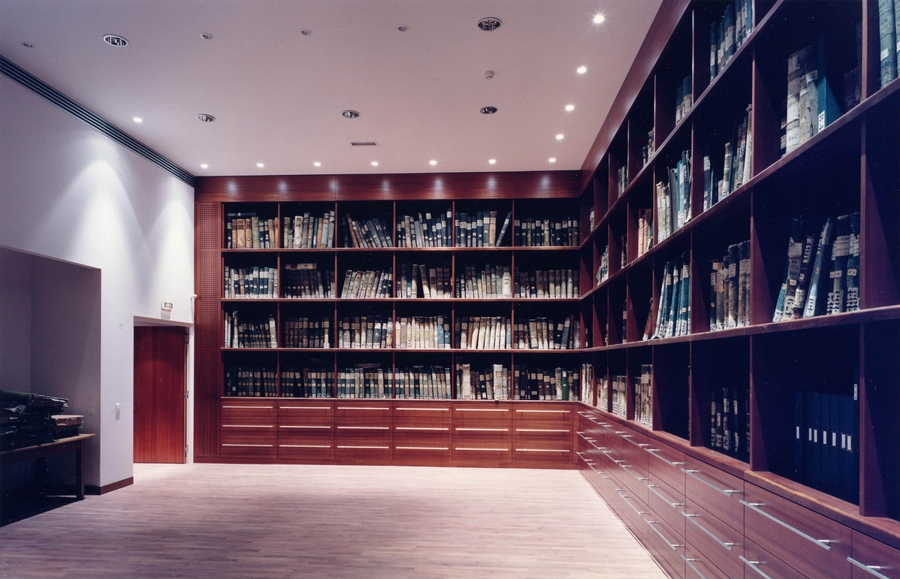
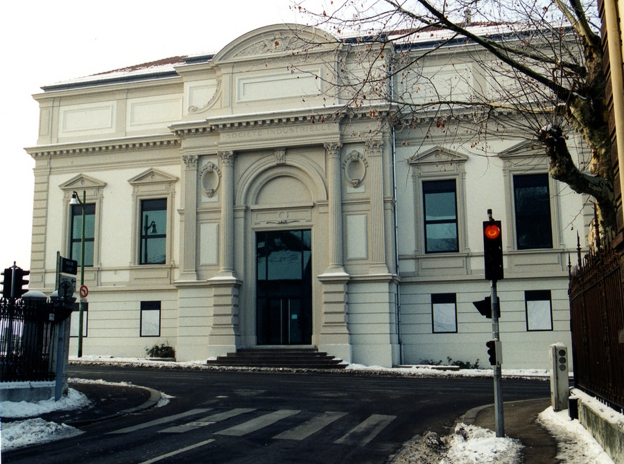
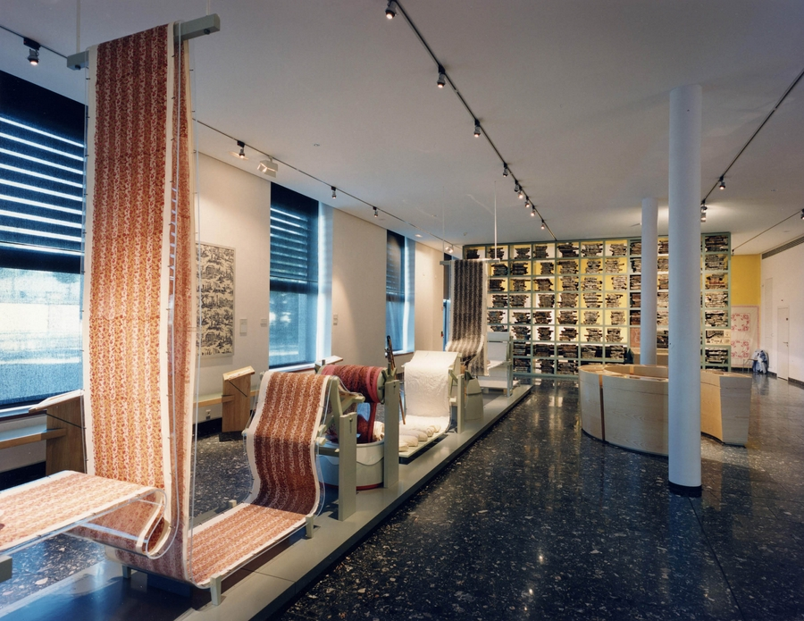
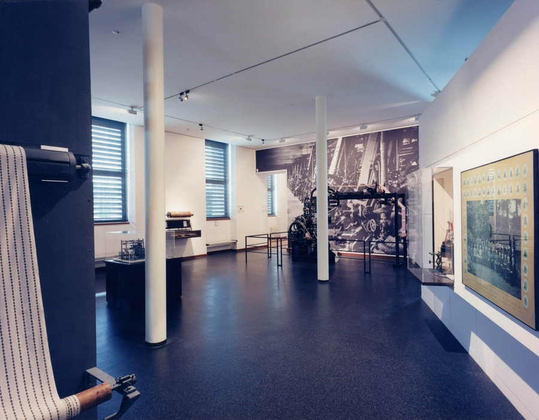
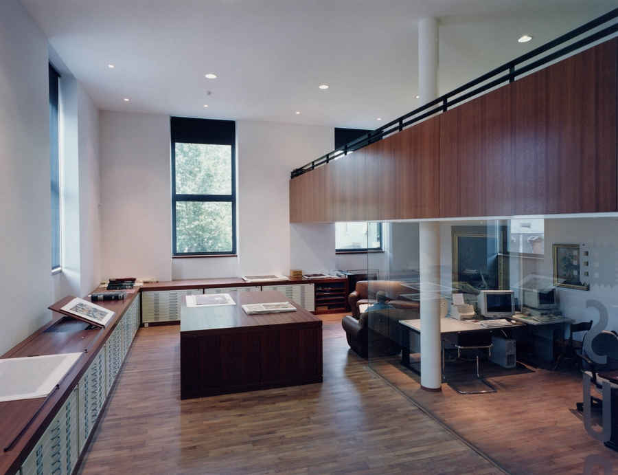
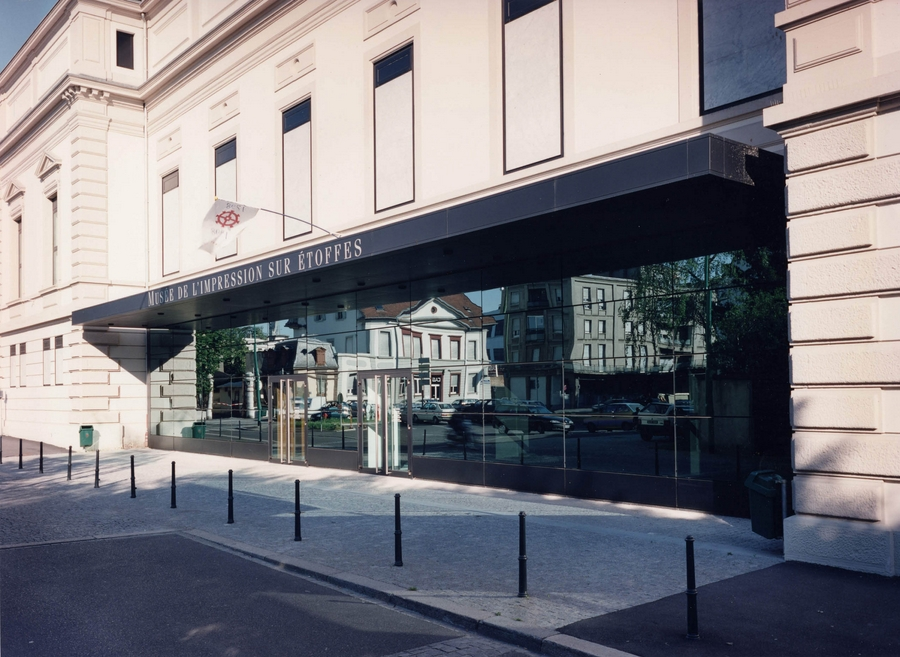
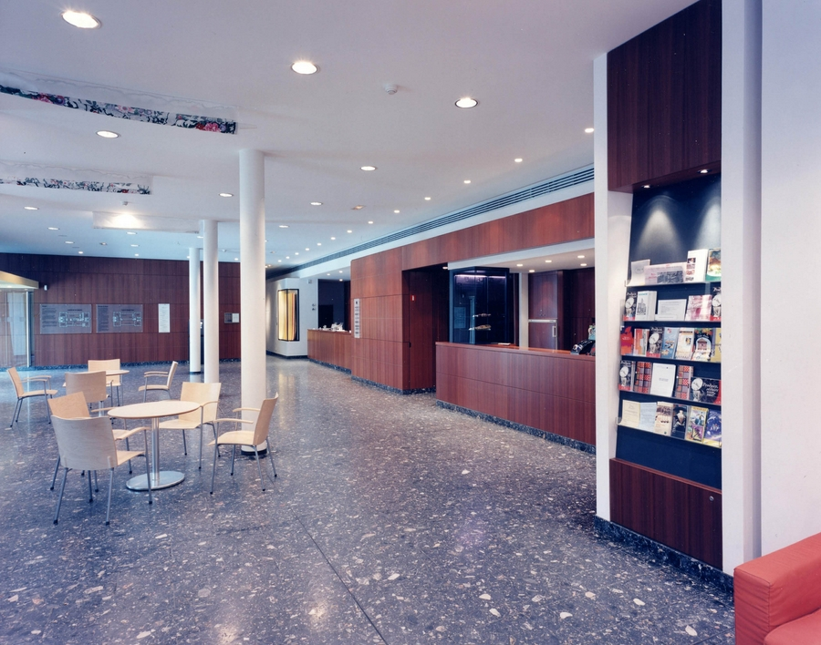

Réhabilitation d'un bâtiment pré-existant datant du XIXème
            siècle.
            Maitrise d'ouvrage : Association du M.I.S.E. / Société Industrielle de
            Mulhouse
            Architectes associés : P. WEBER & P. KEILING
            Collaboration : J. HABERSETZER (Muséographe).
            Montant des travaux : 4 730 000 € (HT)
            2000-2002

 

 

 

