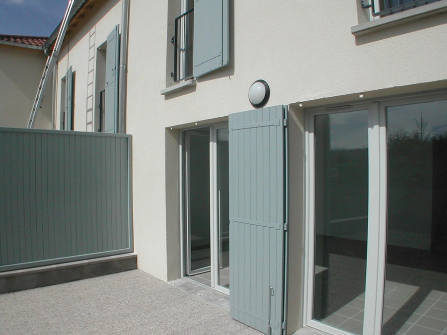
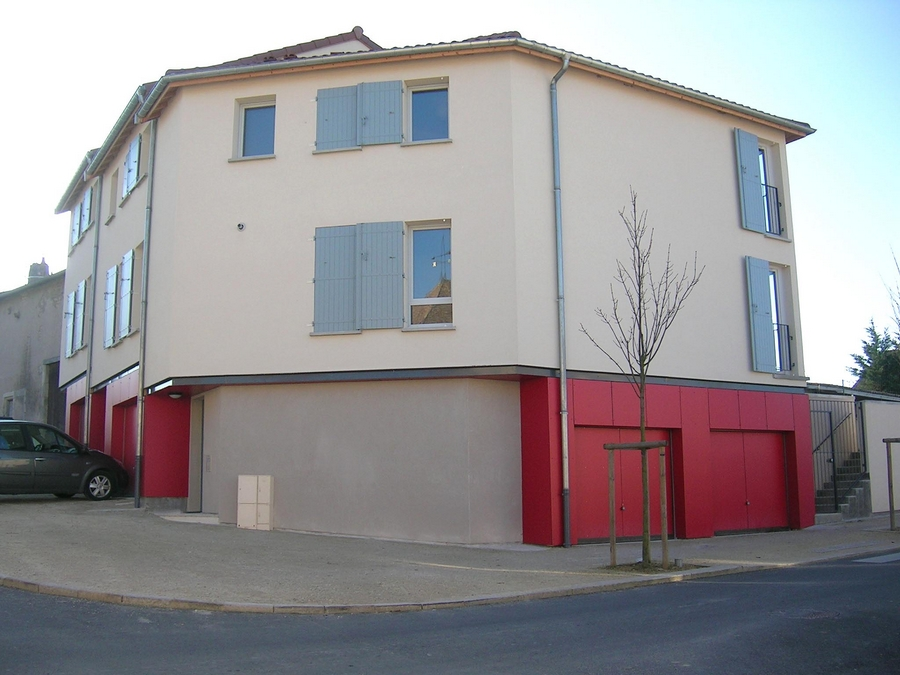
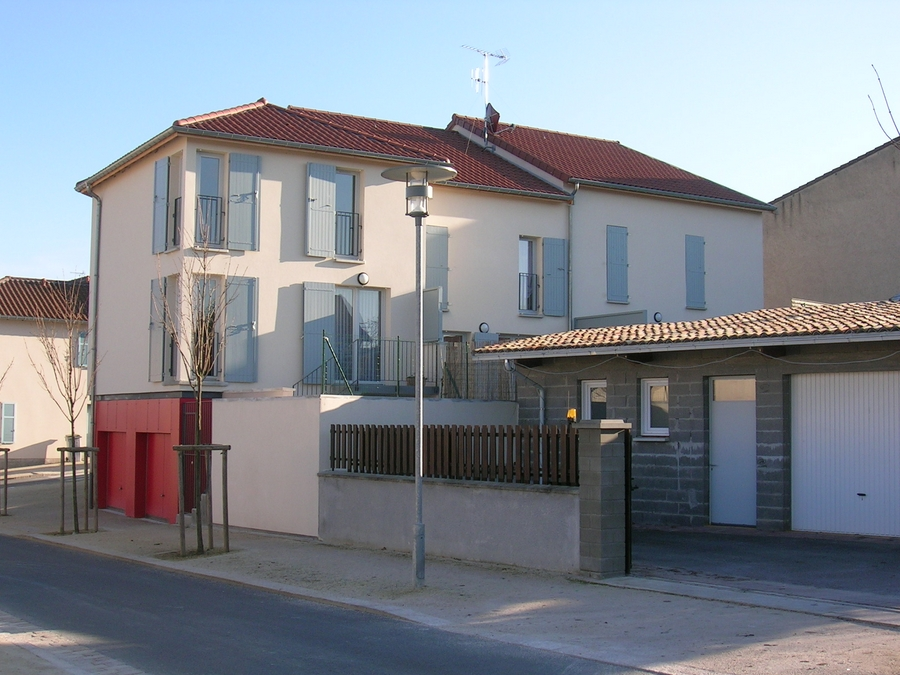
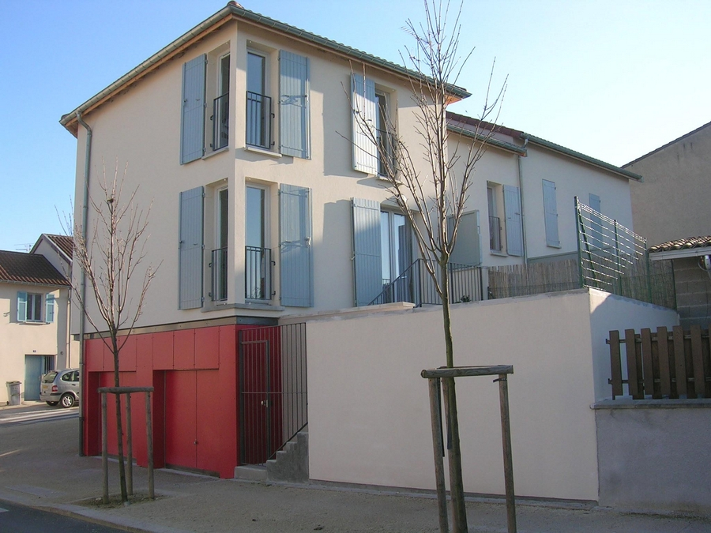
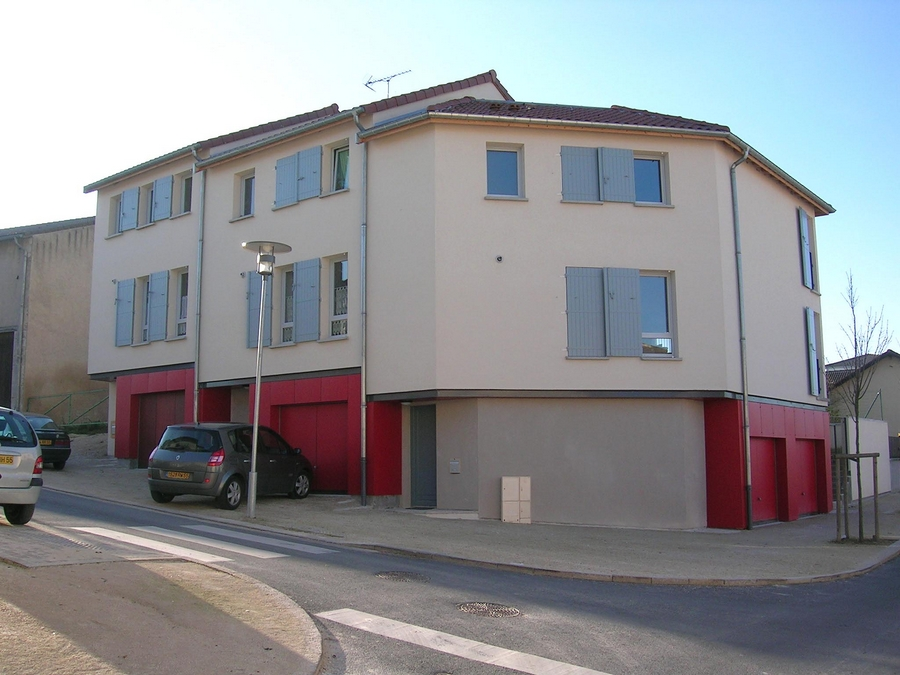

Construction de 3 logements locatifs individuels à Commercy.
            Maitrise d'ouvrage : G.I.E. L.S.M. (OPAC de la Meuse).
            Collaboration : J. PITOIS (Economiste)
            Montant des travaux : 276 000 € | Surface : 345 m² (S.U).
            2005-2006

 

 

