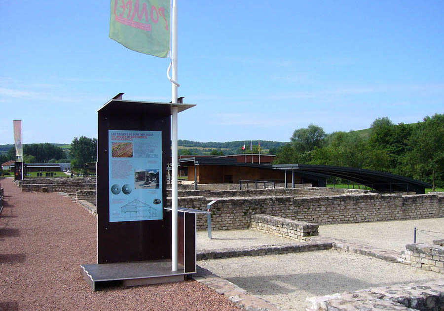
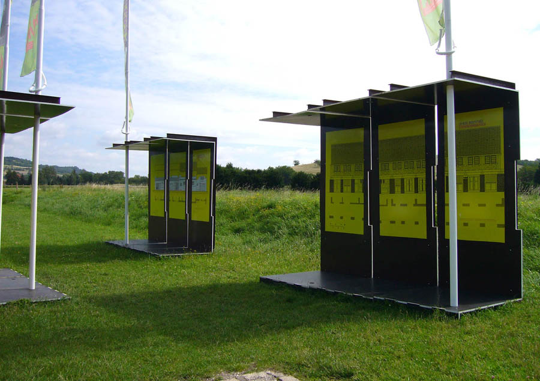
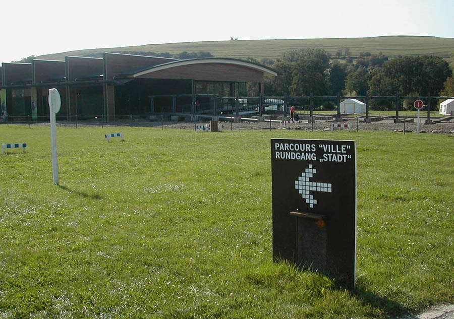
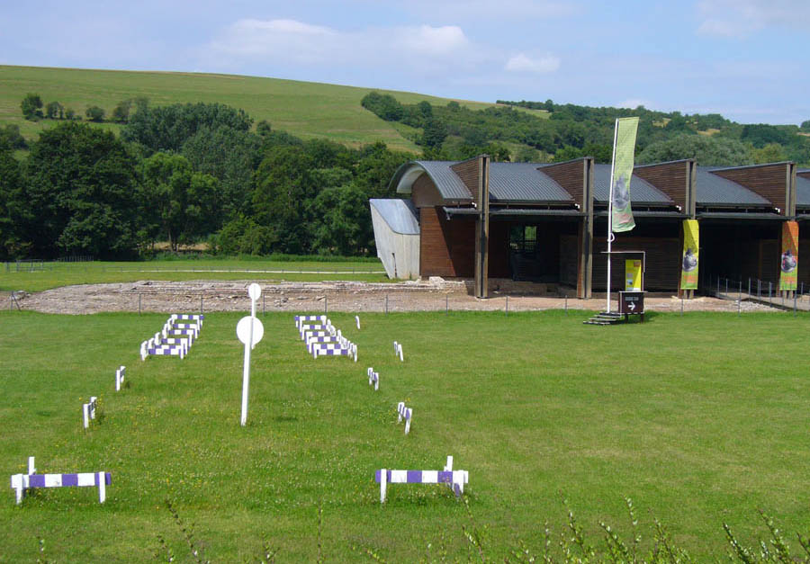
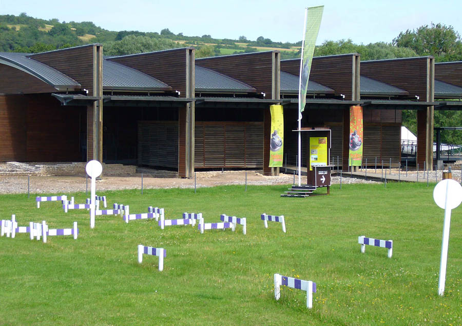

Réalisation scénographique pour un parcours d'interprétation en
            rapport avec l'exposition "Pompei" Parc archéologique Européen de
            Bliesbruck-Reinheim.
            Maitrise d'ouvrage : Conseil Général de Moselle.
            Graphiste associé : Atelier Martial DAMBLANT
            2007

 

 

