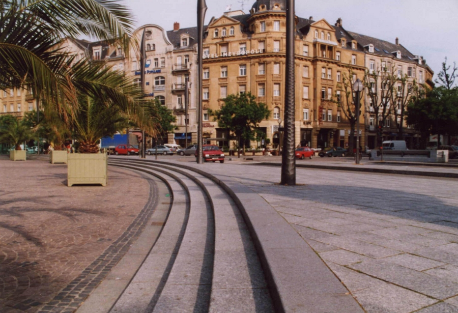
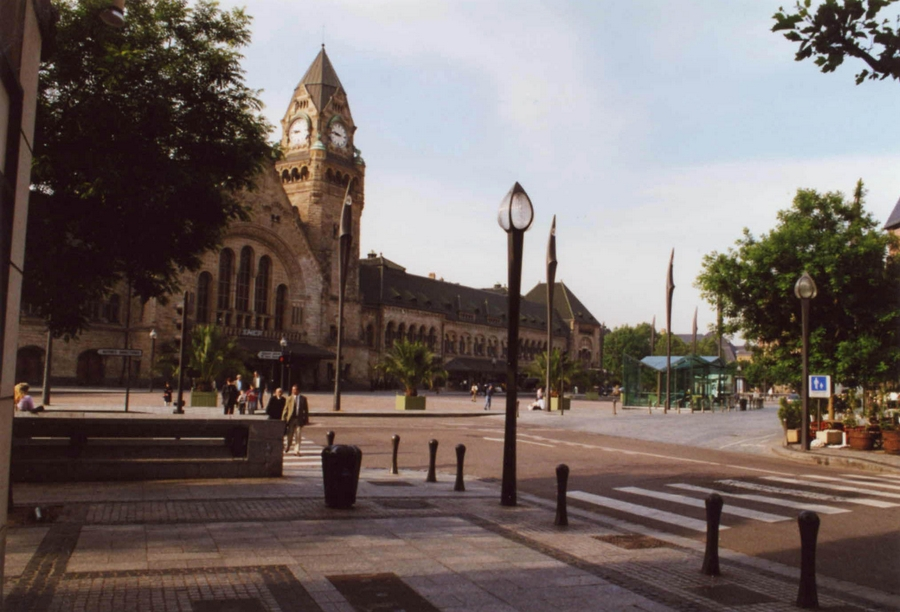
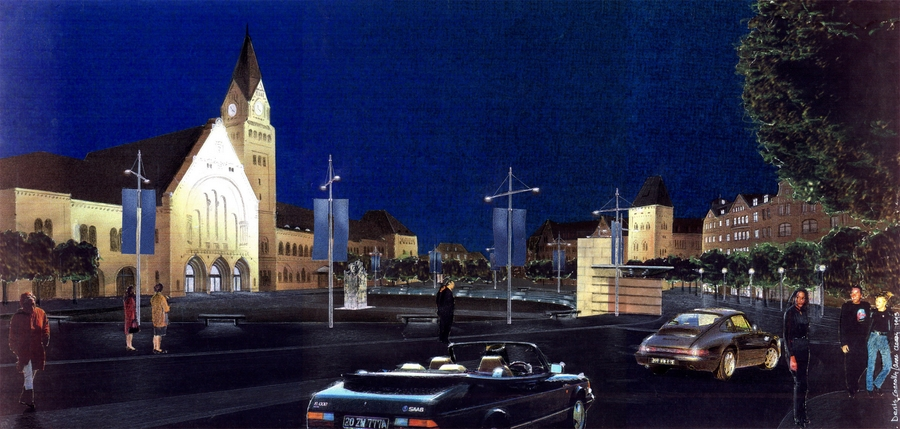

Aménagement de la place du Général de Gaulle (GARE S.N.C.F.).
            Maitrise d'ouvrage : Ville de Metz.
            Architecte associé : Bernard Huet.
            Collaboration : O.G.I (B.E.T.).
            Montant des travaux : 3 354 000 € (HT) | Surface : 20 000 m².
            1994

 

