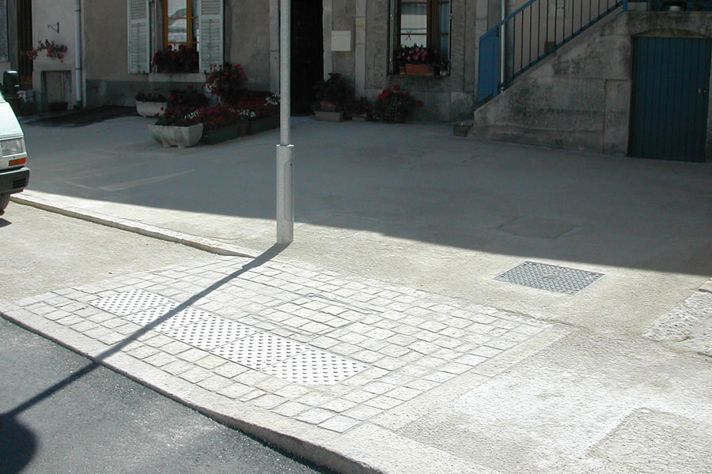
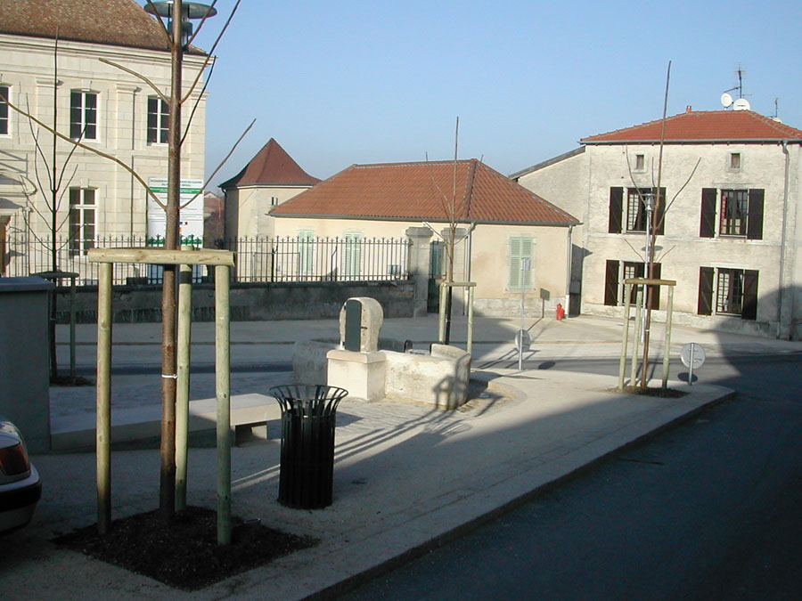
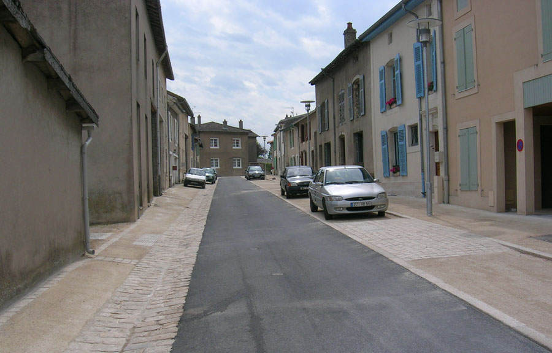
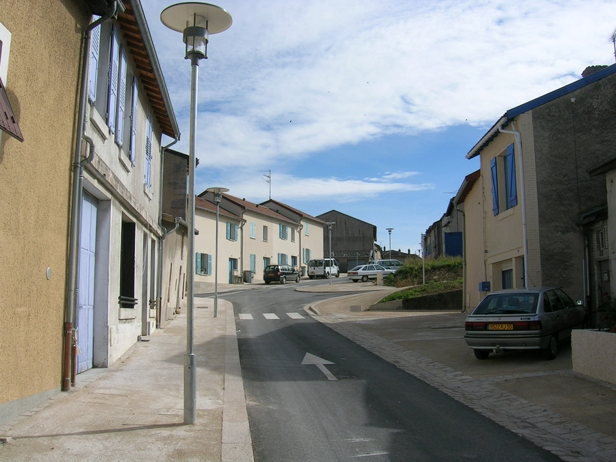
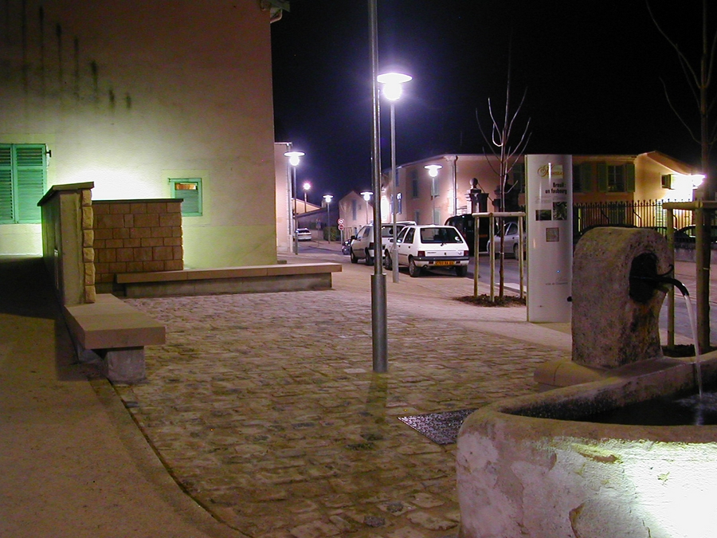
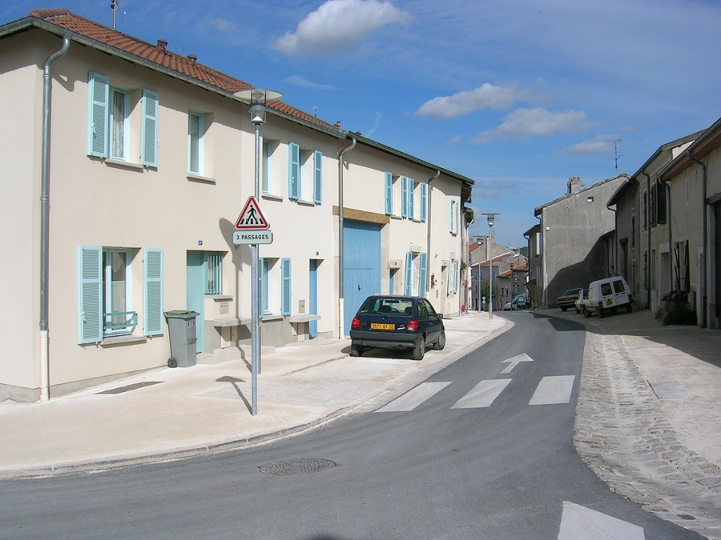
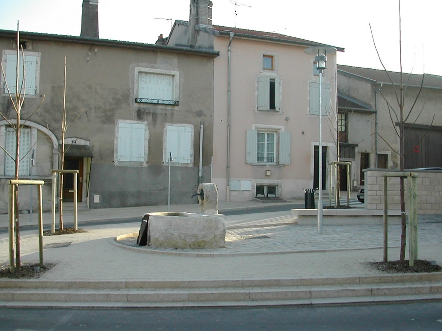
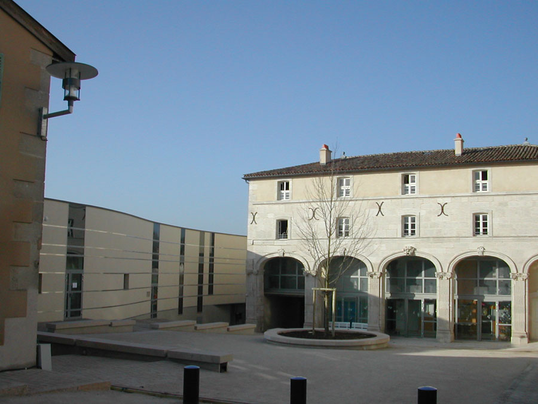

Requalification des espaces publics du quartier de Breuil et aménagement de la
            cour du Prieuré .
            Maitrise d'ouvrage : Ville de Commercy.
            Collaboration : SEFIBA (B.E.T.)
            Montant des travaux : 600 000 € (HT). | Surface : 7 000 m².
            2004.

 

 

 

 

