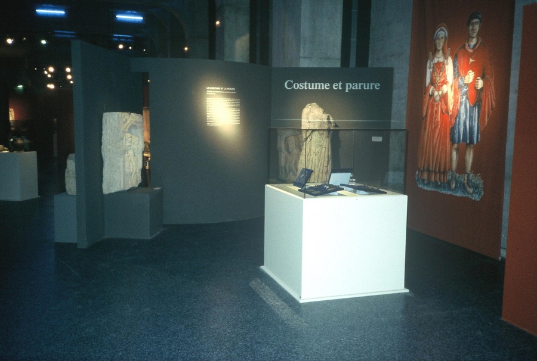
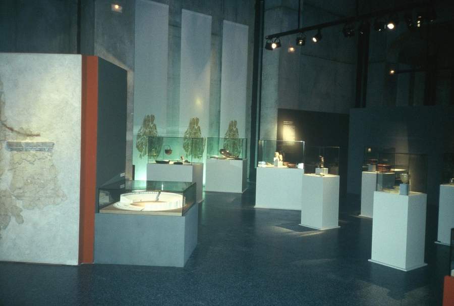
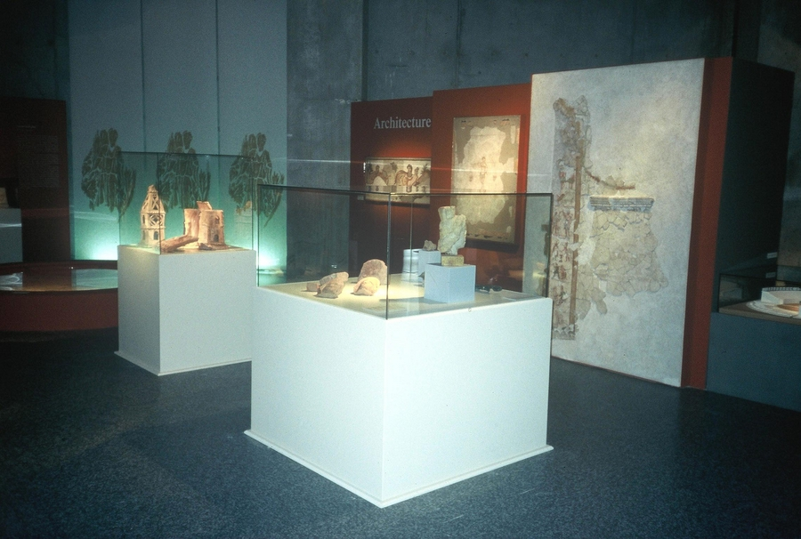

Réalisation scénographique pour une exposition temporaire intitulée
            Romain de Hongrie au Musée de la civilisation Gallo-Romaine à Lyon.
            Maitrise d'ouvrage : Conseil Général du Rhône.
            Coût : 125 000 € (HT) | Surface : 750 m².
            2001-2002.

 

