Amélioration énergétique, actualisation de l'accessibilité et
            renouvellement de la cuisine de la salle construite en 1986 par Serge Schiochet,
            Architecte.
            Maîtrise d’ouvrage : Commune de Semécourt.
            Collaborations : E.T.F INGÉNIERIE (B.E.F.), J. PITOIS (Économiste).
            Montant des travaux : 616 000 € (H.T.) | Surface : 670 m² (S.H.O.N.) 521
            m² (S.U.).
            2011-2012.

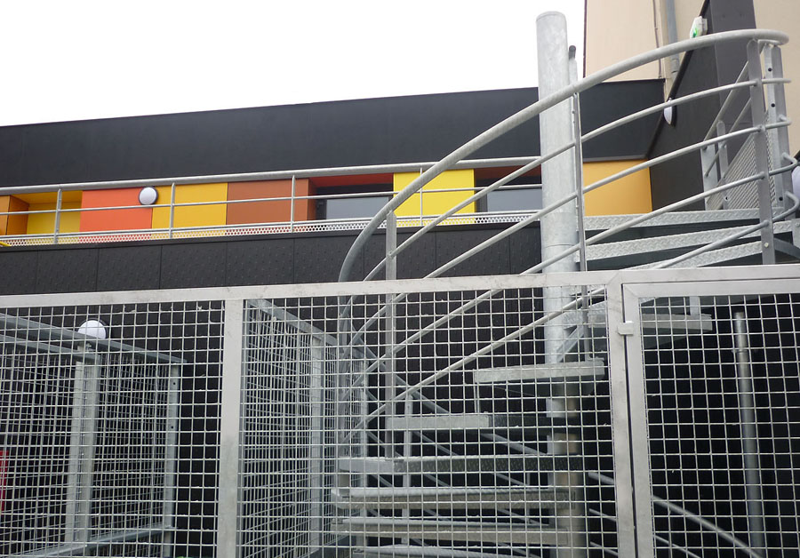 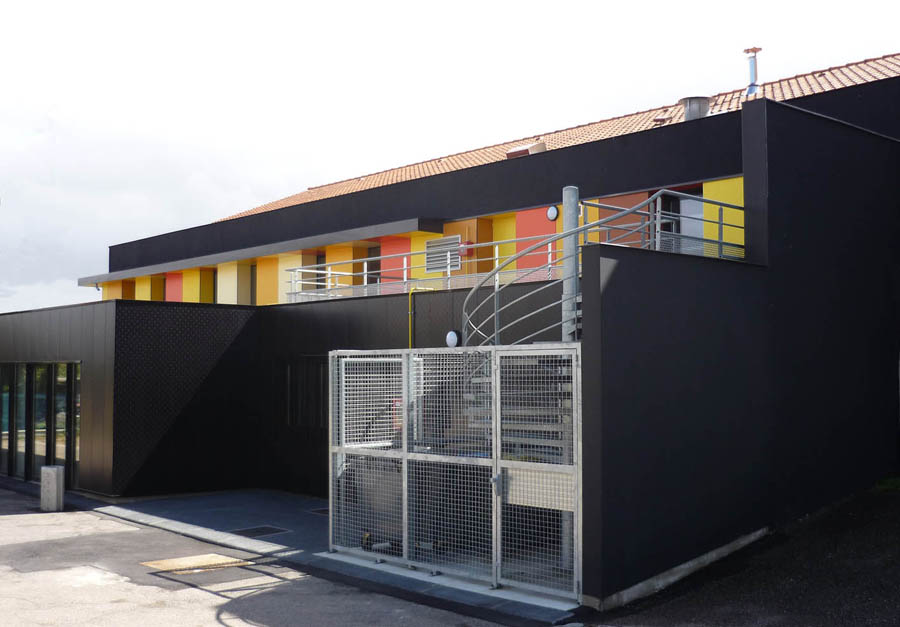

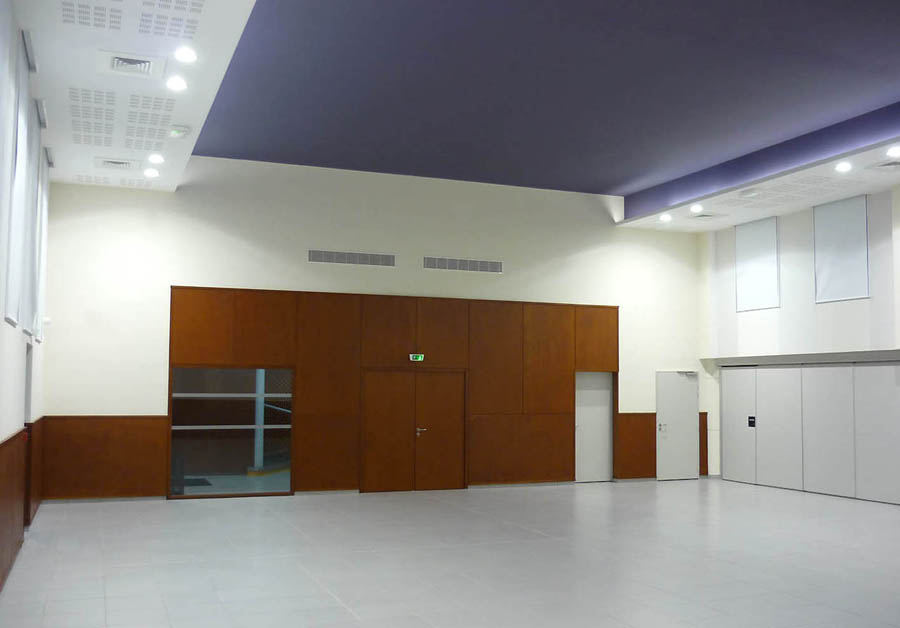 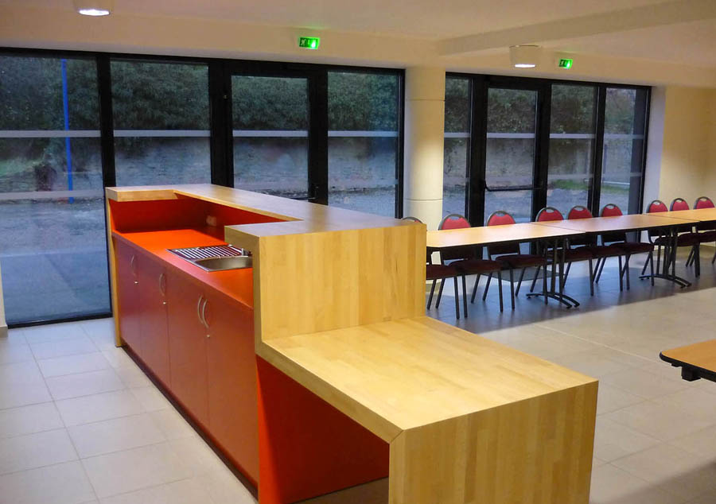

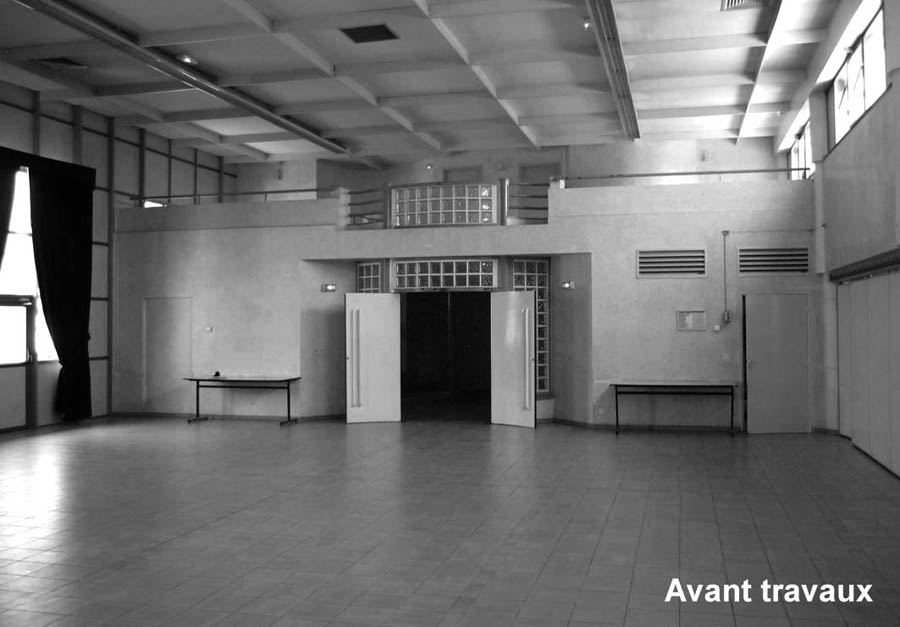 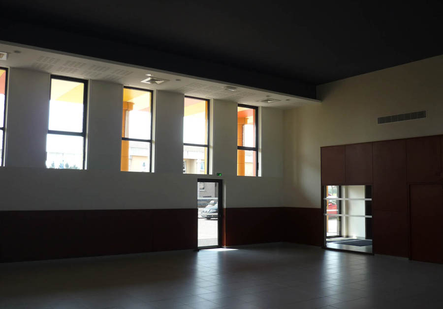

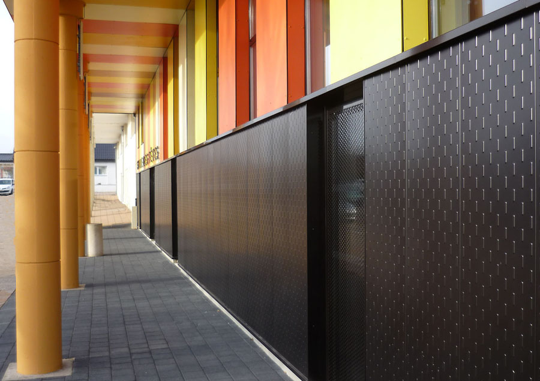 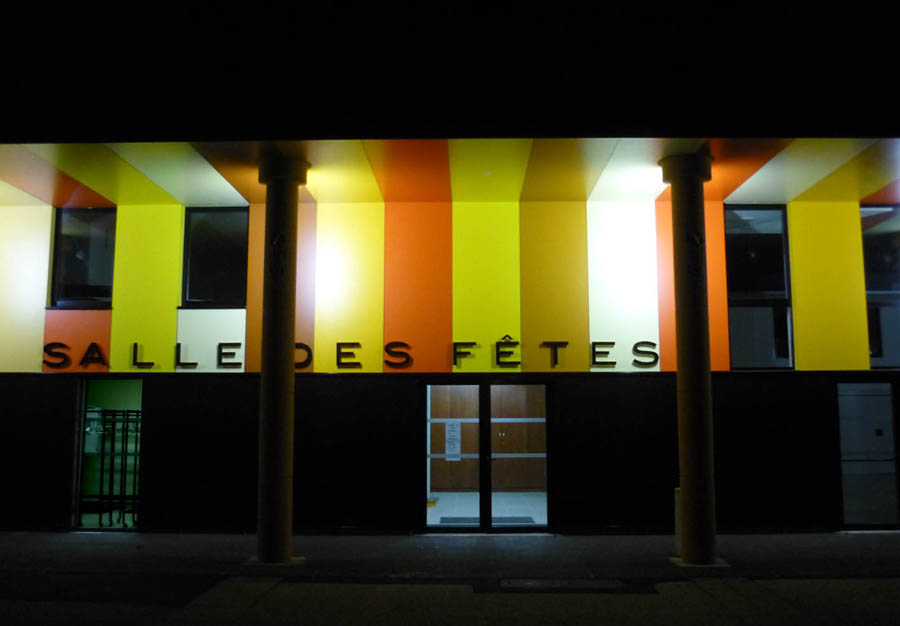

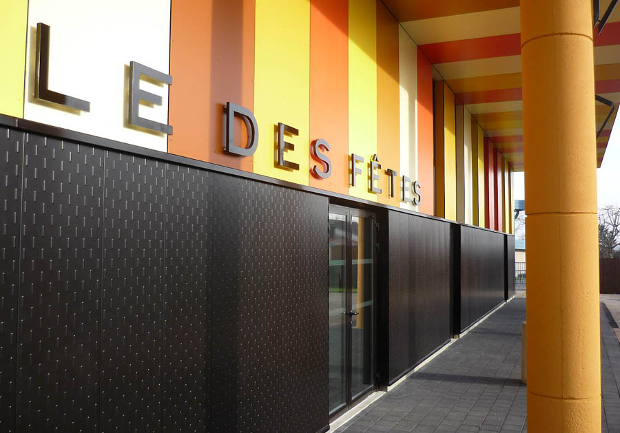 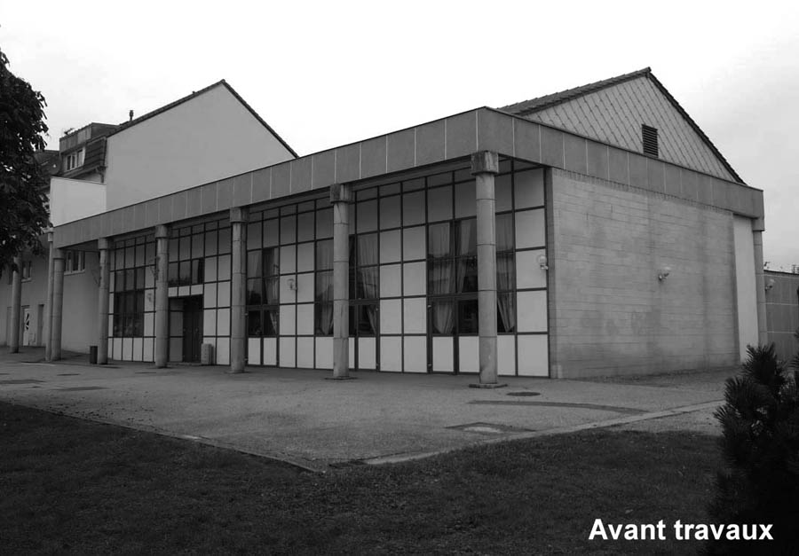

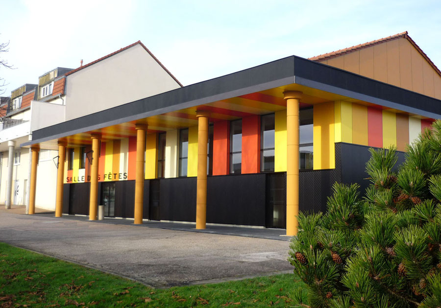 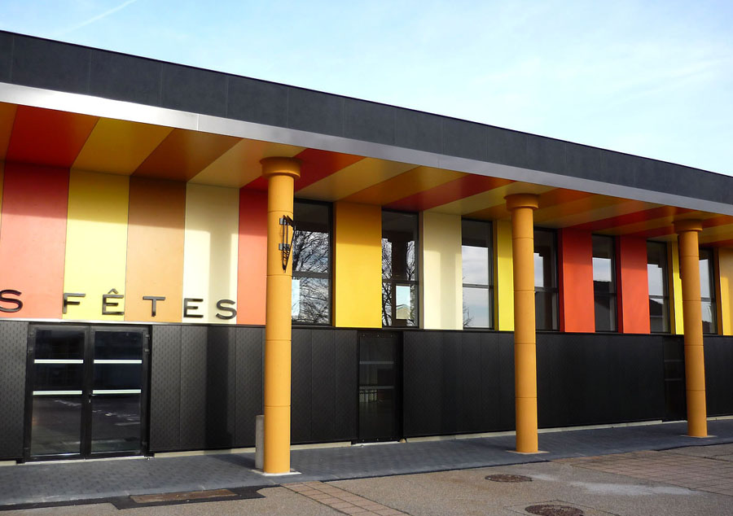

