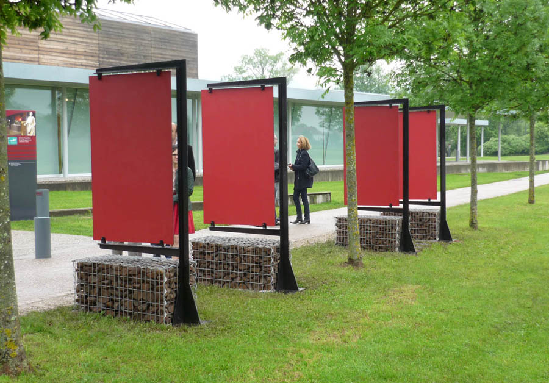
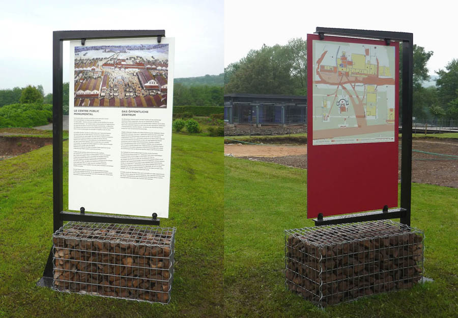
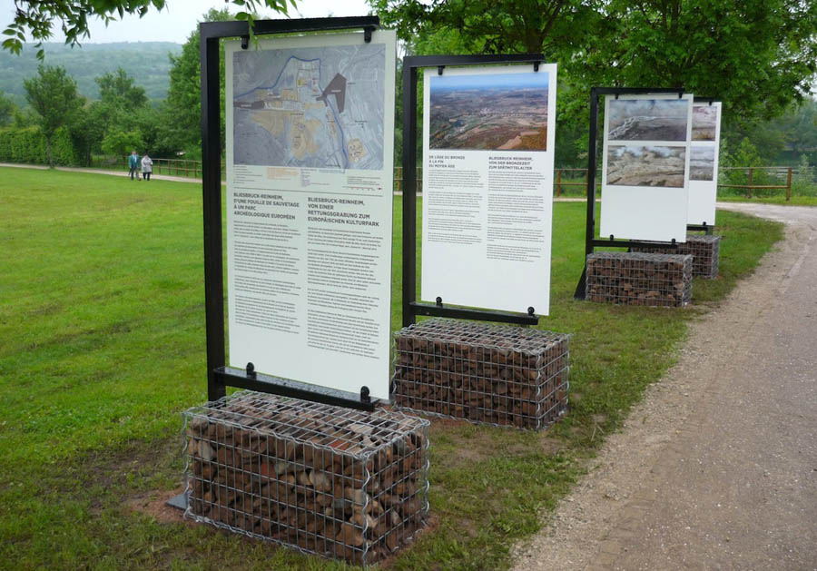

Réalisation de supports didactiques en rapport avec l'exposition permanente
            "Parcours 2013, 2500 ans d’histoire commune en Moselle et en Sarre " pour le parc
            archéologique Européen de Bliesbruck-Reinheim.
            Maitrise d'ouvrage : Conseil Général de Moselle et Saarpfalz-Kreis.
            Graphiste associé : Atelier Martial DAMBLANT
            Coût : 7 000 € (H.T.) | Mécènes : FIMUREX - MAIZIERES LES METZ
            (gabions), LOTZ - FOLSCHVILLER (pierre).
            2013

 

