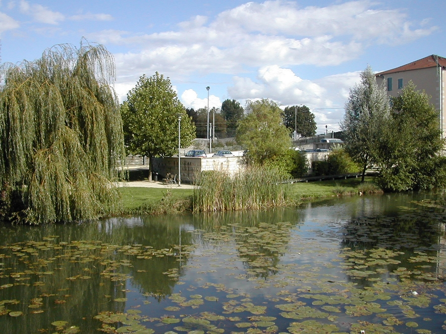
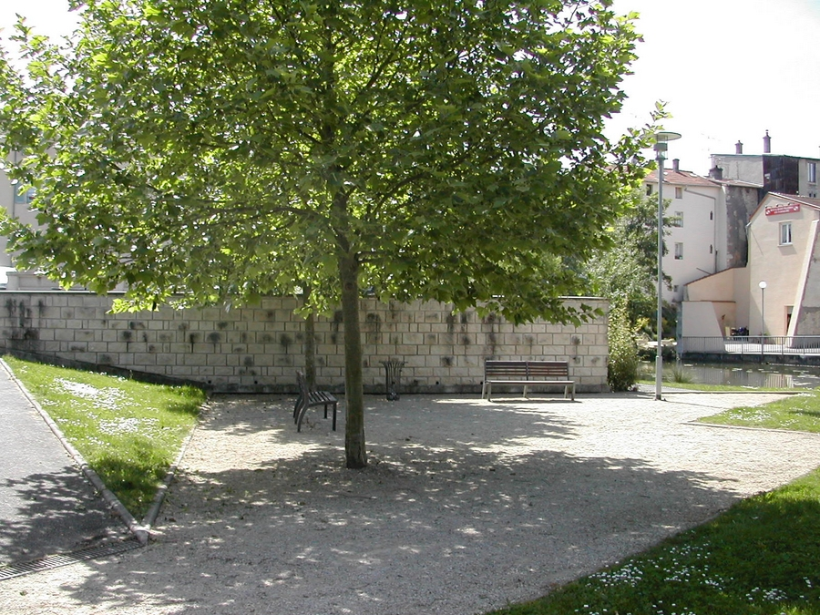
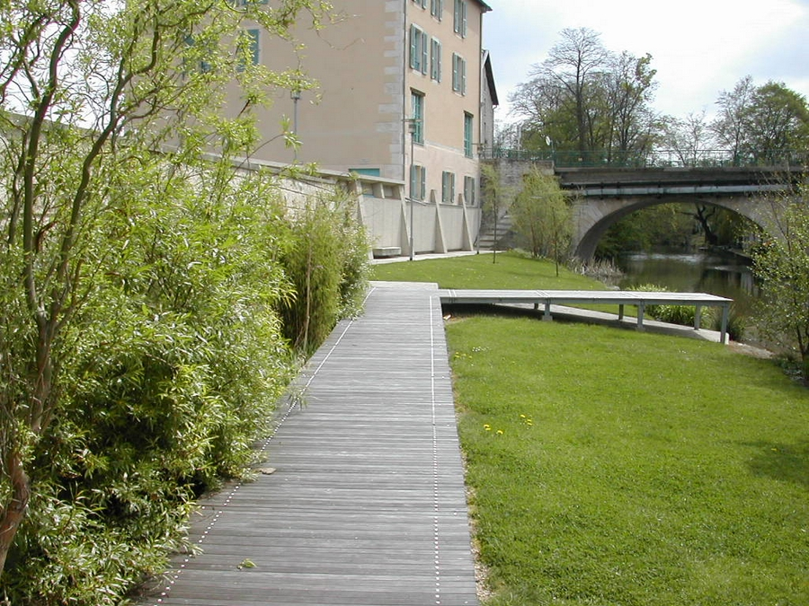
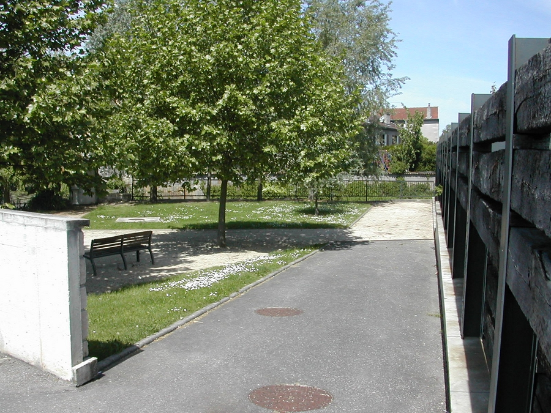
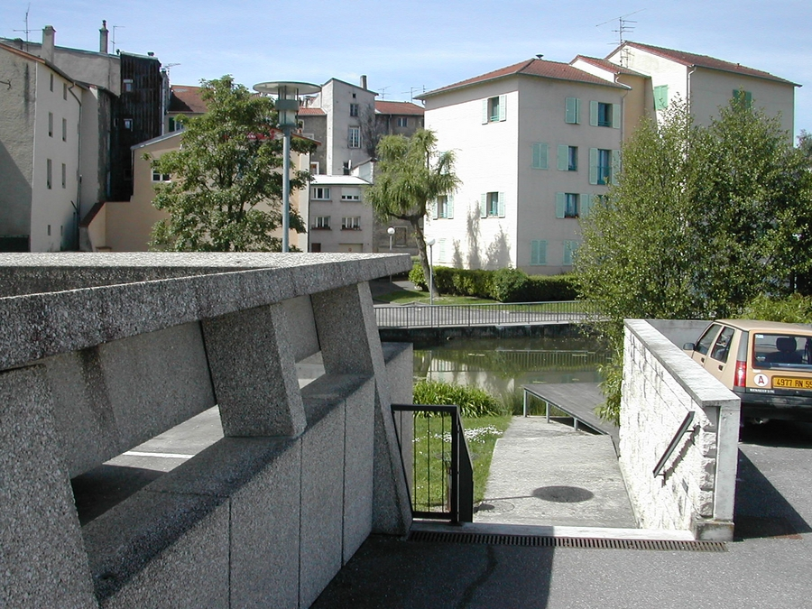
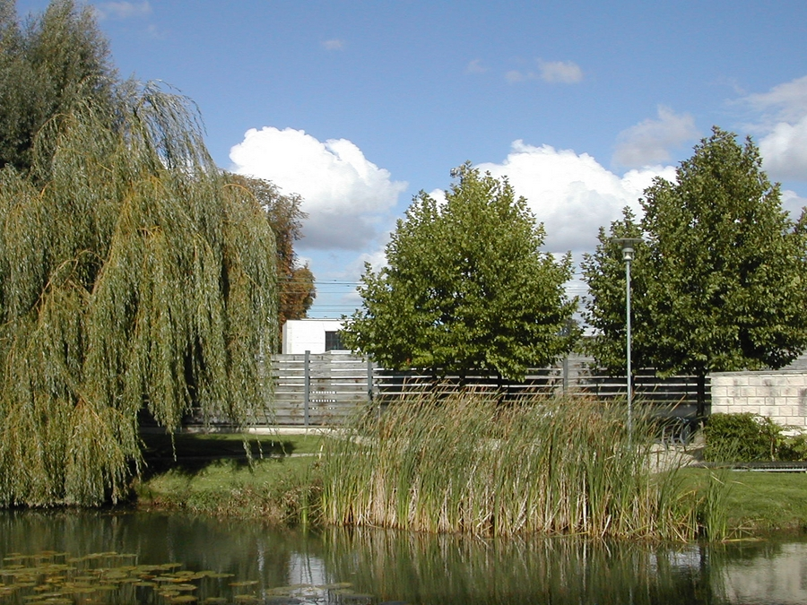
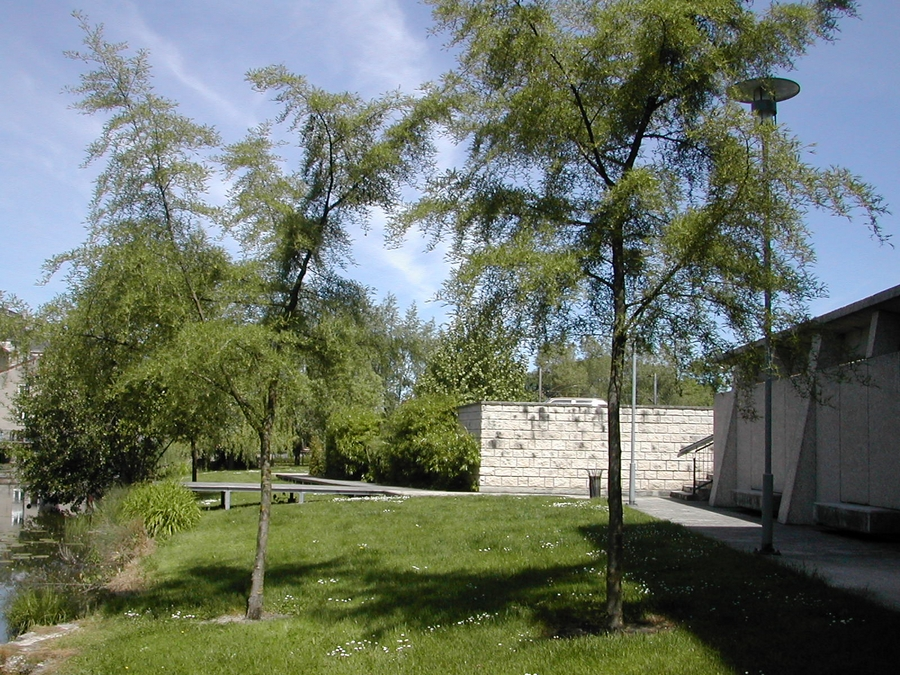

Square et parc de stationnements de l'Ilot des Tanneurs.
            Maitrise d'ouvrage : Ville de Commercy.
            Collaboration : CETOBA (B.E.T.)
            Montant des travaux : 230 000 € (HT) | Surface : 2 500 m².
            1998

 

 

 

