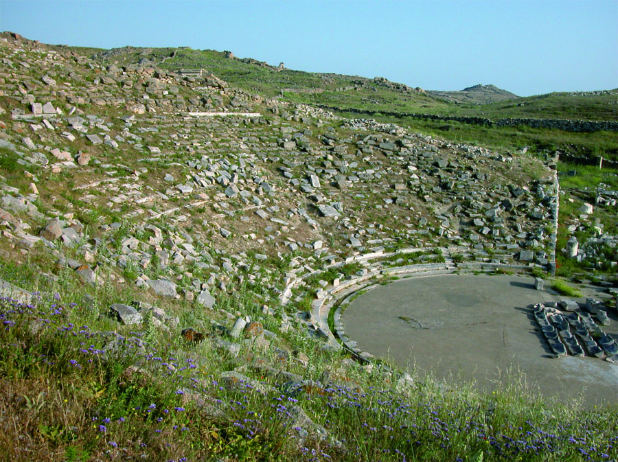
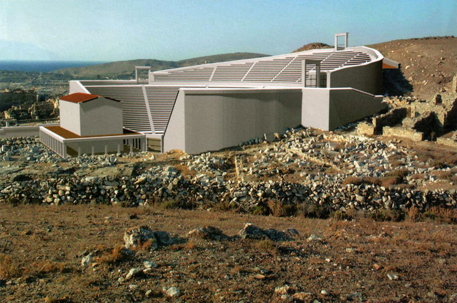
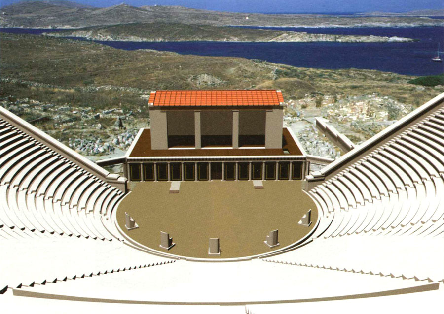
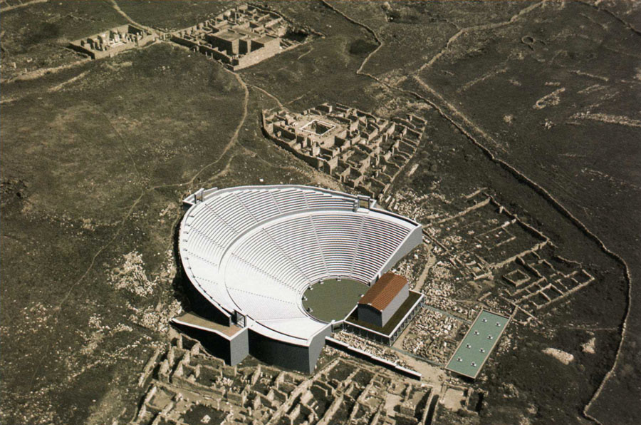
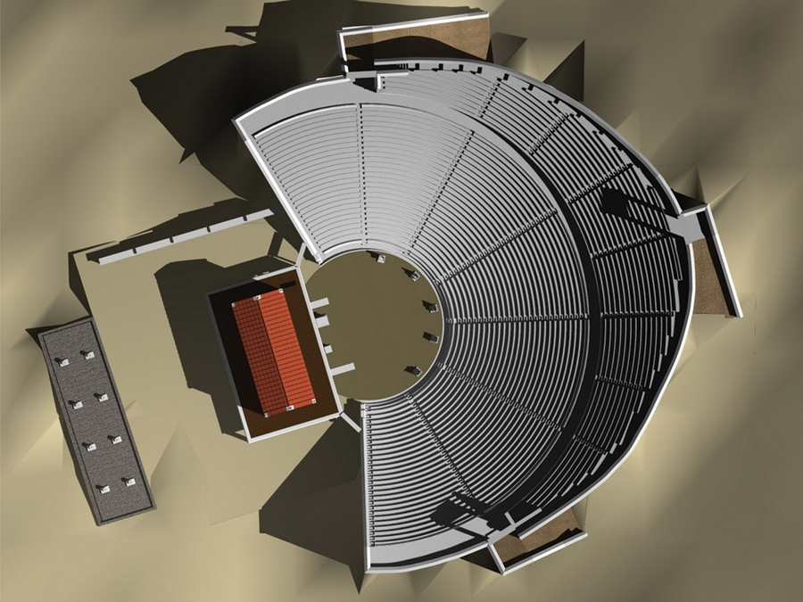
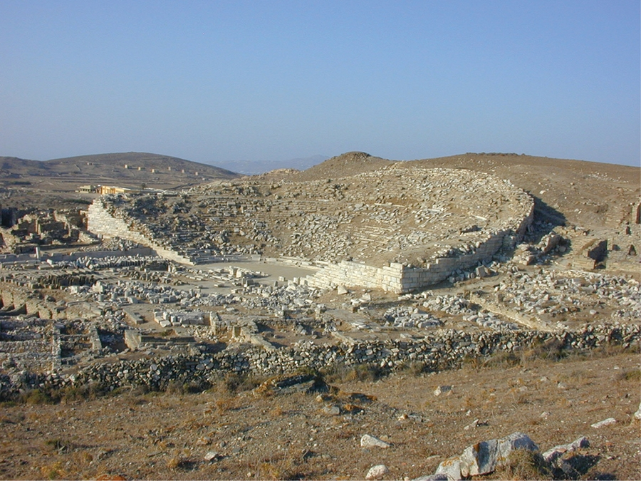
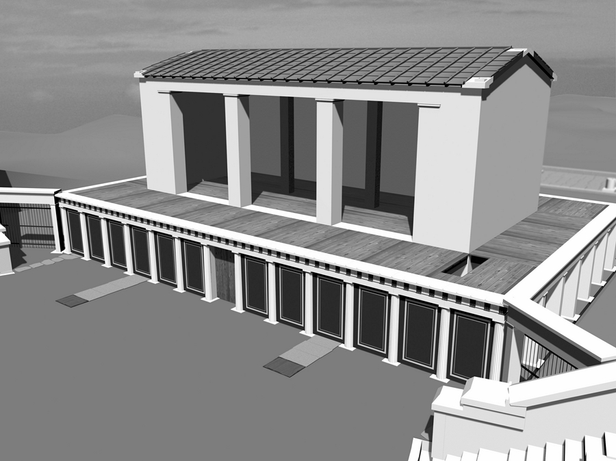
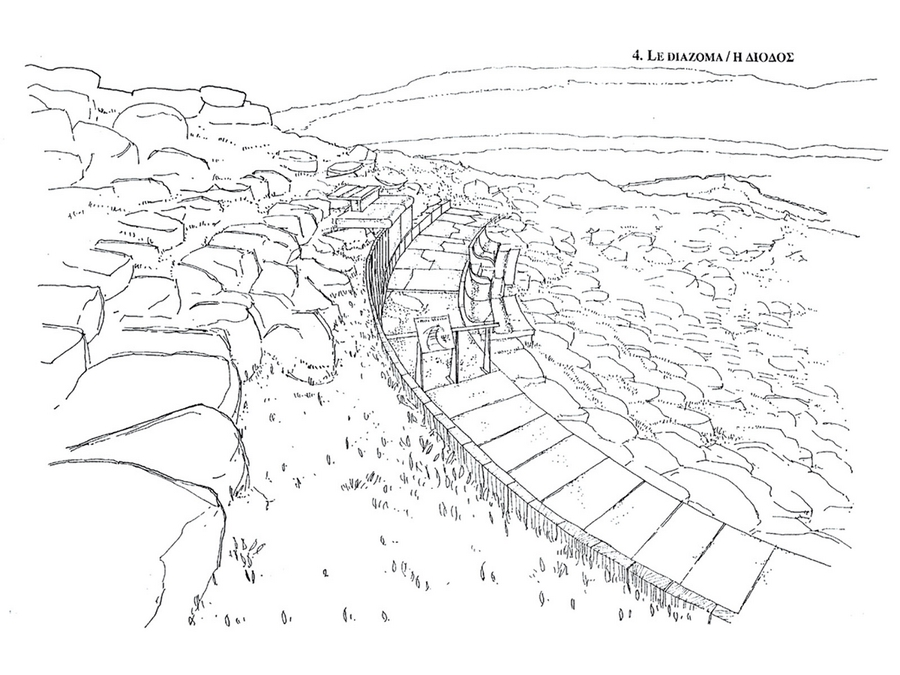
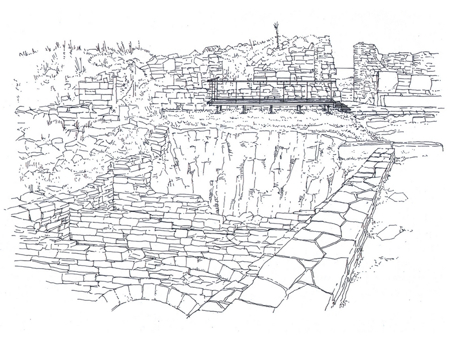
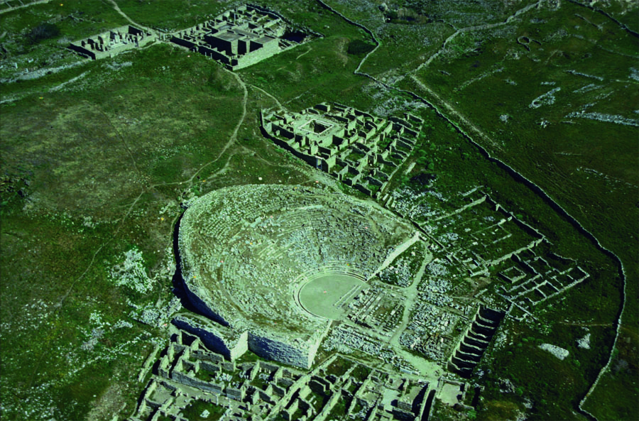

Réalisation d'un parcours d'interprétation pour le théâtre
            antique de l'île grecque de Délos.
            Maitrise d'ouvrage : Ministère grec de la culture.
            Archéologue associé : J.Ch. MORETTI.
            Publication : Fraisse, Philippe et Moretti, Jean-Charles : Le théâtre,
            Exploration Archéologique de Délos XLII (2 volumes), Ecole française
            d'Athènes, Athènes 2007.
            Montant des travaux : 1 200 000 € (HT).
            2007

 

 

 

 

 

