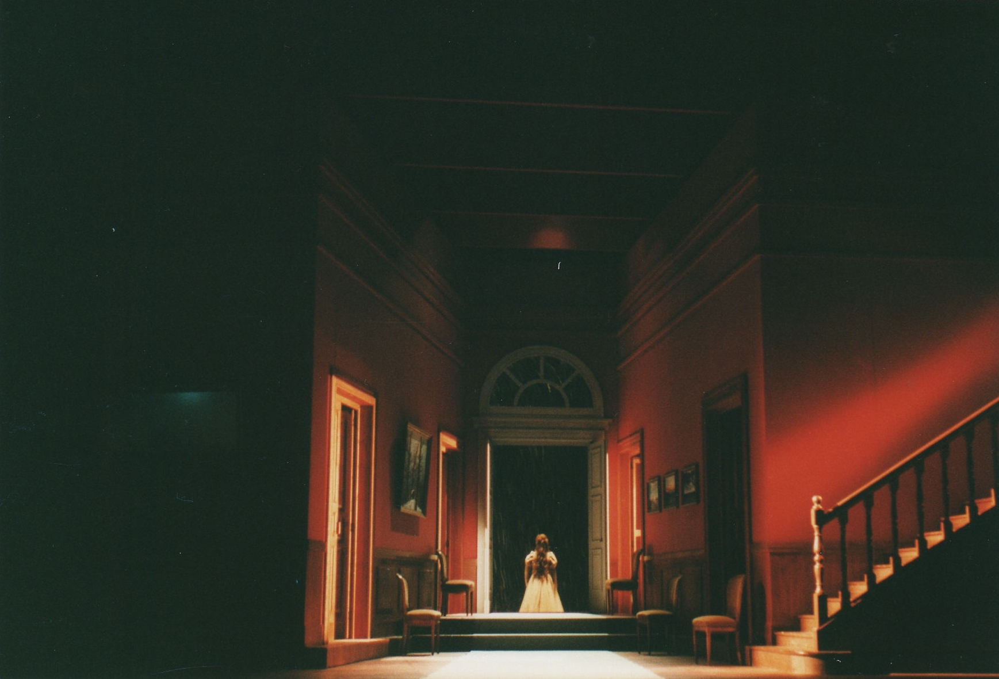
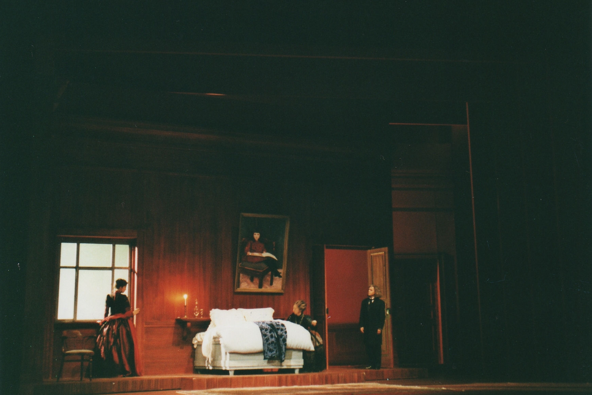
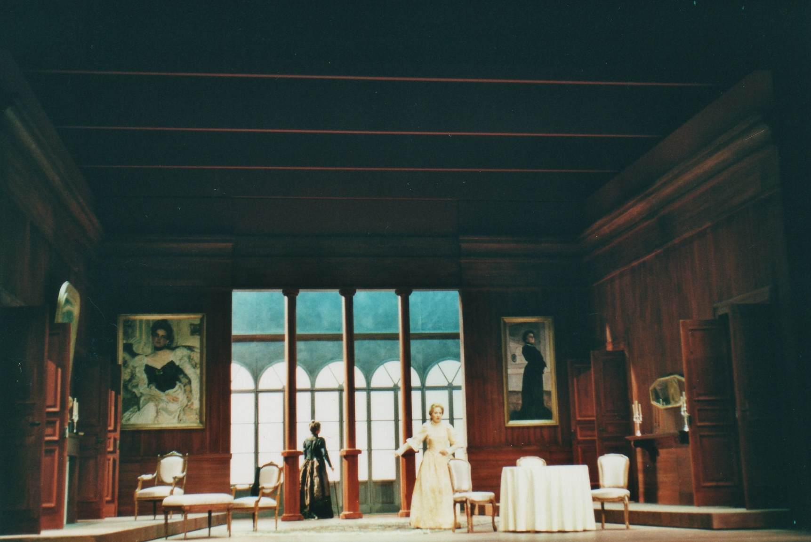
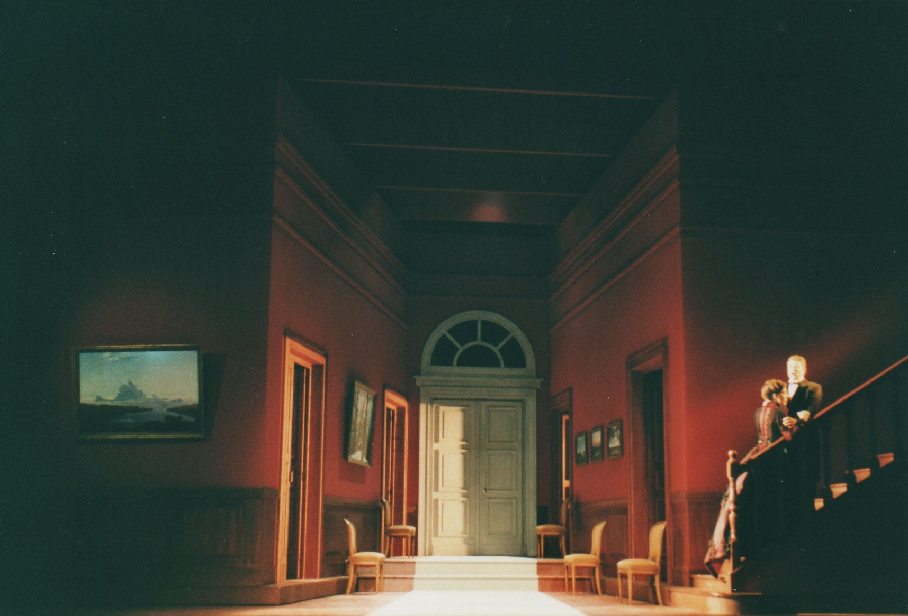
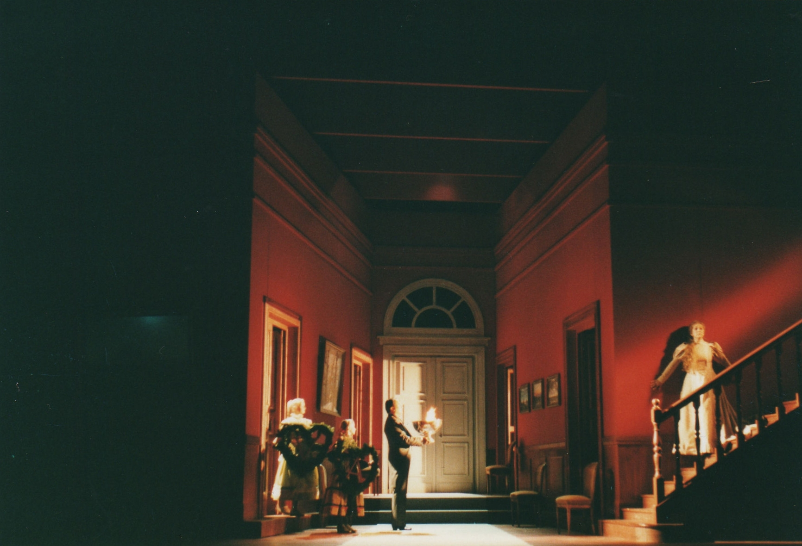

Réalisation de décors pour l’Opéra « Jackie O ».
            Metteur en scène : Danielle ORY.
            Costumes : Arthur ABALLAIN.
            Lumières : Marion HEWLET.
            Année de production : 2000.

 

 

