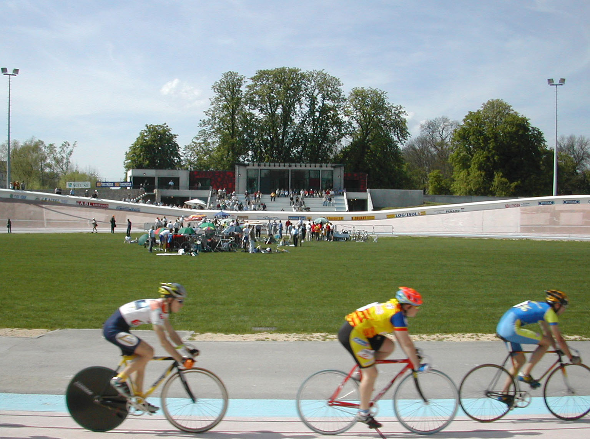
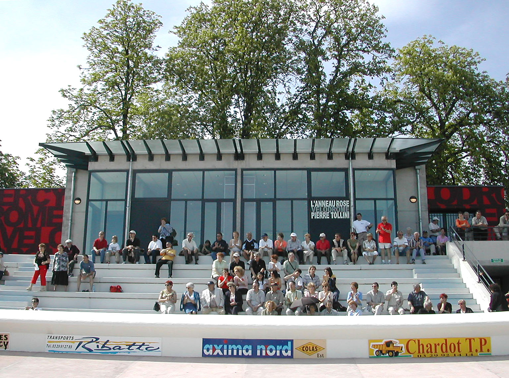
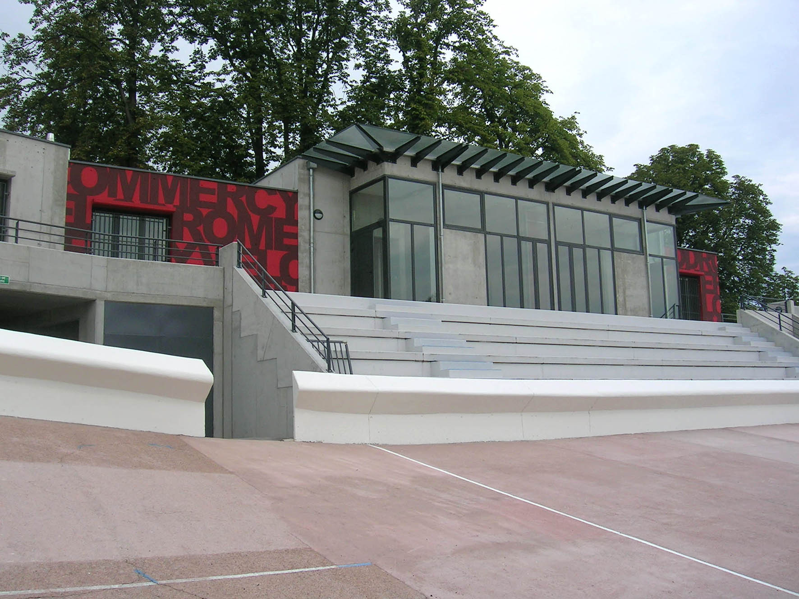
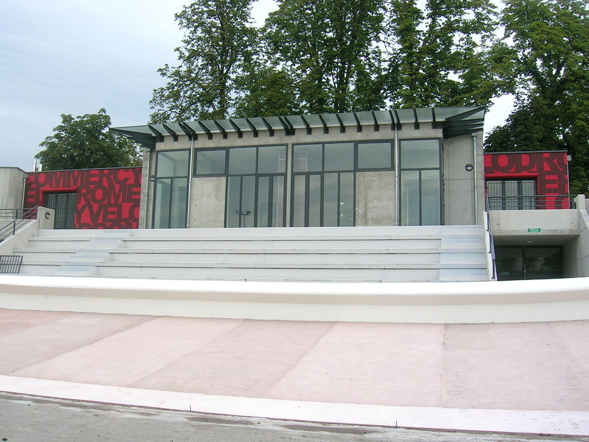
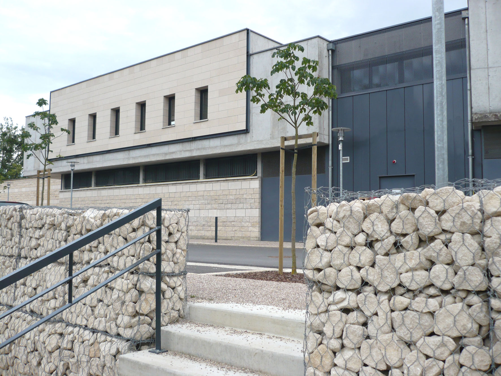
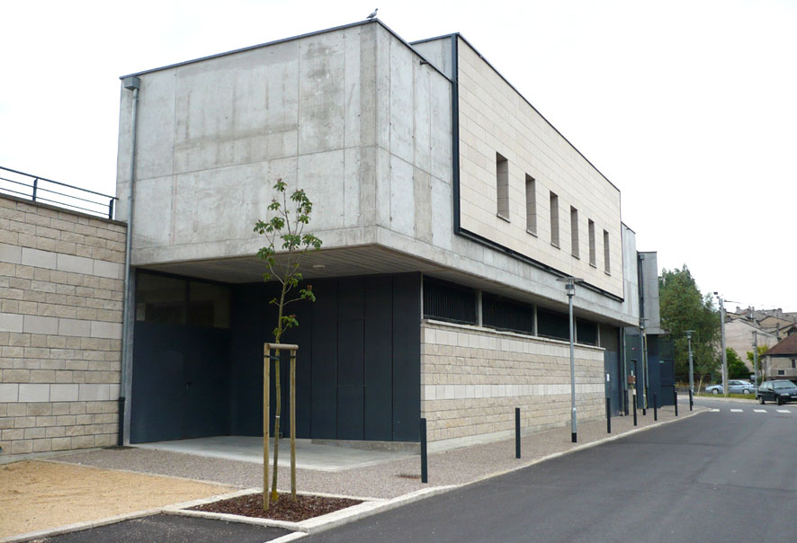
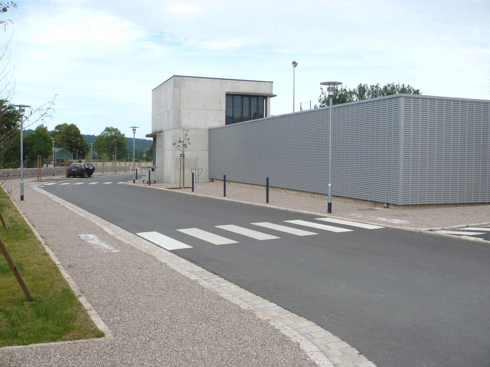
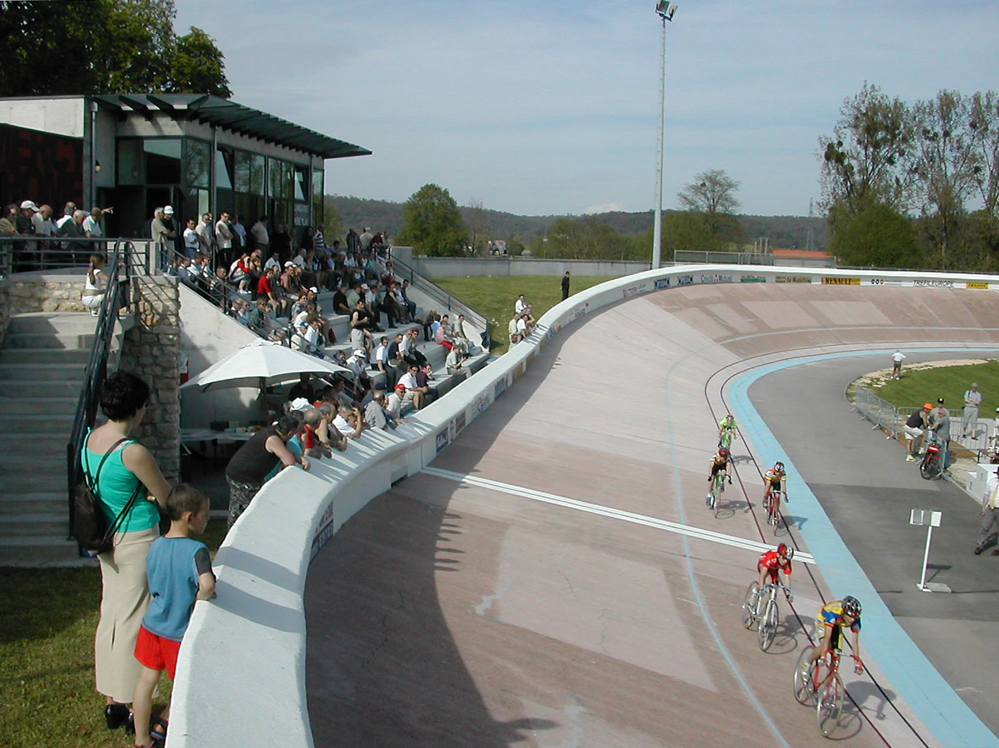

Travaux de rénovation du vélodrome en 3 phases ; après la
            reconstruction des murs de soutènement, la seconde tranche porte sur la
            modernisation des vestiaires, la construction de nouvelles salles, atelier et
            dépôts, la réalisation d'un tunnel d'accès à la piste et la
            construction d'une tribune. Enfin la dernière tranche s'est attachée à la
            restauration de la piste en béton.
            Maitrise d'ouvrage : Ville de Commercy
            Collaborations : CETOBA (B.E.T. Tr. 1 & 2), L.Barrois (B.E.T. Tr. 3), SOGECLI
            (B.E.F.),
            Montant des travaux : Tr. 1 : 381 000 € (HT), Tr. 2 : 870 000 € (HT), Tr. 3
            : 205 000 € (HT). Coût total des travaux : 1 476 000 € (HT).
            Tranche 1 : 2000, Tranche 2 : 2003, Tranche 3 : 2004-2005

 

 

 

 

