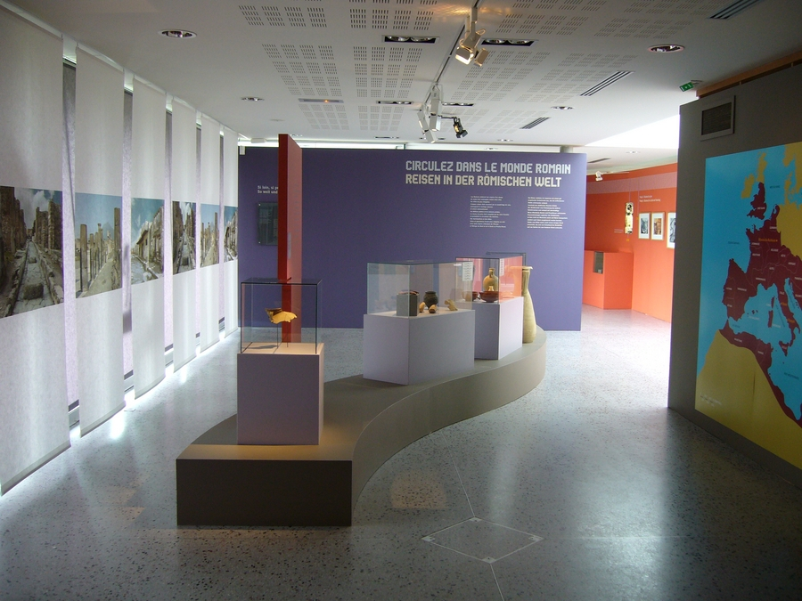
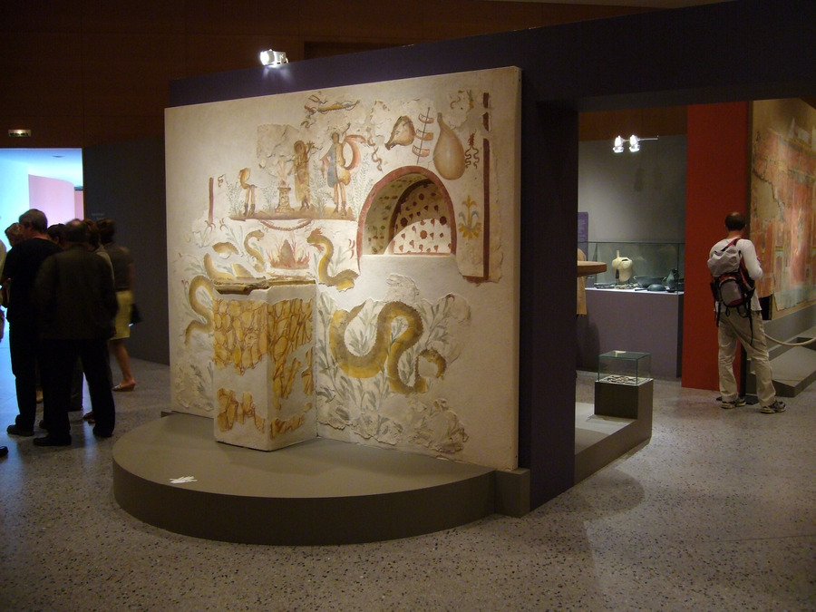
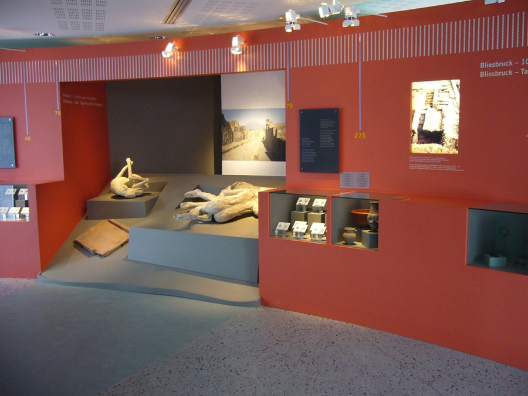
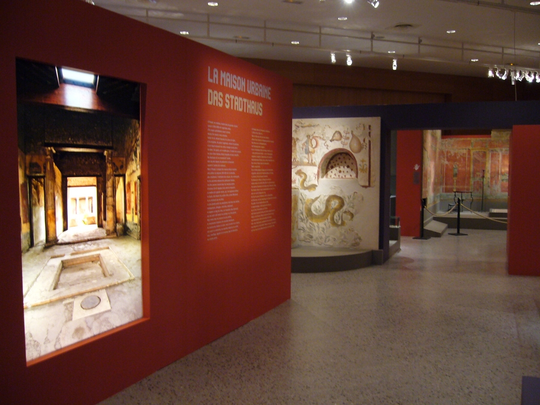
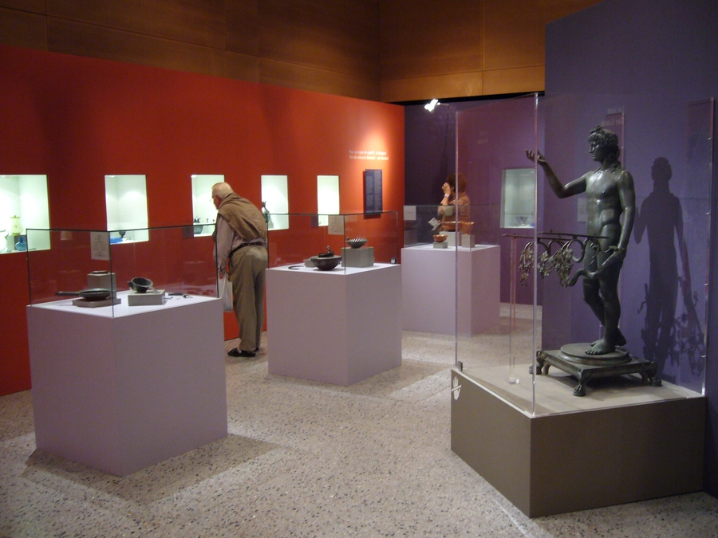
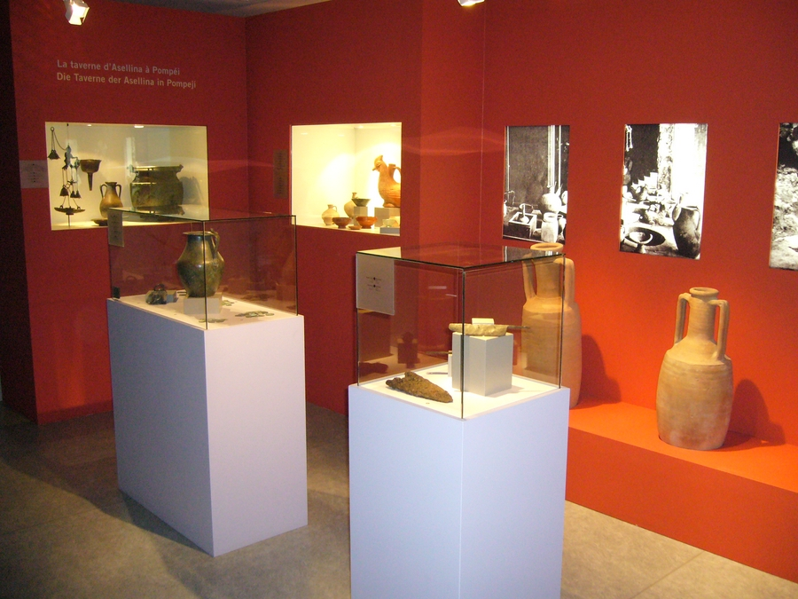
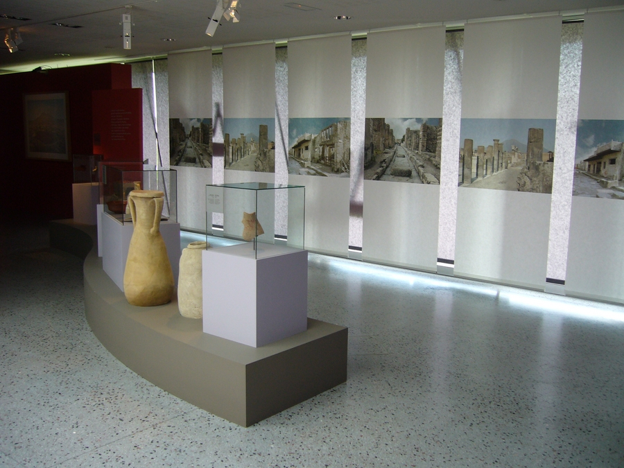

Réalisation scénographique pour une exposition temporaire intitulée
            "De Pompei à Bliesbruck-Reinhein Vivre en Europe romaine" au Parc
            archéologique Européen de Bliesbruck.
            Maitrise d'ouvrage : Conseil Général de Moselle.
            Graphiste associé : Atelier Martial DAMBLANT.
            Éclairagiste associé : Roberto VENTURI.
            Coût : 331 000 € (H.T.) | Surface : 750 m².
            2007

 

 

 

