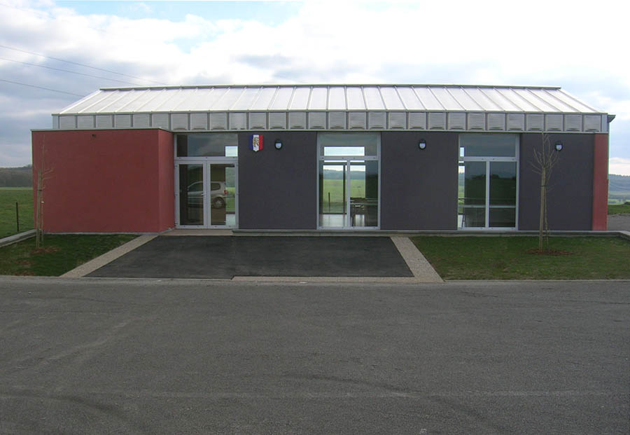
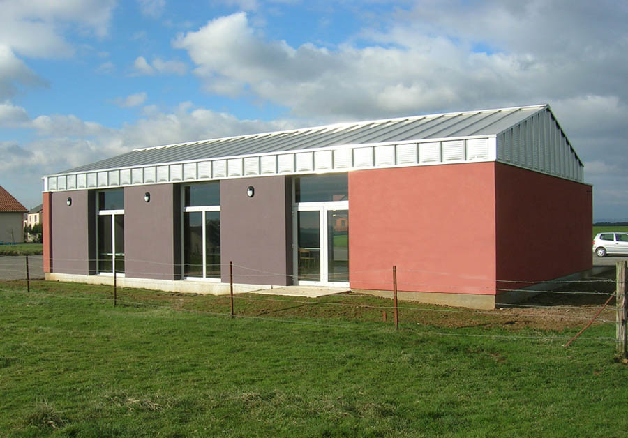
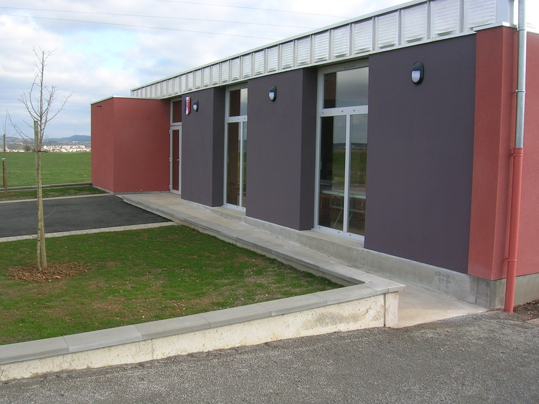
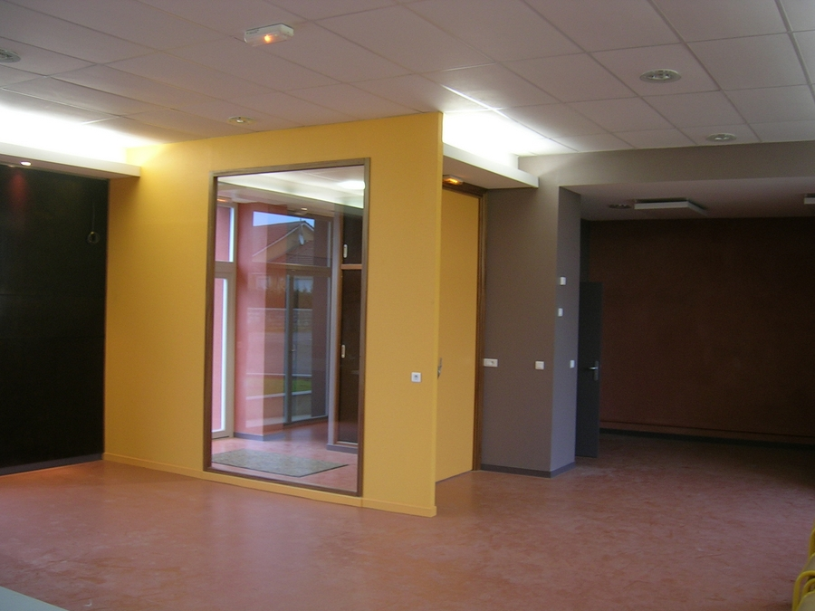
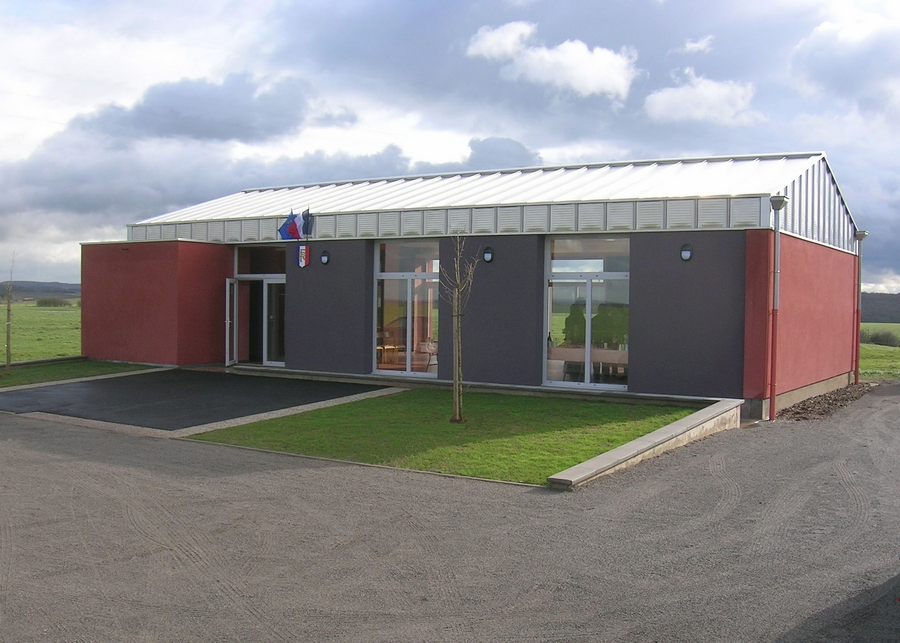
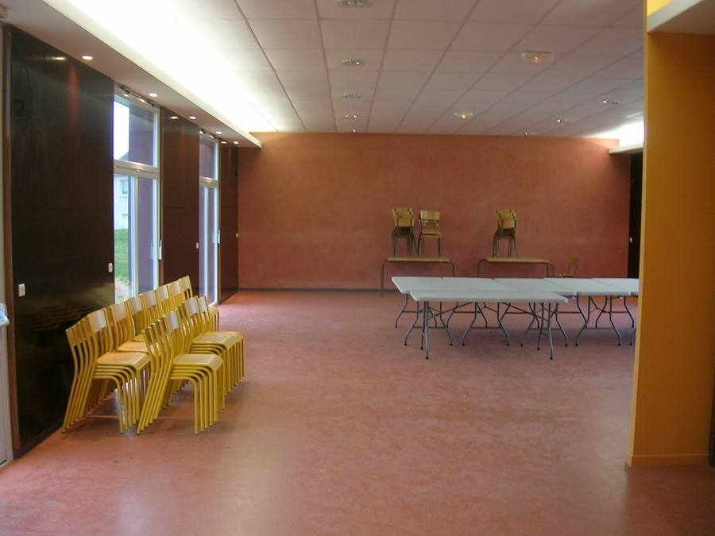

Construction d'une salle communale et d'un bureau de vote pour le quartier de
            Reinange.
            Maitrise d'ouvrage : Commune de Volstroff.
            Collaboration : J. PITOIS (Economiste).
            Montant des travaux : 150 000 € (H.T.) | Surface : 144 m².
            2007

 

 

 

