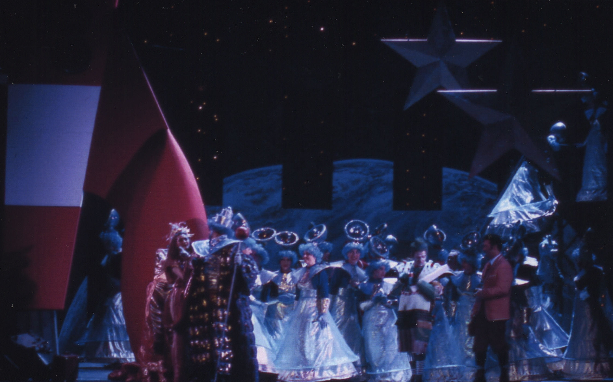
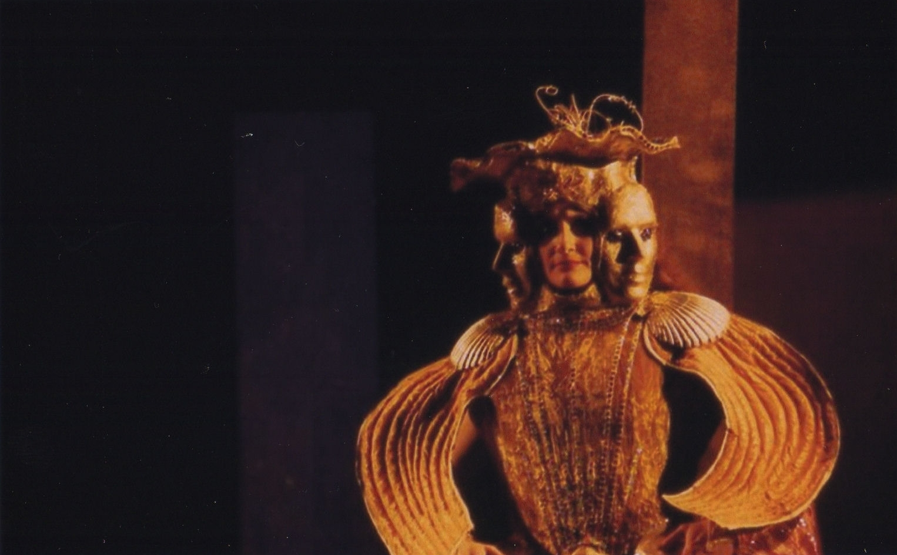
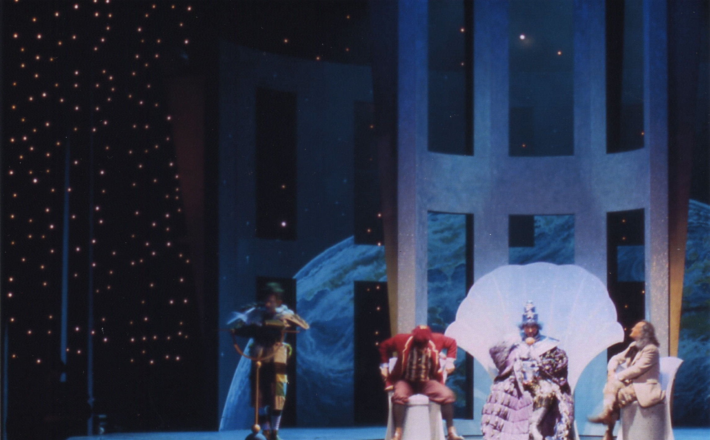
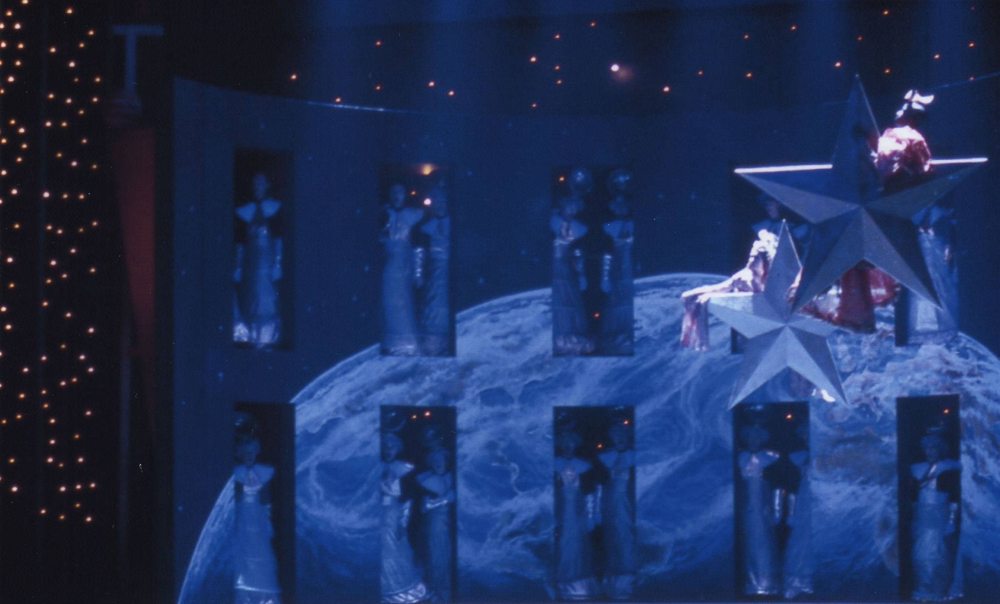
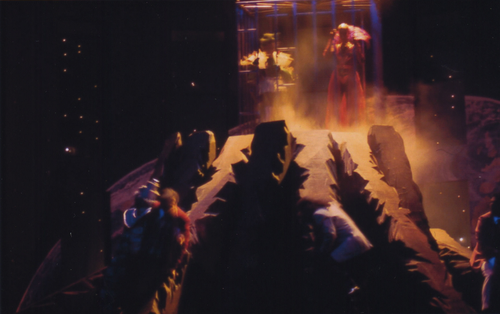
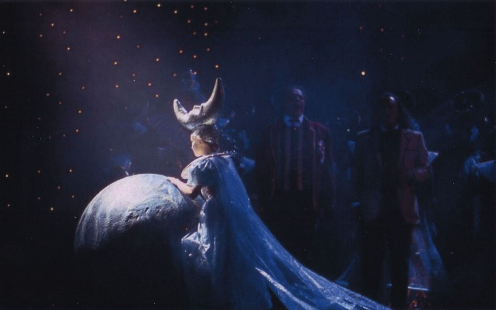

Réalisation de plusieurs décors pour l'Opéra "Le voyage dans la
            lune".
            Metteur en scène : Danielle ORY.
            Costumes : Arthur ABALLAIN.
            Lumières : Roberto VENTURI.
            Année de production : 1999

 

 

 

